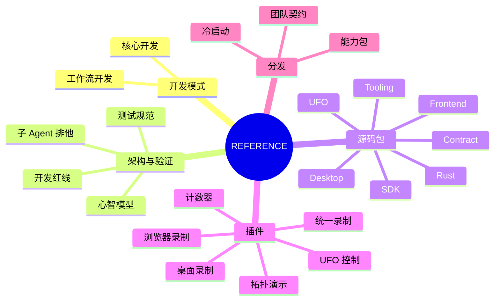

# GraphFramework 工程参考索引

源码与针对性测试优先于文档；先按任务进入对应指南，再查具体接口。

## 先选开发模式

| 模式 | 范围 | 入口 |
| :--- | :--- | :--- |
| 核心开发 | Rust 微内核、基础 `packages/*`、正式 `app/plugins/*`；零业务语义，执行/观察分离。 | [核心开发模式](core-development-mode.md) |
| 工作流开发 | 自然语言与录制意图提取、API/MCP 优先、独立 `runs/<name>/` 装配和测试；非核心插件不进 `app/`。 | [工作流开发模式](workflow-development-mode.md)、[工作流专题](workflow/README.md) |

## 架构与验收

| 文档 | 查什么 |
| :--- | :--- |
| [核心心智模型](architecture/mental-model.md) | Node、State、Info、Change、错误 Info、Projection、单飞与 generation 断代。 |
| [开发准入红线](architecture/development-constraints.md) | Kernel 检查、11 条架构红线、`run.sh` 守卫与凭据安全。 |
| [测试规范](testing-specification.md) | 独立 Run、图耦合度、可观测结果、因果追踪。 |
| [子 Agent 与桌面排他](subagent-parallel-contract.md) | 命名 Run、端口和 Git 所有权；UFO/PSR 真机串行。 |

## 按源码包查接口

| 源码 | 指南 | 重点 |
| :--- | :--- | :--- |
| `packages/rust/` | [Rust](packages/rust/README.md) | 调度、daemon、FFI、拓扑分析。 |
| `packages/contract/` | [Contract](packages/contract/README.md) | 协议操作、错误码、Golden Frames。 |
| `packages/sdk/` | [SDK](packages/sdk/README.md) | TS/Python Node、WorldNode、ChangeContext、测试 Harness。 |
| `packages/desktop/` | [Desktop](packages/desktop/README.md) | Electron 宿主、Preload IPC、运行守卫。 |
| `packages/frontend/` | [Frontend](packages/frontend/README.md) | 零业务工作台、Hooks、主题与 Token。 |
| `packages/tooling/` | [Tooling](packages/tooling/README.md) | Run CLI、可视化、重构。 |
| `packages/ufo/` | [UFO](packages/ufo/README.md) | Windows UIA 与桌面控制。 |

## 插件与分发

六个正式插件的工厂、节点与装配入口见[核心插件索引](plugins/README.md)：[统一录制](plugins/unified-recorder.md)、[浏览器录制](plugins/browser-recorder.md)、[桌面录制](plugins/os-recorder.md)、[UFO 控制](plugins/ufo-computer-control.md)、[拓扑演示](plugins/demo-topology.md)、[计数器](plugins/hello-counter.md)。

新环境与交付流程见[分发总览](distribution/README.md)：[冷启动](distribution/cold-start.md)、[能力包打包/校验/安装](distribution/capability-packaging.md)、[团队分发契约](distribution/distribution-contract.md)。
