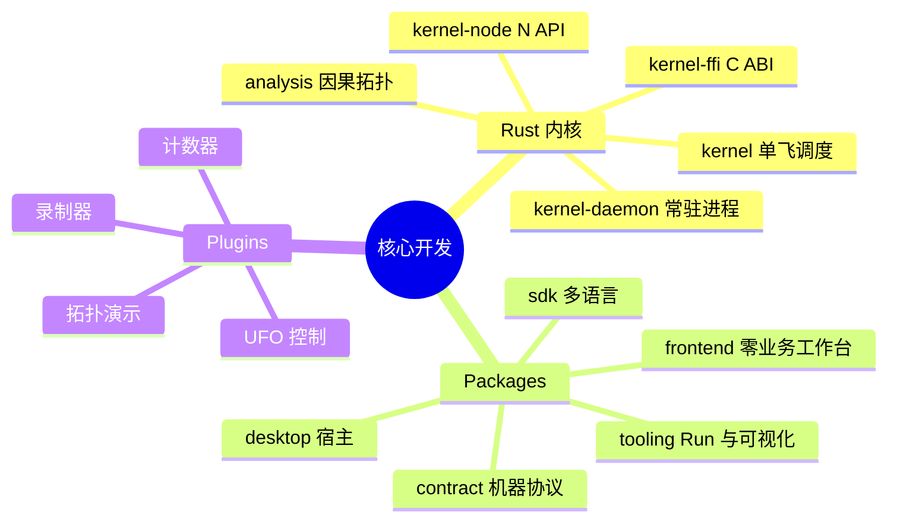

# 核心开发模式

核心开发涵盖 `packages/rust`、基础 `packages/*` 和 `app/plugins/*`，三者随基础软件更新包发布。特定业务流程在 `runs/*` 开发；`app/plugins/` 只收长期公共基础设施插件。

## 源码归属



| 位置 | 职责 |
| :--- | :--- |
| `packages/rust/kernel` | 生产唯一规则空间：FIFO Mailbox、单飞调度、generation 断代、丢弃台账。零业务语义。 |
| `packages/rust/kernel-node` | Node.js N-API，连接 `NativeRuleSpace`。 |
| `packages/rust/kernel-ffi` | 面向 Python/C++ 等的 C ABI。 |
| `packages/rust/kernel-daemon` | 多 Session、租约、Effect 外派的 TCP JSON Lines 宿主；机器契约见 `packages/contract`。 |
| `packages/rust/analysis` | 环路、可达性、Brandes 介数与 Louvain 社区分析。 |
| `packages/sdk` | TS 的 Node/WorldNode、ChangeContext、`NativeRuleSpace` 与测试 Harness；Python 的 daemon client/worker。 |
| `packages/desktop` | Electron、Preload IPC、`run.sh` 启动守卫。 |
| `packages/frontend` | 零业务工作台、主题与响应式客户端 Hooks。 |
| `packages/tooling` | Run 管理、因果可视化、AST 重构。 |
| `packages/contract` | `operations.json`、`errors.json` 与跨语言 Golden Frames。 |
| `app/plugins` | `unified-recorder`、`browser-recorder`、`os-recorder`、`ufo-computer-control`、`demo-topology`、`hello-counter` 的正式核心实现。 |

核心插件与第三方插件使用相同 Manifest 和生命周期；“核心”只表示平台级发布与维护归属。实验、场景和业务插件先放 `runs/<name>/plugins/`，验收后也不进入 `app/`。

## 准入红线

| 检查 | 约束 |
| :--- | :--- |
| 零业务语义 | 调度内核和工作台底座不出现行业字段或业务规则。 |
| 物理分离 | `ExecutionWorldNode` 下发外部动作后立即结算；`ObservationWorldNode` 只监听并把事实作为 Info 返回。 |
| 错误因果化 | Node 异常被捕获为 `@error/NodeFailed`，不击穿规则空间。 |
| 插件归属 | 非核心、未验收或临时插件不进 `app/plugins/`。 |
| 契约先行 | 跨语言/进程协议先更新 `packages/contract/operations.json` 和 Golden Frames，再实现并验收。 |

## 开发与验证

缺陷和扩展先写最小复现，用 `createTestRuntime` 验证局部因果；不以黑盒 Electron 肉眼试验代替测试，不用 `node -e` 拼临时验证。符号分析和重命名优先 LSP；跨包批量重构使用 `node packages/tooling/refactor/refactor.mjs`。小步提交，检查 Git 差异。

```bash
npm --prefix packages/desktop run typecheck
npm --prefix packages/sdk/javascript run typecheck
# 修改 Rust 内核或分析引擎时
cargo test --manifest-path packages/rust/Cargo.toml
```

关联：[核心心智模型](architecture/mental-model.md)、[开发红线](architecture/development-constraints.md)、[机器契约](packages/contract/README.md)、[工作流开发](workflow-development-mode.md)。
