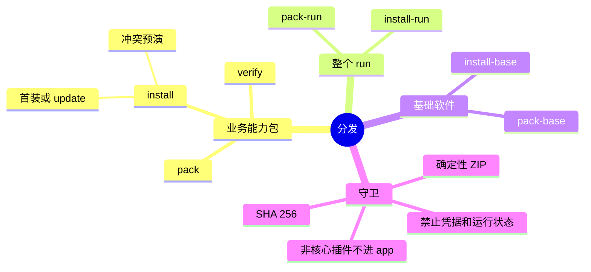

# 能力包打包、验证与安装

能力包是独立、无运行时依赖、确定性压缩的 ZIP 制品。打包、校验和安装统一由根目录 `run.sh` 调用 `packages/tooling/run/src/package.mjs`；手动压缩或覆盖会绕过哈希、凭据和路径审计。

## 分发路径



| 目标 | 命令 | 结果 |
| :--- | :--- | :--- |
| 能力包 | `bash ./run.sh pack <capability-dir> [out.zip]` | ZIP 与同名 `.sha256`。 |
| 校验 | `bash ./run.sh verify <capability.zip> [--expect-sha256 <hex>]` | 零执行沙箱审计结构、清单和哈希。 |
| 安装/更新 | `bash ./run.sh install <capability.zip> [--dir <dir>] [--run <run.config.json>] [--update] [--expect-sha256 <hex>]` | 冲突预演后装配。 |
| 分享整 run | `bash ./run.sh pack-run <run-dir> [out.zip]` | 排除 `.generated`、`run.lock.json`、`node_modules`；ZIP 顶层为 `<runName>/`。 |
| 安装整 run | `bash ./run.sh install-run <run.zip> [target-base-dir]` | 解压至 `runs/<runName>/`。 |
| 基础软件 | `bash ./run.sh pack-base [repo-root] [out.zip]` | 全仓核心底座与工具包。 |
| 安装基础软件 | `bash ./run.sh install-base <base.zip> <target-dir>` | 全新目录或受管设备部署。 |

## 能力包结构与清单

```text
<capability-id>/
├── graphframework.capability.json
├── assembly.mjs
└── plugins/
    ├── backend/<plugin-id>/
    │   ├── graphframework.plugin.json
    │   ├── PACKAGE.md
    │   ├── index.mjs
    │   └── docs/INTEGRATION.md
    └── frontend/<plugin-id>/     # 含 UI 时才有
        ├── graphframework.plugin.json
        ├── PACKAGE.md
        └── index.html / src / ...
```

```json
{
  "id": "my-automation-capability",
  "version": "1.0.0",
  "minFrameworkVersion": "0.2.0",
  "summary": "批量执行与物理反馈采集",
  "workflow": "https://ecs.your-server.com/knowledgeroot/workflows/batch-run.md"
}
```

| 字段 | 约束 |
| :--- | :--- |
| `id` | 必填，匹配 `^[A-Za-z0-9][A-Za-z0-9._-]*$`。 |
| `version` | 必填，SemVer。 |
| `minFrameworkVersion` | 可选，最低兼容框架版本。 |
| `summary` | 可选，业务职责。 |
| `workflow` | 可选，工作流或知识库权威链接。 |

`assembly.mjs` 必须导出 `id` 和 `contribute(run)`；`id` 与清单一致，插件路径不得逃出能力目录，Node factory 必须在插件 manifest 声明。系统公共 Node 只通过 `requireNode` 引用，不打进能力包：

```js
export default {
  id: 'my-automation-capability',
  contribute(run) {
    run.backendPlugin({ id: 'my-automation-backend', path: './plugins/backend/my-automation-backend' })
    run.node({ id: 'automation.executor', plugin: 'my-automation-backend', factory: 'createAutomationNode' })
    run.requireNode('system.timer')
    // 含 UI 时再调用 run.frontendPlugin(...) 与 run.frontend(...)
  },
}
```

## 安全与确定性

发现违禁文件时 `pack` 报错，不静默丢弃：

| 类别 | 禁止内容 |
| :--- | :--- |
| 构建与版本控制 | `node_modules`、`.generated`、`.git`、`.hg`、`.svn`。 |
| 凭据 | `.env`、`daemon-token`、`control-token`、`control.json`、`environment.sh`，以及任何密钥、Token、密码配置。 |
| 运行状态 | `run.lock.json`、`config-snapshot.json`、`close-result.json`、日志、SQLite 或临时状态文件。 |
| 路径 | 绝对路径或用 `..` 跳出能力目录的引用。 |

确定性 ZIP 不依赖系统 `zip` 或第三方 npm 包；实现用 Node.js Buffer 和 CRC32，固定每项 DOS 时间为 `2020-01-01 00:00:00`（`dosTime = 0`，`dosDate = ((2020 - 1980) << 9) | (1 << 5) | 1`），以 Stored 模式保存，路径统一为相对 `/` 且只有一个 `<capability-id>/` 顶层目录。旁产物 `<capability-id>-<version>.zip.sha256` 格式为 `<hash>  <filename>`。

## 发布、接收与冲突


发布前运行 `bash ./run.sh validate runs/<name>/run.config.json`；接收方用 `verify --expect-sha256` 对照哈希。校验器在临时目录解包，检查唯一顶层目录、违禁内容、清单与 SemVer、`assembly.id`、插件存在性及 `apiVersion: 2`、factory 导出、`PACKAGE.md` 的 ID/版本。

```bash
bash ./run.sh verify my-feature-1.0.0.zip --expect-sha256 <hex>
bash ./run.sh install my-feature-1.0.0.zip --run runs/<your-name>/run.config.json
```

`install --run` 写入前预演同名 Node、插件和前端面板冲突，检测已安装目录的本地修改。首装向 `assembly.modules` 追加相对装配路径；`--update` 整体替换现有目录，不重复追加模块路径。

| 冲突选择 | 行动 |
| :--- | :--- |
| 保留本地权威实现 | 终止安装，放弃新包。 |
| 接受传入升级 | 使用 `--update` 原位整体替换；旧数据遵守 generation 因果断代。 |
| 两种能力并存 | 新建不同插件与 Node ID 的扩展插件，用定向 Info 协调。 |

不能直接改正式插件目录、静默覆盖其他 Node Owner，或绕过预演。

## 目录边界与基础软件包

```text
app/                       核心底座与核心插件
runs/<name>/capabilities/  业务能力包安装目录
runs/<name>/plugins/       非核心插件开发目录
```

非核心插件先在独立 run 测试，再通过 `runs/main/capabilities/` 或 `runs/main/plugins/` 并入主 run；不进入 `app/`。

`pack-base` 归集内容：

| 分类 | 路径 |
| :--- | :--- |
| Rust 内核、多语言 SDK、桌面宿主、工作台、契约与工具 | `packages/` |
| 权威与备用参考 | `REFERENCE/`、`DOCUMENTS/` |
| 六类核心插件 | `app/plugins/*`：`unified-recorder`、`browser-recorder`、`os-recorder`、`ufo-computer-control`、`demo-topology`、`hello-counter` |
| Agent 技能 | `.agents/skills/*`：阿里云 Workbench、浏览器、UFO、图健康等 |
| MCP 配置 | `.omp/*`，包括 `mcp.json` |
| 基准与主 run | `runs/alice/`、`runs/main/` |
| 根规范 | `run.sh`、`AGENTS.md`、`README.md`、`LICENSE`、`.gitattributes`、`.gitignore`、`skills-lock.json` |

基础包排除凭据（如 `credentials.json`、`.env`、各种 token）、依赖与编译产物（`node_modules/`、`target/`、`.git/`、`.generated/`、`.playwright-cli/`、`.playwright-mcp/`、`.test-temp/`），以及个人 run 锁、生成数据与日志。凭据由管理员独立安全分发。

相关文档：[冷启动](cold-start.md)、[团队分发契约](distribution-contract.md)、[工作流生命周期](../workflow/workflow-elements-and-lifecycle.md)、[测试规范](../testing-specification.md)。
