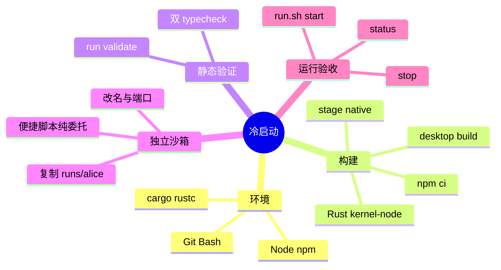

# 冷启动与首次开发环境初始化

适用于新设备或未初始化工作区。完成标准：Git Bash（Windows）、Node.js ≥18、npm、stable Rust 可用；SDK/desktop 依赖和原生绑定就绪；双 TypeScript 检查及主 run 静态配置校验通过；独立 run 可经 `run.sh` 启停。

## 五步闭环



### 1. 探测环境

在仓库根目录运行：

```bash
git --version
bash --version
node --version
npm --version
cargo --version
rustc --version
```

Windows 必须有执行根目录 `run.sh` 的 Git Bash。若 Git 已装但 `bash` 不在 `PATH`，定位本机 Git for Windows 的 `bin` 目录并加入用户 `PATH`。不能用 PowerShell、WSL 或临时脚本绕过统一 run。各包有独立 lockfile；根目录不是统一 npm workspace。

### 2. 安装并构建

```bash
npm --prefix packages/sdk/javascript ci
npm --prefix packages/desktop ci
cargo build --manifest-path packages/rust/Cargo.toml -p graphframework-kernel-node
node packages/rust/scripts/stage-native.mjs
node packages/rust/scripts/stage-backend-native.mjs
npm --prefix packages/desktop run build
```

已有工作区仅在确认 lockfile 与未保存环境不受影响时重跑 `npm ci`；其他包按需安装。两个 stage 脚本将平台原生库放到 SDK 和 Backend 所需位置，缺少会导致加载失败。

### 3. 静态验证

```bash
npm --prefix packages/desktop run typecheck
npm --prefix packages/sdk/javascript run typecheck
bash ./run.sh validate runs/main/run.config.json
```

环境验收无需启动应用；不能直接执行 `npx electron` 或改动 `packages/desktop/host/main.mjs` 绕过守卫。

### 4. 建立独立 Run

复制 `runs/alice/` 为稳定且独占的 `runs/<your-name>/`，改 `run.config.json` 的 `name`，检查 daemon 端口和资源是否冲突。目录包含 `assembly.mjs`、`run.config.json`、Bash 与 Windows 的 `start/status/stop` 便捷脚本。

便捷脚本只透传根目录 `run.sh`，例如 `bash "$REPO_ROOT/run.sh" start "$CONFIG" "$@"`；不能自写启动逻辑。修改展示名称后，确保 `runs/*/*.cmd` 保持 CRLF（`.gitattributes` 强制）；LF 可能令 `cmd.exe` 把引号和中文参数拆错。

### 5. 启停验收

```bash
bash ./run.sh validate runs/<your-name>/run.config.json
bash ./run.sh start runs/<your-name>/run.config.json
bash ./run.sh status runs/<your-name>/run.config.json
bash ./run.sh stop runs/<your-name>/run.config.json
```

Windows 的 `start.cmd`、`status.cmd`、`stop.cmd` 只是上述命令的便捷入口。

## Run 生命周期


启动时由 `supervisor.sh` 按上图顺序完成八步：校验配置/端口/文件边界并锁定 run；拉起独占 daemon；装载装配与物理 Adapter；构建前端与 host；启动 Electron 并注入 `context.json` 的端口和令牌；建立只读 Projection 与受限 Info 通道；验证界面和业务状态，结算 `lifecycle.startInfos`；`stop` 对称关闭。不能跳过阶段。

## 常见故障

| 现象 | 原因与处置 |
| :--- | :--- |
| 找不到 `graphframework-kernel-node.node` | 原生库未分发；重跑 `stage-native.mjs` 与 `stage-backend-native.mjs`。 |
| 提示 `Launch a configured run...` | 触发直接启动守卫；使用根目录 `bash ./run.sh start runs/<name>/run.config.json`。 |
| `.cmd` 报 `config.json"` 或中文参数错位 | 换行变 LF；恢复 CRLF。 |
| `Kernel daemon port collision` | 私有端口重复；调整该 run 配置。 |
| `typecheck` 失败 | 修复类型或导出错误，再继续启动验收。 |

关联：[核心心智模型](../architecture/mental-model.md)、[测试规范](../testing-specification.md)、[能力包](capability-packaging.md)、[分发契约](distribution-contract.md)。
