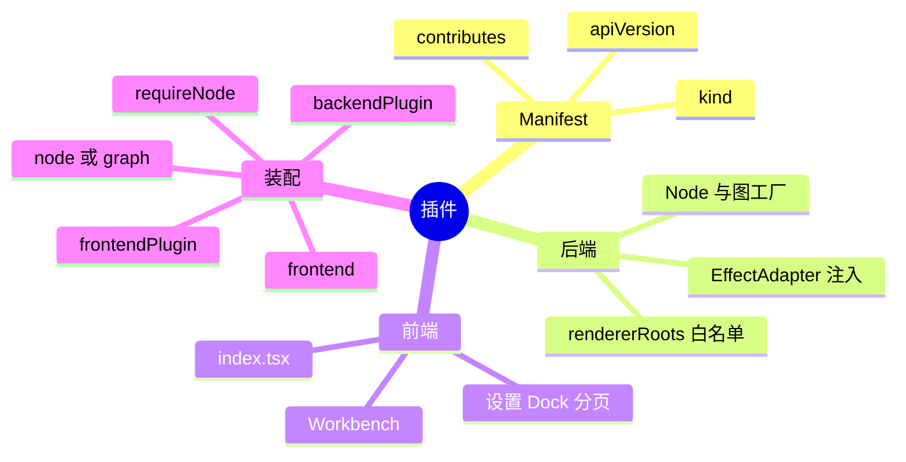
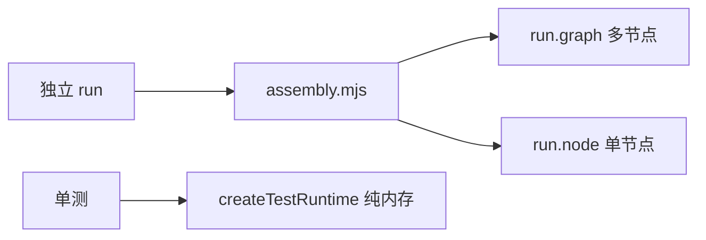

# 核心插件索引与装配

后端在 `app/plugins/backend/*`，前端在 `app/plugins/frontend/*`。两者与 `runs/<name>/plugins/` 下的非核心插件使用相同 Manifest、SDK 和生命周期。旧 `app/plugins/demo-topology/` 是 v1 路径；新开发使用 backend/frontend 分目录。

## 契约总览



`graphframework.plugin.json` 由 `parseStudioPluginManifest` 校验。`apiVersion` 支持 1/2；v2 的 `kind` 只可为 `backend` 或 `frontend`，`contributes` 不跨 kind 混用。

| kind | `contributes` 关键字段 | 例子 |
| :--- | :--- | :--- |
| backend | `backend`, `nodeFactories[]`, `graphFactories[]` | `index.mjs`, `createUnifiedRecorderGraph` |
| frontend | `host`, `frontend`, `elements[]`, `workspaces[]` | `desktop/main.mjs`, `index.tsx` |

```json
{"id":"example.unified-recorder","name":"Unified Recorder","version":"0.1.0","apiVersion":2,"kind":"backend","contributes":{"backend":"index.mjs","nodeFactories":[],"graphFactories":["createUnifiedRecorderGraph"]}}
```

```json
{"id":"example.unified-recorder","name":"Unified Recorder","version":"0.1.0","apiVersion":2,"kind":"frontend","contributes":{"host":"desktop/main.mjs","frontend":"index.tsx","elements":[],"workspaces":[]}}
```

| 暴露面 | 契约 |
| :--- | :--- |
| Node | 继承 `Node`、`ExecutionWorldNode` 或 `ObservationWorldNode`。单节点用 `defineNodeFactory`。 |
| 工厂上下文 | `pluginId`, `dependencies`, `instanceId`, `nodeId`, `params`, `bindings`, `nodeIdFor`；依赖注入 Adapter/路径，不承载业务 State。 |
| 图工厂 | `create<Feature>Graph(ctx)` 返回 `Node[]`；`describe()` 可声明 `kind`, `localIds`, `requiredBindings`, `rendererRoots`，且为纯函数。六个核心后端插件均提供它。 |
| 后端模块 | 默认导出 `defineBackendPlugin({ id, createNodes, rendererRoots })`；每个白名单项含 `targetNodeId`, `infoType`, `validate`，由宿主 `assertRendererRoot` 校验。内部 Info 不向 Renderer 开放。 |
| 前端 | `index.tsx` 挂载 `#root` 并具名导出 `App`；遵守[前端规范](frontend-specification.md)：设置、自由切分/浮窗、单页也保留的底部分页。 |
| Run | `run.node/graph` 条目含 `id`, `plugin`, `factory`, 可选 `params/bindings`；图的 `localIds` 与实例命名空间精确对应。 |

## 六个核心插件

| 插件 | 工厂 | 定位 |
| :--- | :--- | :--- |
| [统一录制器](unified-recorder.md) `example.unified-recorder` | `createUnifiedRecorder` / `createUnifiedRecorderGraph` | `UnifiedSession/Capture/ObserverNode`；桌面、浏览器、声音与字幕合流，Electron/React 主工作台。 |
| [浏览器录制器](browser-recorder.md) `example.browser-recorder` | `createBrowserRecorder` / `createBrowserRecorderGraph` | `RecordingSession/BrowserCapture/BrowserObserverNode`；Playwright CLI 与 CDP 9343 实时录制。 |
| [桌面录制器](os-recorder.md) `example.os-recorder` | `createOsRecorder` / `createOsRecorderGraph` | `RecordingSession/Capture/ObserverNode`；PSR ZIP、XML/MHT、键鼠与截图。 |
| [UFO 控制](ufo-computer-control.md) `example.ufo-computer-control` | `createUfoComputerControl` / `createUfoComputerControlGraph` | `UfoComputerSession/Execution/ObservationNode`；Windows UIA 巡检与十类指令，纯后端。 |
| [拓扑演示](demo-topology.md) `demo.topology` | `createDemoTopology` / `createDemoTopologyGraph` | 订单扇出扇入、Ledger 汇聚与动态 Fraud 节点，Electron/React。 |
| [计数器](hello-counter.md) `example.hello-counter` | `createCounterNode` | `CounterNode`；最小单飞与离线因果诊断，纯后端。 |

## 三种装配



生产装配在 `runs/<name>/assembly.mjs` 注册插件和图，按实例 ID 绑定前端并守护关键节点：

```js
export default {
  id: 'my-workflow.assembly',
  contribute(run) {
    run.backendPlugin({ id: 'example.unified-recorder', path: '../../app/plugins/backend/unified-recorder' })
    run.backendPlugin({ id: 'example.ufo-computer-control', path: '../../app/plugins/backend/ufo-computer-control' })
    run.frontendPlugin({ id: 'example.unified-recorder', path: '../../app/plugins/frontend/unified-recorder' })
    run.graph({ id: 'recorder', plugin: 'example.unified-recorder', factory: 'createUnifiedRecorderGraph' })
    run.graph({ id: 'computer', plugin: 'example.ufo-computer-control', factory: 'createUfoComputerControlGraph' })
    run.frontend({ id: 'main-ui', plugin: 'example.unified-recorder', graph: 'recorder' })
    run.requireNode('recorder/session')
    run.requireNode('computer/session')
  },
}
```

单节点用 `run.backendPlugin(...)` + `run.node({ id: 'my-counter', plugin: 'example.hello-counter', factory: 'createCounterNode' })` + `run.requireNode('my-counter')`。启动只走 `bash ./run.sh start runs/<name>/run.config.json`。

单测用 `createTestRuntime({ nodes })`，构造工厂时注入 Mock `EffectAdapter`，以 `runtime.inject({ targetNodeId, info })` 发消息，`await runtime.waitForQuiescence()` 等待结算，`runtime.getState(nodeId)` 断言状态，最后 `runtime.dispose()`。
