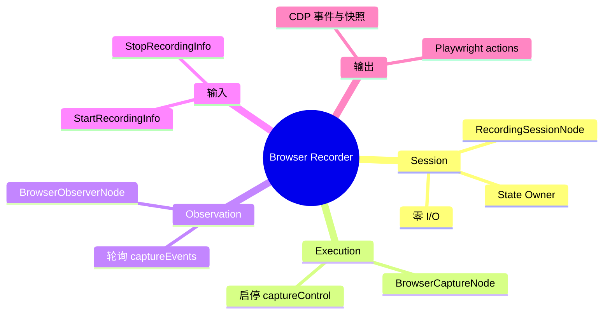
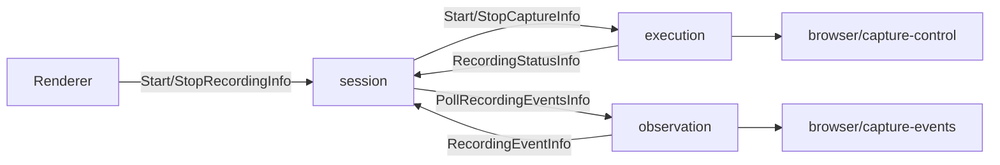

# 浏览器操作录制插件

| 项目 | 路径 |
| :--- | :--- |
| ID | `example.browser-recorder` |
| 后端 | [`app/plugins/backend/browser-recorder/`](../../app/plugins/backend/browser-recorder/) |
| 前端 | [`app/plugins/frontend/browser-recorder/`](../../app/plugins/frontend/browser-recorder/) |

浏览器本体留在 Node 之外。插件既可使用 `playwright-cli` 管道，也可使用 CDP WebSocket 实时录制器；浏览器 I/O 只经宿主注入的 `EffectAdapter`。

## 因果结构





## 工厂、状态与 Info

| 工厂 | 返回/描述 |
| :--- | :--- |
| `createBrowserRecorder(ctx)` | `{ session, execution, observation }`；`ctx` 可提供 `nodeIdFor`、`instanceId` 和 `dependencies.captureControl/captureEvents`。 |
| `createBrowserRecorderGraph(ctx)` | `Node[]`；`describe()` 为 `kind: 'graph'`，本地 ID 为 `session/execution/observation`，`requiredBindings: []`。 |

节点默认 ID：`example.browser-recorder/session`、`execution`、`observation`；实例化后使用 `<instanceId>/<localId>`。`rendererRoots` 只允许向 session 发送 `StartRecordingInfo`、`StopRecordingInfo`，并进行校验。

Session 状态：`status: idle | recording`、`sessionId`、`handle`、`lastActions`、`eventCount`、`lastEvent`、`lastError`。

| Info | 处理 |
| :--- | :--- |
| `StartRecordingInfo { sessionId? }` | 仅 idle 可用；置 recording、清空历史，发送 `StartCaptureInfo`。 |
| `StopRecordingInfo` | 仅 recording 可用；置 idle，发送 `StopCaptureInfo`。 |
| `RecordingStatusInfo { status, handle, actions, error }` | 同步物理状态、句柄、动作或错误。 |
| `RecordingEventInfo { event: { code, kind } }` | 追加 Playwright 代码，递增 `eventCount`。 |

`BrowserCaptureNode(id, sessionId, adapter, observationId)` 用 `captureControl` 执行 `{ op: 'start' | 'stop', sessionId }` 并回发状态；停止时回传完整 actions。`BrowserObserverNode(id, sessionId, adapter)` 用 `captureEvents` 执行 `{ op: 'poll', sessionId, cursor }` 并逐条发送事件。

## 物理适配器

`createBrowserCaptureControlAdapter({ runCli, session })` 与 `createBrowserCaptureEventsAdapter({ runCli, session })` 用宿主提供的 `runCli(args)` 驱动 `playwright-cli`。Adapter ID 分别为 `browser/capture-control` 和 `browser/capture-events`。

`createCdpRecorder({ cdpUrl: 'http://127.0.0.1:9343' })` 返回可注入的 `{ captureControl, captureEvents }`。它通过 `Target.setAutoAttach` 监听新页，以 `Runtime.addBinding('__recordAction')` 捕获点击、填写和导航。选择器优先级：

```text
getByTestId → getByRole → getByPlaceholder → getByLabel → locator → getByText
```

```js
import { createCdpRecorder } from '../../app/plugins/backend/browser-recorder/cdp-recorder.mjs'
const { captureControl, captureEvents } = createCdpRecorder({ cdpUrl: 'http://127.0.0.1:9343' })
// captureControl.execute({ op: 'start' | 'stop', sessionId })
// captureEvents.execute({ op: 'poll', sessionId, cursor })
```

## 装配与测试

```js
export default {
  id: 'browser.assembly',
  contribute(run) {
    run.backendPlugin({ id: 'example.browser-recorder', path: '../../app/plugins/backend/browser-recorder' })
    run.frontendPlugin({ id: 'example.browser-recorder', path: '../../app/plugins/frontend/browser-recorder' })
    run.graph({ id: 'browser-rec', plugin: 'example.browser-recorder', factory: 'createBrowserRecorderGraph' })
    run.requireNode('browser-rec/session')
  },
}
```

内存单测使用 `createTestRuntime`，注入 Mock `captureControl`，依次向 `<instanceId>/session` 发送开始/停止消息并等待 `waitForQuiescence()`，断言 `lastActions`，最后调用 `runtime.dispose()`。
