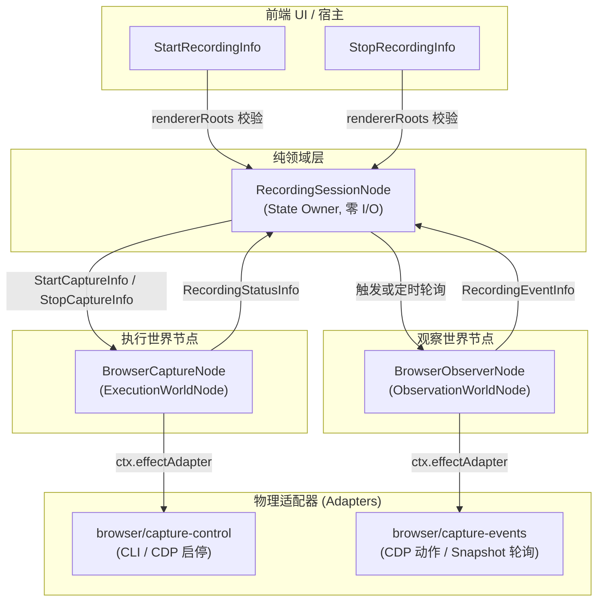

# 浏览器操作录制插件 (Browser Recorder Plugin)

插件 ID：`example.browser-recorder`  
代码源码路径：
- 后端：[`app/plugins/backend/browser-recorder/`](file:///c:/Users/kp157/Desktop/PM/GVSDK/app/plugins/backend/browser-recorder)
- 前端：[`app/plugins/frontend/browser-recorder/`](file:///c:/Users/kp157/Desktop/PM/GVSDK/app/plugins/frontend/browser-recorder)

`example.browser-recorder` 是专注于 Web 浏览器操作的录制插件。它支持两种录制实现路线：
1. **基于 `playwright-cli` 的开箱即用录制管道**；
2. **基于 Chrome DevTools Protocol (CDP) WebSocket 的实时流式录制器 (`cdp-recorder.mjs`)**。

插件严格恪守微内核红线：**浏览器本体永远在 Node 之外**，纯领域 Node 零 I/O，不直接依赖 `playwright` 或 `playwright-core`，所有浏览器交互通过宿主注入的 `EffectAdapter` 进行。

---

## 1. 架构角色与因果流通 (Causal Architecture)



---

## 2. 节点工厂与图工厂 (Factories)

### 2.1 节点类工厂：`createBrowserRecorder(ctx)`

导出路径：`import { createBrowserRecorder } from 'app/plugins/backend/browser-recorder/index.mjs'`

- **函数签名**：
  ```typescript
  function createBrowserRecorder(ctx?: {
    instanceId?: string;
    nodeIdFor?: (local: string) => string;
    dependencies?: {
      captureControl?: EffectAdapter;
      captureEvents?: EffectAdapter;
    };
  }): {
    session: RecordingSessionNode;
    execution: BrowserCaptureNode;
    observation: BrowserObserverNode;
  };
  ```
- **返回值**：
  - `session`: `RecordingSessionNode`（默认 ID：`example.browser-recorder/session`）
  - `execution`: `BrowserCaptureNode`（默认 ID：`example.browser-recorder/execution`）
  - `observation`: `BrowserObserverNode`（默认 ID：`example.browser-recorder/observation`）

---

### 2.2 图工厂：`createBrowserRecorderGraph(ctx)`

导出路径：`import { createBrowserRecorderGraph } from 'app/plugins/backend/browser-recorder/index.mjs'`

- **函数签名**：
  ```typescript
  function createBrowserRecorderGraph(ctx?: Context): Node[];
  ```
- **描述符元数据 (`createBrowserRecorderGraph.describe()`)**：
  ```javascript
  {
    kind: 'graph',
    localIds: ['session', 'execution', 'observation'],
    requiredBindings: [],
    rendererRoots: [
      { localId: 'session', infoType: 'StartRecordingInfo' },
      { localId: 'session', infoType: 'StopRecordingInfo' },
    ],
  }
  ```

---

## 3. 节点类规格与契约字典

### 3.1 `RecordingSessionNode`

#### 状态定义 (State)
```typescript
interface BrowserSessionState {
  status: 'idle' | 'recording';
  sessionId: string | null;
  handle: string | null;
  lastActions: string | null;
  eventCount: number;
  lastEvent: any | null;
  lastError: string | null;
}
```

#### Info 契约处理 (Inbound Infos)
| Info 类型 (`info.type`) | 载荷参数 | 语义与变迁 |
| :--- | :--- | :--- |
| `StartRecordingInfo` | `{ sessionId?: string }` | 检查状态必须为 `idle`；置状态为 `recording`，清空历史动作，向 `execution` 发送 `StartCaptureInfo`。 |
| `StopRecordingInfo` | `{}` | 检查状态必须为 `recording`；置状态为 `idle`，向 `execution` 发送 `StopCaptureInfo`。 |
| `RecordingStatusInfo` | `{ status, handle, actions, error }` | 同步底层物理句柄或错误。 |
| `RecordingEventInfo` | `{ event: { code, kind } }` | 追加新的 Playwright 代码片段至 `lastActions`，递增 `eventCount`。 |

---

### 3.2 `BrowserCaptureNode` (ExecutionWorldNode)
- 构造入参：`constructor(id, sessionId, adapter, observationId)`
- 处理 Info：
  - `StartCaptureInfo`: 调用 `captureControl` 执行 `{ op: 'start', sessionId }`，回发 `RecordingStatusInfo`；
  - `StopCaptureInfo`: 调用 `captureControl` 执行 `{ op: 'stop', sessionId }`，回传录制生成的全量 Playwright `actions`。

---

### 3.3 `BrowserObserverNode` (ObservationWorldNode)
- 构造入参：`constructor(id, sessionId, adapter)`
- 处理 Info：
  - `PollRecordingEventsInfo`: 调用 `captureEvents` 执行 `{ op: 'poll', sessionId, cursor }`，将捕获到的事件通过 `RecordingEventInfo` 发送回 `session`。

---

## 4. 适配器与原生 CDP 录制器 (Adapters & CDP Recorder)

插件提供了开箱即用的两套物理适配器生成器：

### 4.1 CLI 管道适配器

```javascript
import {
  createBrowserCaptureControlAdapter,
  createBrowserCaptureEventsAdapter,
} from 'app/plugins/backend/browser-recorder/index.mjs';

// 基于 playwright-cli 的控制适配器
const controlAdapter = createBrowserCaptureControlAdapter({
  session: 'rec-session',
  runCli: async (args) => {
    // 宿主调用 playwright-cli 进程
    return output;
  },
});

// 基于 playwright-cli 的观察适配器
const eventsAdapter = createBrowserCaptureEventsAdapter({
  session: 'rec-session',
  runCli: async (args) => {
    return output;
  },
});
```

### 4.2 CDP 实时流式录制器 (`createCdpRecorder`)

导出路径：`import { createCdpRecorder } from 'app/plugins/backend/browser-recorder/cdp-recorder.mjs'`

通过 Chrome 9343 端口连接 Chrome 实例：
- 自动挂载 `Target.setAutoAttach` 监听所有新开页面与标签页；
- 注入 `Runtime.addBinding('__recordAction')` 监听用户的真实点击、填写输入、页面跳转；
- 按照优先级生成最健壮的 Playwright 选择器：
  1. `page.getByTestId(...)`
  2. `page.getByRole(...)`
  3. `page.getByPlaceholder(...)`
  4. `page.getByLabel(...)`
  5. `page.locator(...)`
  6. `page.getByText(...)`

```javascript
import { createCdpRecorder } from 'app/plugins/backend/browser-recorder/cdp-recorder.mjs';

const cdp = createCdpRecorder({
  cdpUrl: 'http://127.0.0.1:9343',
  onAction: (action) => console.log('Live action:', action.code),
});

await cdp.start();
// cdp 暴露标准的 controlAdapter 与 eventsAdapter
```

---

## 5. 推荐装配与实例化方式 (Recommended Assembly)

### 5.1 工作流声明式装配 (`assembly.mjs`)

```javascript
// runs/<name>/assembly.mjs
export default {
  id: 'browser.assembly',
  contribute(run) {
    // 1. 注册后端插件
    run.backendPlugin({
      id: 'example.browser-recorder',
      path: '../../app/plugins/backend/browser-recorder',
    });

    // 2. 注册前端插件
    run.frontendPlugin({
      id: 'example.browser-recorder',
      path: '../../app/plugins/frontend/browser-recorder',
    });

    // 3. 实例化图
    run.graph({
      id: 'browser-rec',
      plugin: 'example.browser-recorder',
      factory: 'createBrowserRecorderGraph',
    });

    // 4. 守卫核心节点
    run.requireNode('browser-rec/session');
  },
};
```

### 5.2 单元测试中内存实例化

```javascript
import { createTestRuntime } from '@graphframework/sdk/testing';
import { createBrowserRecorder } from '../../app/plugins/backend/browser-recorder/index.mjs';

const runtime = createTestRuntime();

const mockControl = {
  id: 'browser/capture-control',
  execute: async ({ op }) => ({ handle: 'mock-browser-handle', actions: 'await page.click("button");' }),
};

const { session, execution, observation } = createBrowserRecorder({
  instanceId: 'test-browser',
  dependencies: { captureControl: mockControl },
});

runtime.mountNode(session);
runtime.mountNode(execution);
runtime.mountNode(observation);

await runtime.send({ type: 'StartRecordingInfo', sessionId: 'test-01' }, 'test-browser/session');
await runtime.send({ type: 'StopRecordingInfo' }, 'test-browser/session');

const state = runtime.readState('test-browser/session');
console.log('Recorded Playwright Actions:', state.lastActions);
```
