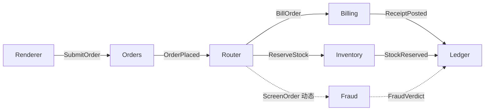
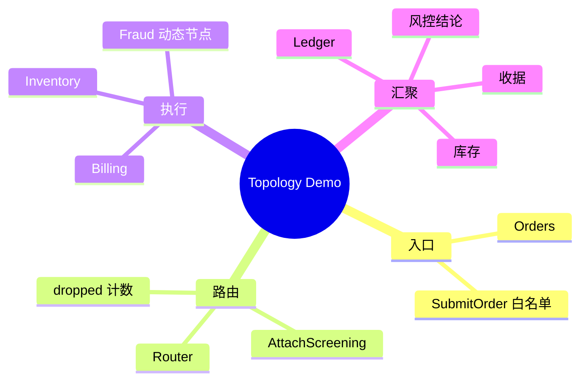

# 因果拓扑演示插件

| 项目 | 路径 |
| :--- | :--- |
| ID | `demo.topology` |
| 后端 | [`app/plugins/backend/demo-topology/`](../../app/plugins/backend/demo-topology/) |
| 前端 | [`app/plugins/frontend/demo-topology/`](../../app/plugins/frontend/demo-topology/) |

插件以订单履约展示定向 Info、并行扇出、回执汇聚、运行期增加筛查节点和投递丢弃反馈。Renderer 只能向 `orders` 发送经过校验的 `SubmitOrder`。

## 因果图





## 工厂与节点契约

`createDemoTopology(ctx)` 返回 `{ orders, router, billing, inventory, ledger }`；`ctx` 可提供 `nodeIdFor` 或 `instanceId`。`createDemoTopologyGraph(ctx)` 返回 `Node[]`，`describe()` 为 `kind: 'graph'`、五个本地 ID、`requiredBindings: []`、`rendererRoots: [{ localId: 'orders', infoType: 'SubmitOrder' }]`。

| 节点 | 默认 ID | State | 输入 → 输出 |
| :--- | :--- | :--- | :--- |
| `OrdersNode` | `demo.orders` | `placed: number` | `SubmitOrder { orderId }` → `OrderPlaced`。 |
| `RouterNode` | `demo.router` | `routed`, `dropped`, `screening[]` | `OrderPlaced` → `BillOrder`、`ReserveStock`、各筛查节点的 `ScreenOrder`；`AttachScreening { nodeId }` 加入名单。 |
| `BillingNode` | `demo.billing` | `billed[]` | `BillOrder` → `ReceiptPosted`。 |
| `InventoryNode` | `demo.inventory` | `reserved[]` | `ReserveStock` → `StockReserved`。 |
| `LedgerNode` | `demo.ledger` | `receipts[]`, `reservations[]`, `verdicts[]` | 汇聚 `ReceiptPosted`、`StockReserved`、`FraudVerdict`。 |
| `FraudNode` | `demo.fraud` | `screened[]` | `ScreenOrder` → `FraudVerdict { orderId, verdict: 'clear' }`。 |

Router 用 `ctx.send(...)?.status === 'dropped'` 统计失败投递；未挂接 Fraud 时，原有账单和库存链仍可独立结算。

## 动态挂接与测试

生产 run 由宿主装配 Fraud 节点，再向 Router 发 `AttachScreening`。以下内存示例在创建测试 runtime 时装入 Fraud，演示相同的路由切换：

```js
import { createTestRuntime } from '@graphframework/sdk/testing'
import { FraudNode, createDemoTopology } from '../../app/plugins/backend/demo-topology/index.mjs'

const nodes = createDemoTopology({ instanceId: 'demo' })
const fraud = new FraudNode('demo/fraud', { ledger: 'demo/ledger' })
const runtime = createTestRuntime({ nodes: [...Object.values(nodes), fraud] })
runtime.inject({ targetNodeId: 'demo/router', info: { type: 'AttachScreening', nodeId: 'demo/fraud' } })
await runtime.waitForQuiescence()
runtime.inject({ targetNodeId: 'demo/orders', info: { type: 'SubmitOrder', orderId: 'ORD-999' } })
await runtime.waitForQuiescence()
const ledger = runtime.getState('demo/ledger')
// receipts、reservations、verdicts 均含 ORD-999。
runtime.dispose()
```

## Run 装配

```js
export default {
  id: 'demo.assembly',
  contribute(run) {
    run.backendPlugin({ id: 'demo.topology', path: '../../app/plugins/backend/demo-topology' })
    run.frontendPlugin({ id: 'demo.topology', path: '../../app/plugins/frontend/demo-topology' })
    run.graph({ id: 'demo-topo', plugin: 'demo.topology', factory: 'createDemoTopologyGraph' })
    run.requireNode('demo-topo/orders')
    run.requireNode('demo-topo/ledger')
  },
}
```

纯内存测试也可只装静态五节点，向 `<instance>/orders` 注入 `SubmitOrder`，等待 `waitForQuiescence()` 后断言 Ledger 的 `receipts` 与 `reservations`，最后释放 runtime。
