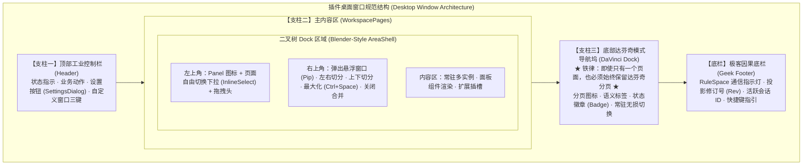

# 插件前端界面与工作台开发规范 (Plugin Frontend Specification)

本规范是 GraphFramework 中**所有官方核心插件（`app/plugins/frontend/*`）以及工作流自定义前端插件（`runs/<name>/plugins/frontend/*`）的强制界面设计与工程实现标准**。

为了向用户提供顶级工业软件级别的操作体验，所有插件前端**绝对严禁**编写粗糙简陋的单体网页或传统后台管理页面，必须全面接入 `@graphframework/workbench` 与 `@graphframework/ui`，并严格遵守以下三大核心支柱。

---

## 核心设计准则三大支柱 (The Three Pillars)



---

## 支柱一：顶部设置与偏好控制规范 (Top Settings & Header)

顶栏是插件全局控制与窗口级行为的中枢，高度统一为 `38px`（达芬奇设计系统标准高度）。

### 1.1 顶栏布局结构
顶栏必须包含四部分：
1. **左侧信息区**：应用 Logo/图标、插件主标题（使用 `--font-family-display`）、以及状态徽章（`IndustrialChip` 实时反映微内核状态 `idle/recording/running/error`）；
2. **业务快速动作区**：包含当前场景的高频操作按钮（如开始/停止录制、启动专用浏览器、打开产物目录等），按钮必须使用 `--action-primary-*` 或达芬奇标准 `.action-btn` 样式；
3. **全局设置入口（强制要求）**：必须包含 `<button className="action-btn" onClick={() => setIsSettingsOpen(true)}><Settings size={12} /><span>设置</span></button>`；
4. **自定义窗口控制三键**：在非 macOS 平台下，由自定义顶栏接管窗口控制（最小化 `—`、最大化/恢复 `▢`、关闭 `✕`），直接调用 `window.shell` 网桥。

### 1.2 全局偏好设置弹窗 (`SettingsDialog`)
点击设置按钮后，必须弹出 `@graphframework/ui` 提供的工业级 `SettingsDialog` 弹窗，支持用户调整三类偏好：
- **主题切换**：消费 `@graphframework/theme` 的四套主题（`dark` 暗色工业风、`light` 明亮素雅、`xueqing` 雪青、`shiliuqun` 石榴裙），严禁硬编码 Hex 色值；
- **排版与字号密度**：支持切换界面字体（`Inter`, `JetBrains Mono`, `System` 等）与显示密度（`compact` 紧凑、`standard` 标准、`spacious` 宽松）；
- **工作区布局重置与持久化**：支持用户将当前切分后的布局保存为该页面的默认布局（`saveWorkspaceDefault`），或一键恢复出厂默认布局（`saveActiveWorkspacePreference`）。

```tsx
<SettingsDialog
  isOpen={isSettingsOpen}
  onClose={() => setIsSettingsOpen(false)}
  currentTheme={theme}
  onThemeChange={handleThemeChange}
  currentFont={typography.font}
  onFontChange={handleFontChange}
  currentDensity={typography.size}
  onDensityChange={handleDensityChange}
  activeWorkspaceId={activeWorkspaceId}
  onSaveWorkspaceDefault={handleSaveWorkspaceDefault}
  onResetWorkspaceDefault={handleResetWorkspaceDefault}
/>
```

---

## 支柱二：Blender 级单页面自由切分与拖出规范 (Blender-Style Docking)

插件主内容区必须完全委托给 `@graphframework/workbench` 的二叉树 Dock 系统（`<main className="app-content"><WorkspacePages /></main>`），赋予用户像在 3D 软件 Blender 或影视剪辑软件中一样的终极自由度。

### 2.1 左上角：单页面自由切换与拖拽互换
每个切分出来的独立区域（`AreaShell`）的头部**左上角**必须提供：
1. **当前面板图标与切换器 (`InlineSelect`)**：
   - 允许用户在**任何单个区域的左上角**，随意将该区域的内容切换为插件注册的任意其他 Panel（例如在同一个区域内，从“录制面板”一秒切换为“事件流审计”或“代码回放”）；
   - 切页不丢失历史，通过 `area.panelHistory` 缓存多面板实例状态。
2. **区域拖拽把手 (`draggable={!floating}`)**：
   - 用户按住左上角区域头部可以进行拖拽；
   - 拖拽到同窗口内另一个区域上释放，触发 `workspace.area.swap`，瞬间互换两个面板的位置。

### 2.2 右上角与边缘：切分、拖出悬浮窗口与最大化
每个区域的头部**右上角**必须提供标准化的 5 组工业控制：
1. **拖出为悬浮窗口 / 放回主窗口 (`PictureInPicture2` 图标)**：
   - 点击该按钮（或**直接把左上角区域拖拽甩出主窗口视口外**），当前面板瞬间剥离为主窗口之外的**独立悬浮子窗口**（`floatingWindow.ts`）；
   - 悬浮窗口具有原生透明磨砂边框、独立置顶能力，并自动同步主窗口的主题、字体与 Token；
   - 再次点击按钮可将悬浮窗口无缝收回主工作台二叉树原位。
2. **左右水平切分 (`Columns2` 图标)**：
   - 触发 `commands.execute('workspace.area.split', { workspaceId, areaId: area.id, direction: 'horizontal' })`，将当前面板一分为二，生成并列左右双栏。
3. **上下垂直切分 (`Rows2` 图标)**：
   - 触发 `commands.execute('workspace.area.split', { workspaceId, areaId: area.id, direction: 'vertical' })`，将当前面板一分为二，生成上下堆叠视图。
4. **全屏最大化与恢复 (`Maximize2` / `Minimize2` 图标，全局快捷键 `Ctrl+Space` / `⌘+Space`)**：
   - 无论当前工作区被切分成了多少个碎块，按下 `Ctrl+Space` 或点击最大化按钮，当前焦点面板瞬间独占铺满整个工作区；再次触发立即恢复多栏并列切分。
5. **关闭并相邻合并 (`X` 图标)**：
   - 调用 `workspace.area.close` 关闭当前区域，二叉树自动将空间回退给同级的相邻区域；保底机制保证最后一个区域不可关闭。
6. **分界线自由拖拽缩放**：
   - 任意两区域之间的分界线由 `splitResizeGesture.ts` 接管，支持鼠标悬停高亮、拖拽微调比例并持久化布局。

---

## 支柱三：底部达芬奇模式分页规范 (DaVinci Mode Pagination)

达芬奇调色软件（DaVinci Resolve）标志性的底部工作区导航（Media, Cut, Edit, Fusion, Color, Fairlight, Deliver）是专业级工作流切换的典范。

### 3.1 核心铁律：即使只有一个页面，也必须始终保留达芬奇模式底栏！
> [!IMPORTANT]
> **无论插件逻辑多么简单、即使整套插件只有 1 个页面（Single Workspace），也绝对严禁隐藏或省略底部的达芬奇分页坞 (`nav.davinci-dock`)！**

**为什么坚持单页面也必须保留？**
1. **视觉结构与底座稳定性**：保证全仓所有插件拥有完全一致的视觉中轴线与视窗纵深，不因页面多寡导致底部高度跳动；
2. **无缝扩展性**：未来业务扩展增加第二、第三个视图时，用户心智模型无需任何迁移；
3. **状态与模式标识**：单页面在底部导航坞中作为当前活动模式的“工作态徽章”（带专属 Icon 与 `LIVE / ACTIVE` 标识），让用户明确当前身处的领域上下文。

### 3.2 达芬奇导航坞 DOM 结构规范
导航坞固定贴合在主内容区下方、极客底栏上方，高度固定为 `36px`：

```tsx
<nav className="davinci-dock" aria-label="工作区分页">
  {PAGE_TABS.map((tab) => {
    const isActive = activeWorkspaceId === tab.key;
    return (
      <button
        key={tab.key}
        type="button"
        className={`dock-item${isActive ? ' is-active' : ''}`}
        onClick={() => switchWorkspace(tab.key)}
      >
        <span className="dock-icon">{tab.icon}</span>
        <span className="dock-label">
          {tab.label}
          {tab.badge && <span className="dock-badge">{tab.badge}</span>}
        </span>
      </button>
    );
  })}
</nav>
```

- **单页面示范**：
  ```javascript
  const PAGE_TABS = [
    { key: 'main', label: '工作台全景', icon: <Layers size={14} />, badge: 'LIVE' },
  ];
  ```
- **多页面示范**：
  ```javascript
  const PAGE_TABS = [
    { key: 'session', label: '录制控制', icon: <Play size={14} />, badge: 'LIVE' },
    { key: 'audit',   label: '事件审计', icon: <ListFilter size={14} /> },
    { key: 'export',  label: '脚本导出', icon: <Code2 size={14} /> },
  ];
  ```

### 3.3 页面常驻与无损切换机制
在 `<WorkspacePages />` 中，所有 Workspace 页面均已实例化并常驻在 DOM 中（非激活页面通过 `display: none` 隐藏）：
- 切换达芬奇分页时，**绝不触发组件卸载（Unmount）**；
- 输入框正在输入的内容、滚动条当前偏移量、WebSocket 活跃连接与底层图订阅全部**完好保留**，杜绝切页重置数据。

---

## 支柱四：极客因果状态底栏规范 (Geek Footer)

紧贴达芬奇导航坞下方，必须保留一行高信噪比的极客状态底栏（`app-footer`，高度 `22px`）：

```tsx
<footer className="app-footer">
  <span>
    <i className={`connection-dot ${connected ? '' : 'is-offline'}`} />
    {connected ? 'RuleSpace 微内核协同中' : '微内核通信异常'}
  </span>
  <span className="footer-meta-tag">
    Rev: <code>{revision}</code>
  </span>
  <span className="footer-meta-tag">
    会话: <code>{sessionId ?? 'IDLE'}</code>
  </span>
  <span className="footer-meta-tag" style={{ marginLeft: '12px' }}>
    快捷键: <code>Ctrl+Space</code> 最大化当前面板 · 左上角自由切页 · 右上角切分与拖出窗口
  </span>
  <span className="footer-spacer" />
  <span>GraphFramework · DaVinci & Blender Dock Suite</span>
</footer>
```

- **`connection-dot`**：以微动呼吸灯形式展示物理 Rust 守护进程/RuleSpace 的因果连接状态；
- **修订版本号 `Rev`**：忠实反映微内核投影（Projection）的单调递增代数版本号；
- **快捷键指引**：显式提示用户 `Ctrl+Space` 最大化、左上角面板选择与右上角切分拖出操作。

---

## 5. 最小合规模板代码 (Standard Plugin Frontend Scaffold)

在开发新的插件前端（`frontend/app.tsx`）时，直接以以下标准模版为骨架：

```tsx
import { useState, useCallback } from 'react';
import { Settings, Layers } from 'lucide-react';
import {
  WorkbenchHostContext,
  WorkspacePages,
  readThemePreference,
  applyThemePreference,
  readTypographyPreferences,
  applyTypographyPreferences,
  saveWorkspaceDefault,
  saveActiveWorkspacePreference,
} from '@graphframework/workbench';
import { SettingsDialog, IndustrialChip } from '@graphframework/ui';
import '@graphframework/workbench/styles/index.css';
import './app.css';

// 达芬奇导航分页定义（★ 即使只有一个页面，也必须定义并展示 ★）
const PAGE_TABS = [
  { key: 'default', label: '默认工作区', icon: <Layers size={14} />, badge: 'READY' },
];

export function App() {
  const [isSettingsOpen, setIsSettingsOpen] = useState(false);
  const [activeWorkspaceId, setActiveWorkspaceId] = useState('default');
  const [theme, setTheme] = useState(readThemePreference);
  const [typography, setTypography] = useState(readTypographyPreferences);

  // 1. 设置偏好处理
  const handleThemeChange = (nextTheme) => {
    setTheme(nextTheme);
    applyThemePreference(nextTheme);
  };
  const handleFontChange = (nextFont) => {
    const next = { ...typography, font: nextFont };
    setTypography(next);
    applyTypographyPreferences(next);
  };
  const handleDensityChange = (nextSize) => {
    const next = { ...typography, size: nextSize };
    setTypography(next);
    applyTypographyPreferences(next);
  };

  return (
    <div className="app-shell" data-theme={theme}>
      {/* 顶部控制栏 */}
      <header className="app-header">
        <div className="header-brand">
          <span className="header-title">My Plugin Console</span>
          <IndustrialChip tone="normal">ONLINE</IndustrialChip>
        </div>
        <div className="header-actions">
          {/* 顶部设置按钮（强制） */}
          <button
            type="button"
            className="action-btn"
            onClick={() => setIsSettingsOpen(true)}
            title="工作台偏好设置"
          >
            <Settings size={12} />
            <span>设置</span>
          </button>
        </div>
      </header>

      {/* 主内容区：完全由 Blender 级二叉树 Dock 系统托管 */}
      <main className="app-content">
        <WorkspacePages />
      </main>

      {/* 底部达芬奇分页导航坞（强制保留，即使单页面） */}
      <nav className="davinci-dock" aria-label="工作区分页">
        {PAGE_TABS.map((tab) => (
          <button
            key={tab.key}
            type="button"
            className={`dock-item${activeWorkspaceId === tab.key ? ' is-active' : ''}`}
            onClick={() => setActiveWorkspaceId(tab.key)}
          >
            <span className="dock-icon">{tab.icon}</span>
            <span className="dock-label">
              {tab.label}
              {tab.badge && <span className="dock-badge">{tab.badge}</span>}
            </span>
          </button>
        ))}
      </nav>

      {/* 极客底栏 */}
      <footer className="app-footer">
        <span><i className="connection-dot" />RuleSpace 已就绪</span>
        <span className="footer-meta-tag">快捷键: <code>Ctrl+Space</code> 最大化当前区域 · 右上角切分与拖出</span>
        <span className="footer-spacer" />
        <span>GraphFramework Suite</span>
      </footer>

      {/* 全局偏好设置弹窗 */}
      <SettingsDialog
        isOpen={isSettingsOpen}
        onClose={() => setIsSettingsOpen(false)}
        currentTheme={theme}
        onThemeChange={handleThemeChange}
        currentFont={typography.font}
        onFontChange={handleFontChange}
        currentDensity={typography.size}
        onDensityChange={handleDensityChange}
        activeWorkspaceId={activeWorkspaceId}
        onSaveWorkspaceDefault={saveWorkspaceDefault}
        onResetWorkspaceDefault={saveActiveWorkspacePreference}
      />
    </div>
  );
}
```

---

## 6. 合规自查清单 (Frontend Compliance Checklist)

在为任何插件提交前端代码或进行代码审查时，逐条核对以下项目：

- [ ] **顶部设置齐全**：顶栏包含明确的设置按钮，点击能正确唤起 `SettingsDialog`，支持四套主题切换和排版密度微调。
- [ ] **二叉树 Dock 接管**：中间主区域使用 `<WorkspacePages />`，严禁在主区域硬编码固定不可调整的写死 `<div>` 布局。
- [ ] **左上角自由切页**：任意切分出来的面板左上角均带有 `InlineSelect`，可随意切换至插件已注册的任一 Panel。
- [ ] **切分与拖出全功能**：右上角支持弹出为悬浮独立窗口（PiP）、左右分栏、上下分栏、`Ctrl+Space` 最大化与关闭合并。
- [ ] **达芬奇底栏不缺失**：即使该插件仅有 1 个页面，底部仍完整渲染 `<nav className="davinci-dock">`，且样式、高亮及 Badge 正常工作。
- [ ] **常驻无损切换**：多页面切换不卸载 DOM，保留用户的输入、状态与滚动位置。
- [ ] **Token 纯净度**：样式只消费 `--surface-*`、`--content-*`、`--border-*`、`--action-*` 等语义 Token，零硬编码 Hex 色值。
