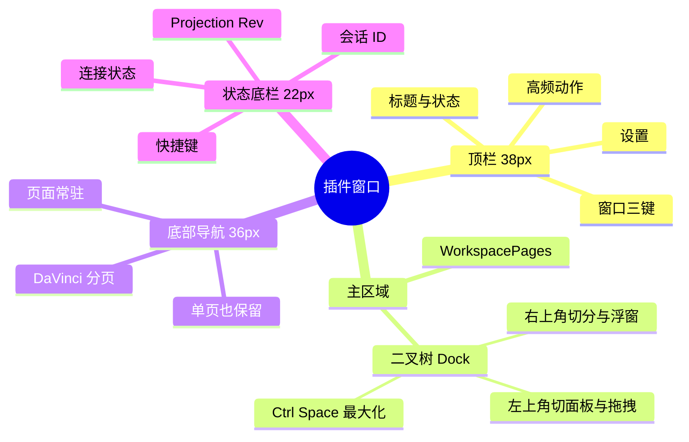

# 插件前端界面与工作台开发规范

适用于 `app/plugins/frontend/*` 和 `runs/<name>/plugins/frontend/*`。界面使用 `@graphframework/workbench` 与 `@graphframework/ui`。

## 窗口结构



## 顶栏与偏好

| 区域 | 要求 |
| :--- | :--- |
| 信息 | Logo/图标、标题（`--font-family-display`）、反映 `idle/recording/running/error` 的 `IndustrialChip`。 |
| 动作 | 场景高频操作，如启停录制、启动专用浏览器、打开产物；使用 `--action-primary-*` 或 `.action-btn`。 |
| 设置 | 明确的“设置”按钮打开 `SettingsDialog`。 |
| 窗口控制 | 非 macOS 使用 `window.shell` 控制最小化、最大化/恢复、关闭。 |

`SettingsDialog` 支持：

| 偏好 | 选项与约束 |
| :--- | :--- |
| 主题 | `dark`、`light`、`xueqing`、`shiliuqun`；消费 `@graphframework/theme`，不硬编码 Hex。 |
| 排版 | `Inter`、`JetBrains Mono`、`System` 等字体；`compact`、`standard`、`spacious` 三档密度。 |
| 布局 | 保存当前布局为默认（`saveWorkspaceDefault`），或恢复出厂布局（`saveActiveWorkspacePreference`）。 |

```tsx
<SettingsDialog
  isOpen={isSettingsOpen} onClose={() => setIsSettingsOpen(false)}
  currentTheme={theme} onThemeChange={handleThemeChange}
  currentFont={typography.font} onFontChange={handleFontChange}
  currentDensity={typography.size} onDensityChange={handleDensityChange}
  activeWorkspaceId={activeWorkspaceId}
  onSaveWorkspaceDefault={handleSaveWorkspaceDefault}
  onResetWorkspaceDefault={handleResetWorkspaceDefault}
/>
```

## Dock 区域

主内容由 `<main className="app-content"><WorkspacePages /></main>` 托管。`AreaShell` 的操作契约：

| 位置 | 操作 | 行为 |
| :--- | :--- | :--- |
| 左上角 | `InlineSelect` | 切到任意已注册 Panel；`area.panelHistory` 保留历史面板状态。 |
| 左上角 | 拖拽把手 | 拖到其他区域触发 `workspace.area.swap`；拖出视口形成独立悬浮窗。 |
| 右上角 | `PictureInPicture2` | 浮窗/收回；浮窗有磨砂边框、置顶能力，并同步主题、字体、Token。 |
| 右上角 | `Columns2` | `workspace.area.split`，`direction: 'horizontal'`，左右双栏。 |
| 右上角 | `Rows2` | `workspace.area.split`，`direction: 'vertical'`，上下双栏。 |
| 右上角 | `Maximize2` / `Minimize2` | 最大化/恢复；`Ctrl+Space`，macOS 为 `⌘+Space`。 |
| 右上角 | `X` | `workspace.area.close`，空间归还相邻区域；最后一个区域不可关闭。 |
| 分界线 | 拖拽 | `splitResizeGesture.ts` 调整比例并持久化。 |

## 底部分页与状态栏

即使只有一个 Workspace，也始终显示 `nav.davinci-dock`。页签包含图标、语义标签、可选 Badge 和活动态；单页可显示 `LIVE/ACTIVE`。固定高度 `36px`，位于主内容与状态栏之间。

`WorkspacePages` 让页面常驻 DOM，通过 `display: none` 隐藏非活动页。切页不卸载组件，保留输入、滚动、连接和图订阅。

```tsx
<nav className="davinci-dock" aria-label="工作区分页">
  {PAGE_TABS.map((tab) => (
    <button key={tab.key} type="button"
      className={`dock-item${activeWorkspaceId === tab.key ? ' is-active' : ''}`}
      onClick={() => switchWorkspace(tab.key)}>
      <span className="dock-icon">{tab.icon}</span>
      <span className="dock-label">{tab.label}{tab.badge && <span className="dock-badge">{tab.badge}</span>}</span>
    </button>
  ))}
</nav>
```

页签示例：单页 `[{ key: 'main', label: '工作台全景', icon: <Layers size={14} />, badge: 'LIVE' }]`；多页可用 `session/audit/export` 对应录制控制、事件审计、脚本导出。

状态栏 `app-footer` 固定高 `22px`，显示 `connection-dot`、微内核/RuleSpace 连接状态、Projection 修订号 `Rev`、当前会话 ID 和快捷键。连接灯反映 Rust 守护进程状态；`Rev` 必须取自投影。可在末尾显示产品标识。

## 接入要点

从 `@graphframework/workbench` 导入 `WorkspacePages`、`readThemePreference`、`applyThemePreference`、`readTypographyPreferences`、`applyTypographyPreferences`、`saveWorkspaceDefault`、`saveActiveWorkspacePreference` 和样式；从 `@graphframework/ui` 导入 `SettingsDialog`、`IndustrialChip`。`App` 管理设置弹窗、活动页、主题和排版状态，偏好回调同时更新 React 状态与持久化偏好。

结构顺序为 `app-header` → `app-content`（`WorkspacePages`）→ `davinci-dock` → `app-footer` → `SettingsDialog`。非 macOS 顶栏接入 `window.shell` 三键；分页按钮执行工作区切换命令。连接状态、`Rev` 与会话 ID 取自 Projection。

## 提交前核对

- [ ] 设置按钮与 `SettingsDialog` 可用；四主题、字体、密度、布局保存/重置可用。
- [ ] 主内容使用 `WorkspacePages`；任意区域可切面板、互换、切分、浮窗、最大化、关闭和缩放。
- [ ] 底部分页始终显示，切页保留组件状态；状态栏显示真实连接、修订号和会话。
- [ ] 样式只消费 `--surface-*`、`--content-*`、`--border-*`、`--action-*` 等语义 Token，无硬编码 Hex。
