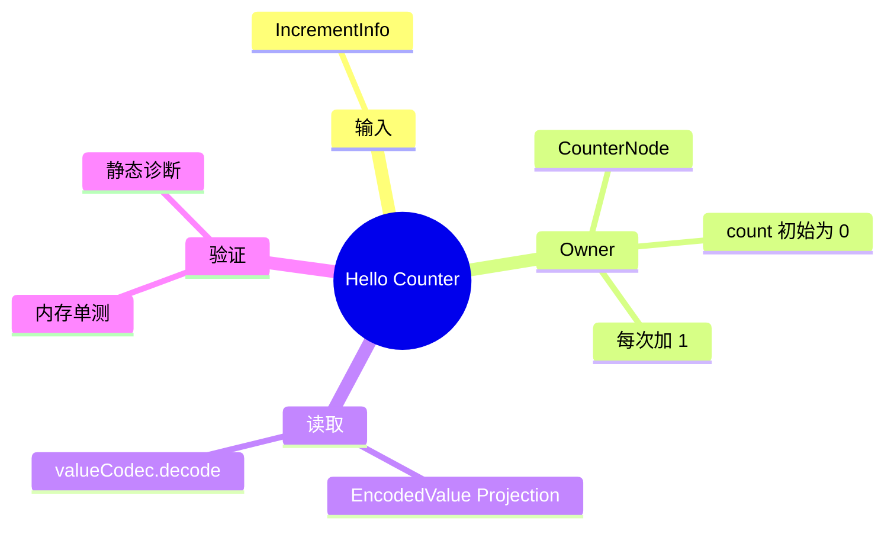

# 计数器与离线诊断插件

插件 ID：`example.hello-counter`；源码见 [`app/plugins/backend/hello-counter/`](../../app/plugins/backend/hello-counter/)。它提供无 I/O 的 `CounterNode`，用来验证 mailbox、single-flight、change、单节点工厂和离线因果分析；不贡献前端 Element 或 Workspace。

## 最小因果链



外部只能发送 `IncrementInfo`；`count` 由 Counter 独占写入，前端只读取微内核 Projection，不维护第二份状态。

## 工厂与清单

```js
import { Node, defineNodeFactory } from '@graphframework/sdk/plugin'

export class CounterNode extends Node {
  constructor(id = 'example.counter') { super(id, 'Counter', { count: 0 }) }
  change(info, ctx) {
    if (info.type === 'IncrementInfo') ctx.patchState({ count: ctx.read('count') + 1 })
  }
}

export const createCounterNode = defineNodeFactory((ctx) =>
  new CounterNode(ctx?.nodeId || 'example.counter'))
```

`createCounterNode.describe()`：`kind: 'node'`、`localIds: ['counter']`、`requiredBindings: []`、`rendererRoots: [{ localId: 'counter', infoType: 'IncrementInfo' }]`。清单 `graphframework.plugin.json`：`id: example.hello-counter`、`version: 1.0.0`、`apiVersion: 2`、`kind: backend`、`contributes.backend: index.mjs`、`nodeFactories: ['createCounterNode']`、`graphFactories: []`。

## 离线诊断

无需启动 Electron 或常驻 daemon。`scripts/diagnose.mjs` 与 `analysis/links.mjs` 支持：

```bash
npm --prefix packages/desktop run diagnose -- validate
npm --prefix packages/desktop run diagnose -- node example.counter
npm --prefix packages/desktop run diagnose -- change example.counter::IncrementInfo
npm --prefix packages/desktop run diagnose -- info IncrementInfo@example.counter
npm --prefix packages/desktop run diagnose -- state example.counter::count
npm --prefix packages/desktop run diagnose -- path state:example.counter::count change:example.counter::IncrementInfo
npm --prefix packages/desktop run diagnose -- health
npm --prefix packages/desktop run diagnose -- reach example.counter
```

这些命令分别验证全局契约、Node 定义、变迁、Info 路由、State 归属、因果路径、图健康与可达性。

## 装配与单测

```js
export default {
  id: 'counter.assembly',
  contribute(run) {
    run.backendPlugin({ id: 'example.hello-counter', path: '../../app/plugins/backend/hello-counter' })
    run.node({ id: 'app-counter', plugin: 'example.hello-counter', factory: 'createCounterNode' })
    run.requireNode('app-counter')
  },
}
```

```js
import { createTestRuntime } from '@graphframework/sdk/testing'
import { CounterNode } from '../../app/plugins/backend/hello-counter/index.mjs'

const runtime = createTestRuntime({ nodes: [new CounterNode('test.counter')] })
for (let i = 0; i < 3; i += 1) runtime.inject({ targetNodeId: 'test.counter', info: { type: 'IncrementInfo' } })
await runtime.waitForQuiescence()
expect(runtime.getState('test.counter').count).toBe(3)
runtime.dispose()
```

针对性测试：

```bash
npm --prefix packages/desktop test -- app/plugins/backend/hello-counter/backend.test.mjs --silent
npm --prefix packages/desktop test -- app/plugins/backend/hello-counter/tests/native-graph-host.test.mjs --silent
```
