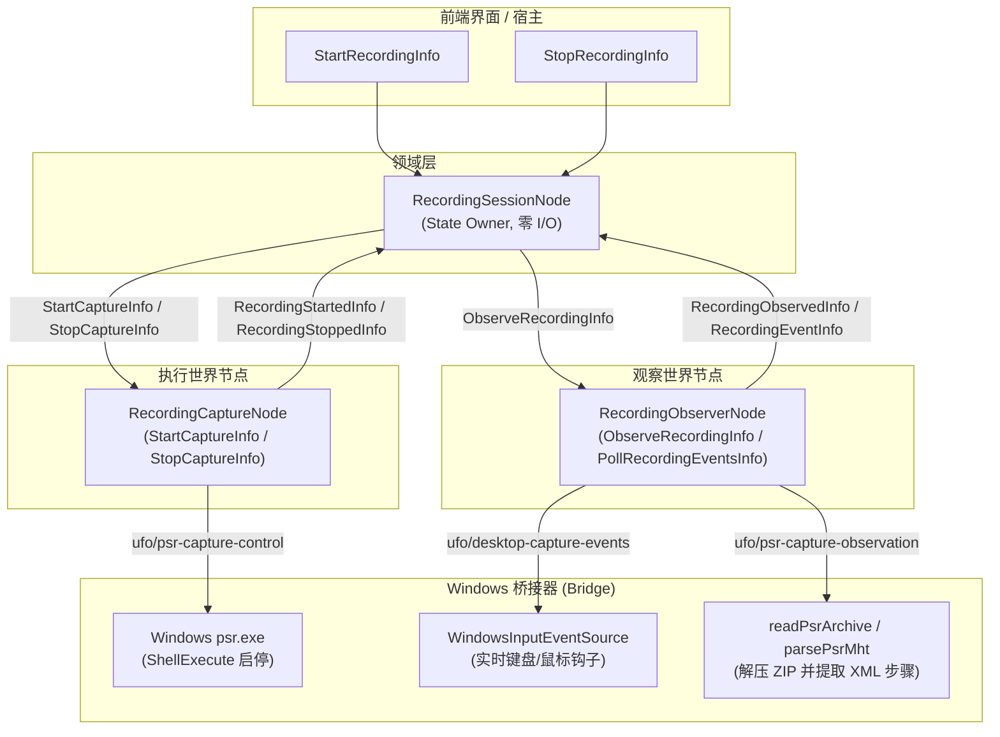

# Windows 桌面步骤录制插件 (OS Recorder Plugin)

插件 ID：`example.os-recorder`  
代码源码路径：
- 后端：[`app/plugins/backend/os-recorder/`](file:///c:/Users/kp157/Desktop/PM/GVSDK/app/plugins/backend/os-recorder)
- 前端：[`app/plugins/frontend/os-recorder/`](file:///c:/Users/kp157/Desktop/PM/GVSDK/app/plugins/frontend/os-recorder)

`example.os-recorder` 是面向 Windows 全桌面的用户操作捕获插件。它与微软 UFO（Windows Agent 框架）的录制格式兼容，通过调度 Windows 系统原生的步骤记录器（`psr.exe`）或实时输入事件源，捕获键鼠操作、提取窗口标题与控件动作，并在录制停止后自动解压 ZIP 归档、解析内部 XML 与 MHT 文件，生成结构化的桌面操作流水。

---

## 1. 架构角色与双世界节点分离 (Separation of WorldNodes)



---

## 2. 节点工厂与图工厂 (Factories)

### 2.1 节点类工厂：`createOsRecorder(ctx)`

导出路径：`import { createOsRecorder } from 'app/plugins/backend/os-recorder/index.mjs'`

- **函数签名**：
  ```typescript
  function createOsRecorder(ctx?: {
    instanceId?: string;
    nodeIdFor?: (local: string) => string;
    dependencies?: {
      captureControl?: EffectAdapter;
      captureObservation?: EffectAdapter;
      captureEvents?: EffectAdapter;
    };
  }): {
    session: RecordingSessionNode;
    execution: RecordingCaptureNode;
    observation: RecordingObserverNode;
  };
  ```
- **返回值**：
  - `session`: `RecordingSessionNode`（默认 ID：`example.os-recorder/session`）
  - `execution`: `RecordingCaptureNode`（默认 ID：`example.os-recorder/execution`）
  - `observation`: `RecordingObserverNode`（默认 ID：`example.os-recorder/observation`）

---

### 2.2 图工厂：`createOsRecorderGraph(ctx)`

导出路径：`import { createOsRecorderGraph } from 'app/plugins/backend/os-recorder/index.mjs'`

- **函数签名**：
  ```typescript
  function createOsRecorderGraph(ctx?: Context): Node[];
  ```
- **描述符元数据 (`createOsRecorderGraph.describe()`)**：
  ```javascript
  {
    kind: 'graph',
    localIds: ['session', 'execution', 'observation'],
    requiredBindings: [],
    rendererRoots: [
      { localId: 'session', infoType: 'StartRecordingInfo' },
      { localId: 'session', infoType: 'StopRecordingInfo' },
    ],
  }
  ```

---

## 3. 节点类、状态机与 Info 契约

### 3.1 `RecordingSessionNode`

#### 状态模式 (State Schema)
```typescript
interface OsSessionState {
  status: 'idle' | 'starting' | 'recording' | 'stopping' | 'processing' | 'error';
  sessionId: string | null;
  handle: string | null;
  eventCount: number;
  events: Array<{
    index: number;
    time: string | null;
    application: string | null;
    action: string | null;
    description: string | null;
  }>;
  applications: string[];
  artifactPath: string | null;
  recorder: 'Microsoft UFO / Windows Steps Recorder';
  startedAt: string | null;
  completedAt: string | null;
  lastEvent: any | null;
  lastError: string | null;
}
```

#### 接受的 Info 契约 (Inbound Infos)
| Info 类型 (`info.type`) | 字段载荷 | 状态跃迁与行为 |
| :--- | :--- | :--- |
| `StartRecordingInfo` | `{ sessionId?: string }` | 当前处于 `idle` 或 `error` 时置为 `starting`，发送 `StartCaptureInfo` 给执行节点。 |
| `StopRecordingInfo` | `{}` | 当前处于 `recording` 时置为 `stopping`，发送 `StopCaptureInfo` 给执行节点。 |
| `RecordingStartedInfo` | `{ sessionId, handle, artifactPath, startedAt }` | 置为 `recording`，记录 ZIP 目标产物路径与物理句柄。 |
| `RecordingStoppedInfo` | `{ sessionId, artifactPath }` | 置为 `processing`，发送 `ObserveRecordingInfo` 给观察节点。 |
| `RecordingObservedInfo` | `{ sessionId, artifactPath, events, applications, completedAt }` | 归档解析完成，状态回至 `idle`，更新全量事件序列。 |
| `RecordingEventInfo` | `{ sessionId, event }` | 接收实时输入流，将按键/点击增量推入 `events`。 |
| `RecordingFailedInfo` | `{ phase, message }` | 失败处理，置状态为 `error`。 |

---

## 4. 底层 Windows 桥接器与解析器 (Bridge & Parsers)

位于 [`app/plugins/backend/os-recorder/bridge/windows-step-recorder.mjs`](file:///c:/Users/kp157/Desktop/PM/GVSDK/app/plugins/backend/os-recorder/bridge/windows-step-recorder.mjs)：

### 4.1 PSR 录制适配器：`createWindowsStepRecorder(options)`

- **核心入参**：
  - `recordingsDirectory`: 录制产物 ZIP 的输出目录；
  - `ufoDirectory`: UFO 依赖目录（供 Python 解析脚本定位）；
  - `executable`: `psr.exe` 路径（默认为 `C:\Windows\System32\psr.exe`）。
- **返回值**：
  - `captureControl`: 对应 `ufo/psr-capture-control` 的 `EffectAdapter`；
  - `captureObservation`: 对应 `ufo/psr-capture-observation` 的 `EffectAdapter`。
- **Windows 权限与 EACCES 兼容**：
  现代 Windows 构建可能在直接调用 `CreateProcess` 时因 UAC 产生 `EACCES` 错误。`windows-step-recorder.mjs` 自动集成了回退机制，无缝转由 `rundll32.exe shell32.dll,ShellExec_RunDLL` 拉起 PSR。

### 4.2 归档解析工具：`readPsrArchive` 与 `parsePsrMht`
- `parsePsrMht(content)`：从 Windows 步骤记录器生成的 MHT 文件中，利用正则与 XML 解码器抽离 `<RecordSession>`、`<EachAction>` 属性（`ActionNumber`, `Time`, `FileName`, `Action`, `Description`）。
- `readPsrArchive(artifactPath, { tarExecutable })`：借助 Windows 自带的 `tar.exe` 零第三方依赖解压 ZIP 并返回 `{ session, applications, events }`。

### 4.3 实时输入源：`createWindowsInputEventSource()`
- 暴露 `start(sessionId)`、`stop()` 与 `poll()`，支持在录制期间以极低开销监听键盘与鼠标增量并自动做击键合并。

---

## 5. 推荐装配与实例化方式 (Recommended Assembly)

### 5.1 工作流声明式装配 (`runs/<name>/assembly.mjs`)

```javascript
// runs/<name>/assembly.mjs
export default {
  id: 'os-rec.assembly',
  contribute(run) {
    // 1. 注册后端与前端插件
    run.backendPlugin({
      id: 'example.os-recorder',
      path: '../../app/plugins/backend/os-recorder',
    });
    run.frontendPlugin({
      id: 'example.os-recorder',
      path: '../../app/plugins/frontend/os-recorder',
    });

    // 2. 挂载图实例
    run.graph({
      id: 'os-rec',
      plugin: 'example.os-recorder',
      factory: 'createOsRecorderGraph',
    });

    // 3. 守护核心节点
    run.requireNode('os-rec/session');
  },
};
```

### 5.2 测试中内存实例化

```javascript
import { createTestRuntime } from '@graphframework/sdk/testing';
import { createOsRecorder } from '../../app/plugins/backend/os-recorder/index.mjs';

const runtime = createTestRuntime();

const mockControl = {
  id: 'ufo/psr-capture-control',
  execute: async ({ op }) => ({ handle: 'psr:mock', artifactPath: 'C:/temp/rec.zip', startedAt: new Date().toISOString() }),
};
const mockObservation = {
  id: 'ufo/psr-capture-observation',
  execute: async () => ({ events: [{ index: 1, action: 'Left Click on Notepad' }], applications: ['notepad.exe'] }),
};

const { session, execution, observation } = createOsRecorder({
  instanceId: 'test-os',
  dependencies: {
    captureControl: mockControl,
    captureObservation: mockObservation,
  },
});

runtime.mountNode(session);
runtime.mountNode(execution);
runtime.mountNode(observation);

await runtime.send({ type: 'StartRecordingInfo', sessionId: 'sess-1' }, 'test-os/session');
await runtime.send({ type: 'StopRecordingInfo' }, 'test-os/session');

const state = runtime.readState('test-os/session');
console.log('Session Status:', state.status); // 'idle'
console.log('Recorded Events:', state.events);
```
