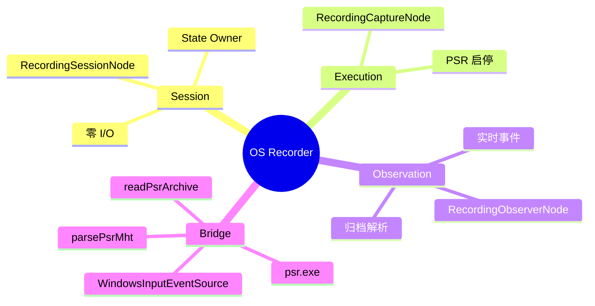
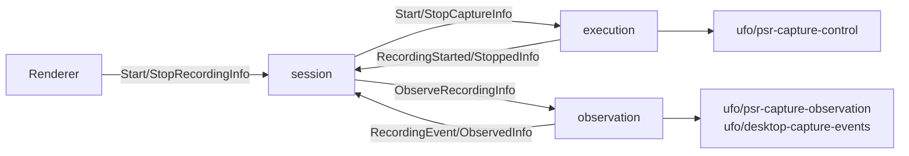

# Windows 桌面步骤录制插件

| 项目 | 路径 |
| :--- | :--- |
| ID | `example.os-recorder` |
| 后端 | [`app/plugins/backend/os-recorder/`](../../app/plugins/backend/os-recorder/) |
| 前端 | [`app/plugins/frontend/os-recorder/`](../../app/plugins/frontend/os-recorder/) |

插件捕获 Windows 键鼠、窗口和控件操作，兼容微软 UFO 格式。宿主可启用原生 `psr.exe` 与实时输入事件源；停止后解包 ZIP，解析 XML/MHT 为结构化步骤。

## 三节点与物理能力





| 工厂 | 返回/描述 |
| :--- | :--- |
| `createOsRecorder(ctx)` | `{ session, execution, observation }`；`ctx` 可提供 `nodeIdFor`、`instanceId`、`dependencies.captureControl/captureObservation/captureEvents`。 |
| `createOsRecorderGraph(ctx)` | `Node[]`；`describe()` 为 `kind: 'graph'`，本地 ID 为 `session/execution/observation`，`requiredBindings: []`。 |

默认节点 ID 为 `example.os-recorder/<localId>`；实例前缀由 `nodeIdFor()` 或 `instanceId` 决定。`rendererRoots` 只允许开始/停止消息进入 session。

## Session 契约

| 状态组 | 字段 |
| :--- | :--- |
| 生命周期 | `status: idle/starting/recording/stopping/processing/error`、`sessionId`、`startedAt`、`completedAt`、`lastError`。 |
| 操作 | `events[]`（`index/time/application/action/description`）、`eventCount`、`applications[]`、`lastEvent`。 |
| 物理产物 | `handle`、`artifactPath`、`recorder: 'Microsoft UFO / Windows Steps Recorder'`。 |

| Info | 状态与行为 |
| :--- | :--- |
| `StartRecordingInfo { sessionId? }` | idle/error → starting；发送 `StartCaptureInfo`。 |
| `RecordingStartedInfo { sessionId, handle, artifactPath, startedAt }` | starting → recording；记录句柄和 ZIP 路径。 |
| `RecordingEventInfo { sessionId, event }` | 追加实时键鼠事件。 |
| `StopRecordingInfo` | recording → stopping；发送 `StopCaptureInfo`。 |
| `RecordingStoppedInfo { sessionId, artifactPath }` | stopping → processing；发送 `ObserveRecordingInfo`。 |
| `RecordingObservedInfo { sessionId, artifactPath, events, applications, completedAt }` | processing → idle；以归档结果更新完整轨迹。 |
| `RecordingFailedInfo { phase, message }` | → error，记录错误。 |

## Windows Bridge

实现位于 [`windows-step-recorder.mjs`](../../app/plugins/backend/os-recorder/bridge/windows-step-recorder.mjs)。

| API | 契约 |
| :--- | :--- |
| `createWindowsStepRecorder(options)` | 输入 `recordingsDirectory`、`ufoDirectory`、`executable?`（默认 `C:\Windows\System32\psr.exe`）；返回 `captureControl` 与 `captureObservation`。 |
| `parsePsrMht(content)` | 从 `<RecordSession>`、`<EachAction>` 提取 `ActionNumber`、`Time`、`FileName`、`Action`、`Description`。 |
| `readPsrArchive(path, { tarExecutable })` | 用 Windows `tar.exe` 解包 ZIP，返回 `{ session, applications, events }`。 |
| `createWindowsInputEventSource()` | `start(sessionId)`、`stop()`、`poll()`；实时键鼠增量与击键合并。 |

PSR 直接 `CreateProcess` 遇到 UAC `EACCES` 时，Bridge 回退到 `rundll32.exe shell32.dll,ShellExec_RunDLL`。Adapter ID：`ufo/psr-capture-control`、`ufo/psr-capture-observation`、`ufo/desktop-capture-events`。

## 装配与测试

```js
export default {
  id: 'os-rec.assembly',
  contribute(run) {
    run.backendPlugin({ id: 'example.os-recorder', path: '../../app/plugins/backend/os-recorder' })
    run.frontendPlugin({ id: 'example.os-recorder', path: '../../app/plugins/frontend/os-recorder' })
    run.graph({ id: 'os-rec', plugin: 'example.os-recorder', factory: 'createOsRecorderGraph' })
    run.requireNode('os-rec/session')
  },
}
```

内存单测以 `createTestRuntime` 装配三个节点，注入 Mock `captureControl` 与 `captureObservation`；开始、停止后分别等待 `waitForQuiescence()`，断言状态回到 `idle` 且 `events` 含真实解析结果，最后 `runtime.dispose()`。
