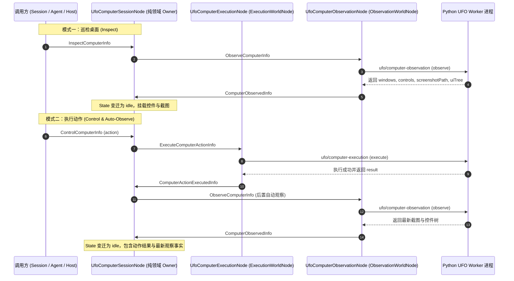

# UFO 计算机全控插件 (UFO Computer Control Plugin)

插件 ID：`example.ufo-computer-control`  
代码源码路径：[`app/plugins/backend/ufo-computer-control/`](file:///c:/Users/kp157/Desktop/PM/GVSDK/app/plugins/backend/ufo-computer-control)

`example.ufo-computer-control` 是微软 UFO（UI-Focused Agent Framework）在 GraphFramework 体系中的第一方接入插件。它将整个 Windows 桌面封装为可被 Info 驱动调用的因果图，支持：
1. **桌面应用全景巡检与 UIA 控件树解析**（获取窗口列表、控件层级、实时截图）；
2. **10 大原子键鼠指令下发**（点击、输入、热键、滚动、拖拽、等待、窗口最大化等）；
3. **“执行动作 -> 自动后置观察 -> 更新全景 State”闭环因果流**。

---

## 1. 闭环因果流与架构切分 (Closed-Loop Causal Flow)

纯领域节点与物理执行/观察世界节点严格物理隔离：



---

## 2. 节点工厂与图工厂 (Factories)

### 2.1 节点类工厂：`createUfoComputerControl(ctx)`

导出路径：`import { createUfoComputerControl } from 'app/plugins/backend/ufo-computer-control/index.mjs'`

- **函数签名**：
  ```typescript
  function createUfoComputerControl(ctx?: {
    instanceId?: string;
    nodeIdFor?: (local: string) => string;
    dependencies?: {
      ufoComputerExecution?: EffectAdapter;
      ufoComputerObservation?: EffectAdapter;
    };
  }): {
    session: UfoComputerSessionNode;
    execution: UfoComputerExecutionNode;
    observation: UfoComputerObservationNode;
  };
  ```
- **返回值**：
  - `session`: `UfoComputerSessionNode`（默认 ID：`example.ufo-computer-control/session`）
  - `execution`: `UfoComputerExecutionNode`（默认 ID：`example.ufo-computer-control/execution`）
  - `observation`: `UfoComputerObservationNode`（默认 ID：`example.ufo-computer-control/observation`）

---

### 2.2 图工厂：`createUfoComputerControlGraph(ctx)`

导出路径：`import { createUfoComputerControlGraph } from 'app/plugins/backend/ufo-computer-control/index.mjs'`

- **函数签名**：
  ```typescript
  function createUfoComputerControlGraph(ctx?: Context): Node[];
  ```
- **描述符元数据 (`createUfoComputerControlGraph.describe()`)**：
  ```javascript
  {
    kind: 'graph',
    localIds: ['session', 'execution', 'observation'],
    requiredBindings: [],
    rendererRoots: [], // 纯后端调度驱动，不开放 renderer 直发通道
  }
  ```

---

## 3. 状态模式与全量 Info 协议字典

### 3.1 `UfoComputerSessionNode` 状态模式 (State Schema)

```typescript
interface UfoComputerSessionState {
  status: 'idle' | 'observing' | 'executing' | 'error';
  requestId: string | null;
  operation: string | null;
  selectedWindow: any | null;
  windows: Array<{
    handle: number;
    title: string;
    process: string;
  }>;
  controls: Array<{
    id: string;
    control_type: string;
    name: string;
    bounding_box: [number, number, number, number];
  }>;
  screenshotPath: string | null;
  uiTree: any | null;
  actionResult: any | null;
  observation: any | null;
  completedAt: string | null;
  lastError: string | null;
}
```

---

### 3.2 节点接受的 Inbound Infos 契约

#### 1. 巡检指令：`InspectComputerInfo`
- **载荷**：
  ```typescript
  {
    type: 'InspectComputerInfo',
    requestId: string,
    observation?: {
      mode?: 'desktop' | 'selected-window',
      windowTitle?: string,
      windowHandle?: number
    }
  }
  ```
- **行为**：状态切为 `observing`，派发 `ObserveComputerInfo` 至观察节点。

#### 2. 控制指令：`ControlComputerInfo`
- **载荷**：
  ```typescript
  {
    type: 'ControlComputerInfo',
    requestId: string,
    action: {
      command: 'click' | 'type' | 'press_key' | 'hotkey' | 'scroll' | 'drag' | 'wait' | 'maximize',
      // 命令具体参数，如 controlId, text, keys, distance, duration 等
      [key: string]: any;
    },
    observation?: {
      mode?: 'selected-window' | 'desktop'
    }
  }
  ```
- **行为**：状态切为 `executing`，派发 `ExecuteComputerActionInfo` 至执行节点。执行成功后自动衔接观察。

#### 3. 内部流通 Infos
- `ExecuteComputerActionInfo`: Session -> ExecutionWorldNode
- `ComputerActionExecutedInfo`: ExecutionWorldNode -> Session
- `ObserveComputerInfo`: Session -> ObservationWorldNode
- `ComputerObservedInfo`: ObservationWorldNode -> Session（携带全量观察结果回传，置为 `idle`）
- `ComputerControlFailedInfo`: WorldNode -> Session（异常捕获为 Info，置为 `error`，**严禁未捕获异常击穿规则空间**）

---

## 4. Python UFO Worker 网桥 (`createUfoComputerBridge`)

位于 [`app/plugins/backend/ufo-computer-control/bridge/ufo-computer-bridge.mjs`](file:///c:/Users/kp157/Desktop/PM/GVSDK/app/plugins/backend/ufo-computer-control/bridge/ufo-computer-bridge.mjs)：

### 函数签名与参数
```typescript
function createUfoComputerBridge(options: {
  pythonExecutable: string;       // Python 解释器路径（通常为 packages/ufo/.venv/Scripts/python.exe）
  ufoDirectory: string;           // UFO 根目录路径（如 packages/ufo）
  screenshotsDirectory: string;   // 临时截图落盘目录
  workerScript?: string;          // 默认为 bridge 目录下的 ufo-computer-worker.py
  requestTimeoutMs?: number;      // 单个命令超时时间（默认 30,000ms）
}): {
  executionAdapter: EffectAdapter;   // id: 'ufo/computer-execution'
  observationAdapter: EffectAdapter; // id: 'ufo/computer-observation'
  stop: () => Promise<void>;         // 优雅终止 Python 进程
};
```

### 10 大 UFO 原子动作支持一览
网桥与 `ufo-computer-worker.py` 支持完整的键鼠控制：
1. `click`: 点击指定控件或屏幕坐标（`{ controlId, button: 'left'|'right'|'middle', double: boolean }`）
2. `type`: 向活动窗口或指定控件键入文本（`{ text: 'Hello World' }`）
3. `press_key`: 单次按键（`{ key: 'enter' }`）
4. `hotkey`: 组合快捷键（`{ keys: ['ctrl', 's'] }`）
5. `scroll`: 鼠标滚轮（`{ direction: 'down'|'up', distance: 3 }`）
6. `drag`: 拖拽操作（`{ start: [x1, y1], end: [x2, y2] }`）
7. `wait`: 等待延时（`{ duration: 1.5 }`）
8. `maximize`: 窗口最大化（`{ windowHandle }`）
9. `focus`: 聚焦窗口（`{ windowHandle }`）
10. `inspect`: 单独刷新当前窗口 UIA 树结构

---

## 5. 推荐装配与实例化方式 (Recommended Assembly)

### 5.1 工作流声明式装配 (`runs/<name>/assembly.mjs`)

```javascript
// runs/<name>/assembly.mjs
export default {
  id: 'main.assembly',
  contribute(run) {
    // 1. 引入 UFO 控制后端插件
    run.backendPlugin({
      id: 'example.ufo-computer-control',
      path: '../../app/plugins/backend/ufo-computer-control',
    });

    // 2. 实例化图并命名实例
    run.graph({
      id: 'computer',
      plugin: 'example.ufo-computer-control',
      factory: 'createUfoComputerControlGraph',
    });

    // 3. 守护核心会话节点
    run.requireNode('computer/session');
  },
};
```

### 5.2 宿主环境依赖配置 (`runs/<name>/run.config.json`)

```json
{
  "version": 2,
  "name": "main",
  "assembly": { "modules": ["assembly.mjs"] },
  "backend": {
    "host": "host.mjs",
    "dependencies": {
      "ufoDirectory": "../../packages/ufo",
      "pythonExecutable": "python.exe",
      "ufoPythonExecutable": "../../packages/ufo/.venv/Scripts/python.exe"
    }
  }
}
```

### 5.3 测试中端到端模拟调用

```javascript
import { createTestRuntime } from '@graphframework/sdk/testing';
import { createUfoComputerControl } from '../../app/plugins/backend/ufo-computer-control/index.mjs';

const runtime = createTestRuntime();

// 模拟 UFO 物理适配器
const mockExec = {
  id: 'ufo/computer-execution',
  execute: async ({ action }) => ({ success: true, executed: action.command }),
};
const mockObs = {
  id: 'ufo/computer-observation',
  execute: async () => ({
    windows: [{ handle: 101, title: 'Notepad', process: 'notepad.exe' }],
    controls: [{ id: 'edit-1', control_type: 'Edit', name: 'Text Editor' }],
    screenshotPath: 'C:/temp/snap.png',
  }),
};

const { session, execution, observation } = createUfoComputerControl({
  instanceId: 'test-ufo',
  dependencies: {
    ufoComputerExecution: mockExec,
    ufoComputerObservation: mockObs,
  },
});

runtime.mountNode(session);
runtime.mountNode(execution);
runtime.mountNode(observation);

// 下发动作：输入文本
await runtime.send({
  type: 'ControlComputerInfo',
  requestId: 'req-01',
  action: { command: 'type', text: 'Auto Typing' },
}, 'test-ufo/session');

const state = runtime.readState('test-ufo/session');
console.log('Final Status:', state.status); // 'idle'
console.log('Action Result:', state.actionResult); // { success: true, executed: 'type' }
console.log('Observation Screenshot:', state.screenshotPath); // 'C:/temp/snap.png'
```
