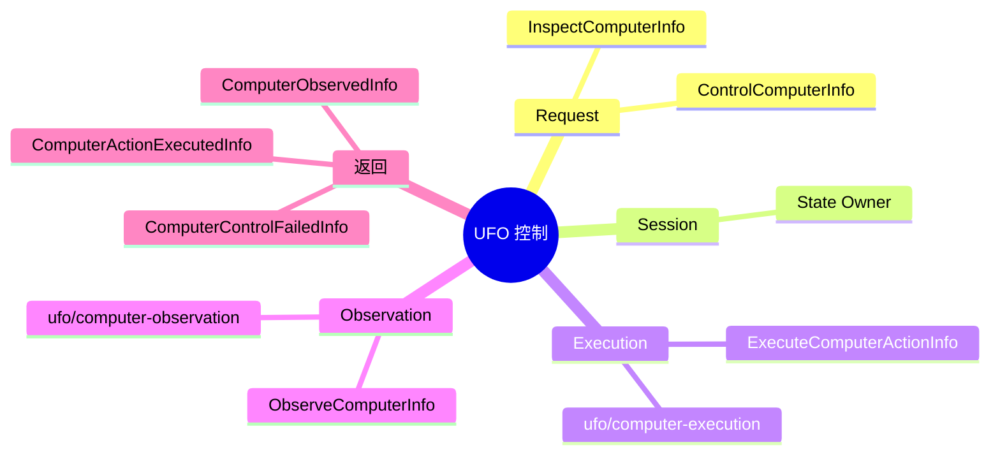

# UFO Computer Control 插件

纯后端 v2 插件，ID `example.ufo-computer-control`，源码在 [`app/plugins/backend/ufo-computer-control/`](../../app/plugins/backend/ufo-computer-control/)。无 renderer roots；外部控制必须经宿主入口注入。

## 因果闭环



巡检：Request → Observation → Session。控制：Request → Execution → Observation → Session。`ComputerRequestStartedInfo`、`ComputerActionExecutedInfo`、`ComputerObservedInfo` 汇入 Session；WorldNode 捕获 Adapter 错误并发送 `ComputerControlFailedInfo`。Session 只接收事实，不向上游发送 Info，静态拓扑无环。

| 根导出 | 契约 |
| :--- | :--- |
| 四个类 | `UfoComputerRequestNode`、`UfoComputerSessionNode`、`UfoComputerExecutionNode`、`UfoComputerObservationNode`。 |
| `createUfoComputerControl(ctx)` | `{ request, session, execution, observation }`。 |
| `createUfoComputerControlGraph(ctx)` | `Node[]`；`describe().localIds` 为四节点。 |
| Adapter ID | `UFO_EXECUTION_ADAPTER_ID = 'ufo/computer-execution'`，`UFO_OBSERVATION_ADAPTER_ID = 'ufo/computer-observation'`。 |
| Bridge | `createUfoComputerBridge(options)`，也可从 `./bridge` 子路径导入。 |

装配 `run.backendPlugin(...)`、`run.graph({ id: 'computer', plugin: 'example.ufo-computer-control', factory: 'createUfoComputerControlGraph' })`、`run.requireNode('computer/request')` 和 `run.requireNode('computer/session')`。请求注入 `computer/request`，结果读取 `computer/session`；另有 `computer/execution`、`computer/observation`。无实例上下文时默认为 `example.ufo-computer-control/*`。

## 外部 Info 与 Action

```js
{ type: 'InspectComputerInfo', requestId: 'inspect-1',
  observation: { mode: 'desktop', includeScreenshot: true } }

{ type: 'ControlComputerInfo', requestId: 'focus-1',
  action: { command: 'focus_window', window: { titleContains: 'Notepad' } },
  observation: { mode: 'selected-window', includeControls: true, includeUiTree: false } }
```

`requestId` 必须非空，控制消息必须有 `action`。Session 不逐条验证 UFO command 参数；worker 负责最终 schema 校验。

```ts
interface ComputerAction {
  command: string
  window?: { id?: string; handle?: number; name?: string; titleContains?: string }
  controlId?: string
  controlName?: string
  args?: Record<string, unknown>
}
```

| 命令组 | worker 当前白名单 |
| :--- | :--- |
| UI/输入 | `click_input`, `click_on_coordinates`, `drag_on_coordinates`, `set_edit_text`, `keyboard_input`, `wheel_mouse_input`, `click`, `double_click`, `keypress`, `move`, `scroll`, `type`。 |
| 窗口 | `focus_window`, `maximize_window`, `minimize_window`, `restore_window`, `close_window`。 |

窗口命令用 `action.window` 定位；其他命令可用顶层 `controlId/controlName` 引用最近一次观察的控件，参数放入 `action.args`。控件 ID 是短期句柄；窗口变化后重新观察，不能长期持久化。

## Observation 与 State

```ts
interface ComputerObservationRequest {
  mode?: 'desktop' | 'window' | 'selected-window' | 'after-action'
  window?: { id?: string; handle?: number; name?: string; titleContains?: string }
  includeScreenshot?: boolean
  includeControls?: boolean
  includeUiTree?: boolean
  maxControls?: number  // 1..1000
  settleMs?: number     // 0..5000
}
```

`desktop` 返回顶层窗口和可选全屏截图；其他模式针对目标/已选窗口，可返回截图、控件和 UI tree。结果字段：`mode`、`windows`、`selectedWindow`、`controls`、`screenshotPath`、`uiTree`、`observedAt`。

窗口字段：`id/name/title/type/handle/processId/processName/rect/active/minimized/maximized/visible`。控件字段：`id/name/type/automationId/className/rect/enabled/visible`。旧字段 `process`、`control_type`、`bounding_box` 不再使用。

Session State：`status`、`requestId`、`operation`、`selectedWindow`、`windows`、`controls`、`screenshotPath`、`uiTree`、`actionResult`、`observation`、`completedAt`、`lastError`。`completedAt` 取自物理观察/Info，纯领域 Session 不读时钟；调用方只读 Projection，不能写回 State 或把 Python UIA 对象装入 Info。

## Bridge 与验证

```ts
createUfoComputerBridge({ pythonExecutable, ufoDirectory, screenshotsDirectory,
  workerScript?, spawnProcess?, requestTimeoutMs? })
```

Bridge 返回 `executionAdapter`、`observationAdapter`、异步 `stop()`。按需启动 JSONL worker，串行请求，验证 ready handshake，实施超时；run teardown 必须调用 `stop()` 关闭/终止子进程。`runs/main/host.mjs` 解析 UFO、Python 与截图目录并注入实例；开发 run 沿用构造注入，Node 内不启动 Python。

```bash
npm --prefix packages/desktop test -- app/plugins/backend/ufo-computer-control/tests/backend.test.mjs --silent
npm --prefix packages/desktop test -- runs/main/tests/main-assembly.test.mjs --silent
npm --prefix packages/desktop run check:renderer-boundary
npm --prefix packages/desktop run typecheck
npm --prefix packages/sdk/javascript run typecheck
```

Mock 测试覆盖巡检、执行后观察、执行失败与根导出。真机验收经命名 run、桌面独占权和用户请求；并行测试不操作物理桌面。
