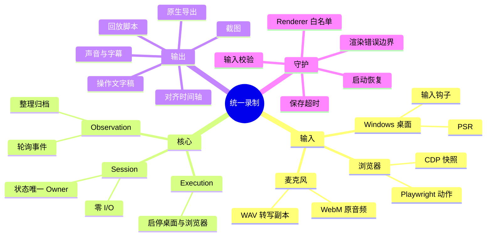
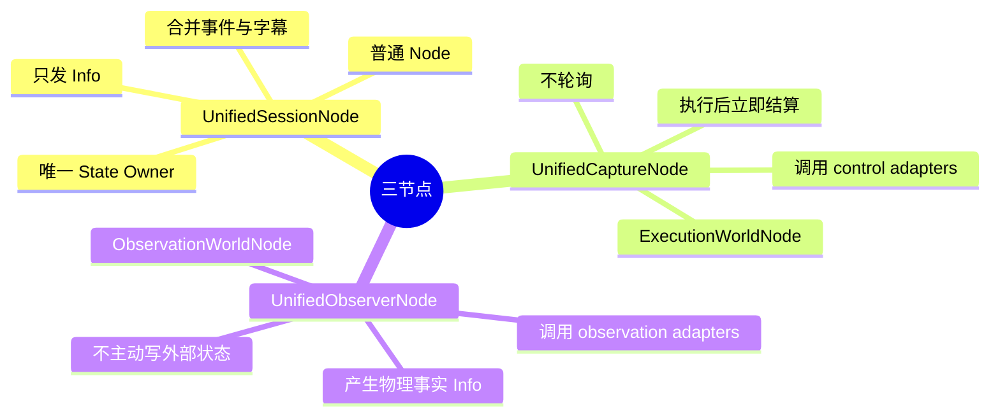
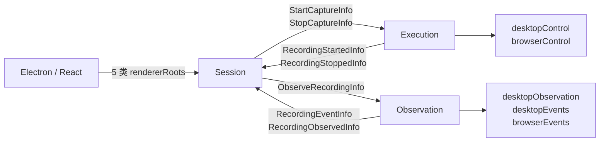
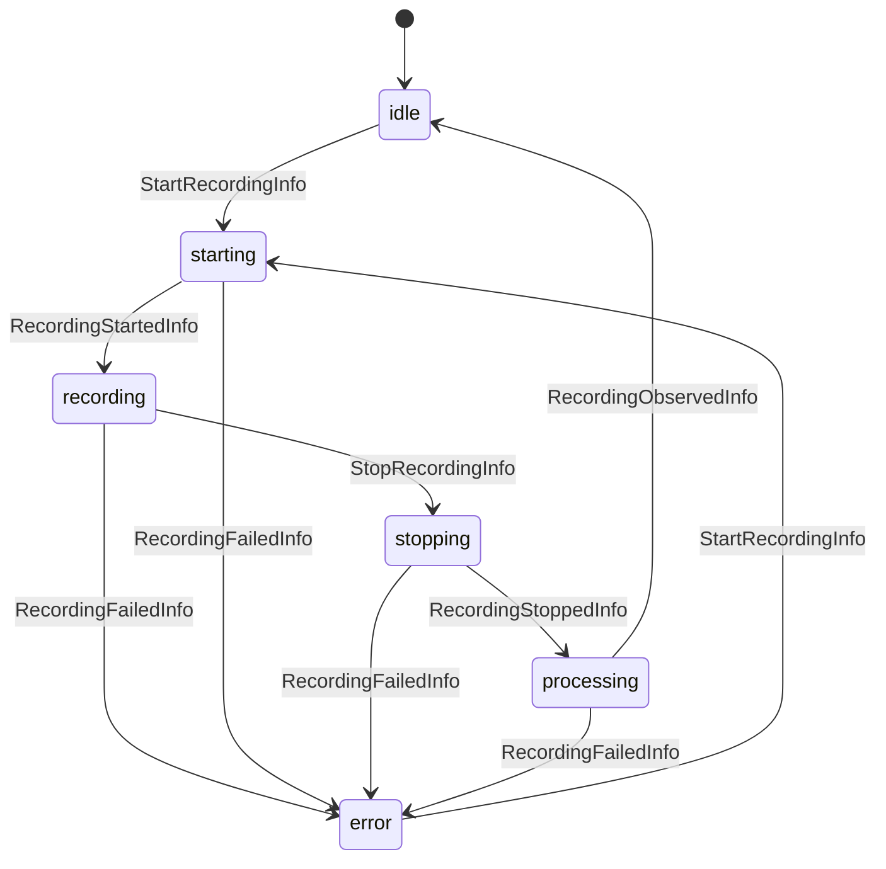
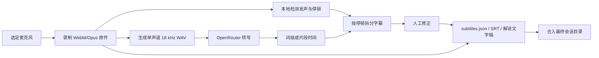
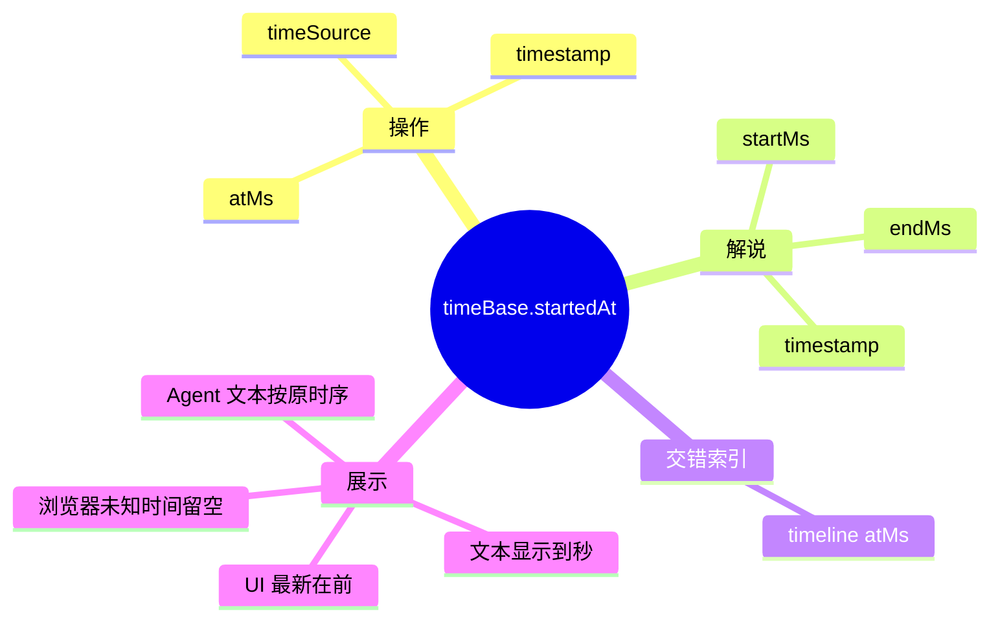
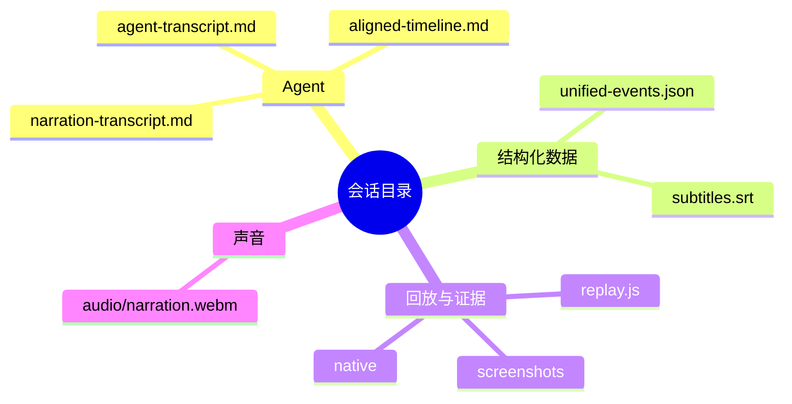
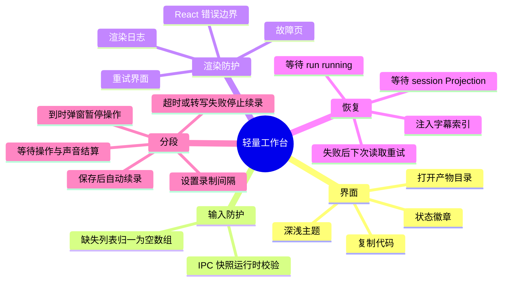

# 统一双源录制插件

| 项目 | 值 |
| :--- | :--- |
| 插件 ID | `example.unified-recorder` |
| 后端 | [`app/plugins/backend/unified-recorder/`](../../app/plugins/backend/unified-recorder/) |
| 前端 | [`app/plugins/frontend/unified-recorder/`](../../app/plugins/frontend/unified-recorder/) |
| 主 run 数据 | `runs/main/.generated/data/recordings/` |

插件把 Windows 桌面、浏览器和麦克风合为同一录制会话，输出 Agent 可读操作记录、可回放脚本、截图、原生备份、独立声音轨道和字幕。

## 一图总览



## 架构边界





五个物理能力均由 run 宿主以 `EffectAdapter` 注入；插件不持有浏览器，也不直接驱动 PSR。

| Adapter 常量 | ID | 用途 |
| :--- | :--- | :--- |
| `DESKTOP_CONTROL_ADAPTER_ID` | `unified/desktop-control` | 启停桌面录制 |
| `BROWSER_CONTROL_ADAPTER_ID` | `unified/browser-control` | 启停浏览器录制 |
| `DESKTOP_OBSERVATION_ADAPTER_ID` | `unified/desktop-observation` | 解包 PSR/MHT、提取截图和权威轨迹 |
| `DESKTOP_EVENTS_ADAPTER_ID` | `unified/desktop-events` | 轮询桌面实时事件 |
| `BROWSER_EVENTS_ADAPTER_ID` | `unified/browser-events` | 轮询浏览器实时事件 |

## 工厂与公开入口

```js
import {
  createUnifiedRecorder,
  createUnifiedRecorderGraph,
} from '../../app/plugins/backend/unified-recorder/index.mjs'
```

| API | 返回值 | 说明 |
| :--- | :--- | :--- |
| `createUnifiedRecorder(ctx)` | `{ session, execution, observation }` | 自动绑定三个节点 ID；依赖从 `ctx.dependencies` 注入。 |
| `createUnifiedRecorderGraph(ctx)` | `Node[]` | 图工厂；本地 ID 为 `session`、`execution`、`observation`，无 required binding。 |

节点 ID 默认为 `example.unified-recorder/<localId>`；存在 `nodeIdFor()` 或 `instanceId` 时使用实例前缀。

### Renderer 白名单

五类消息均发往 `session`，并由 `validate()` 校验：

| Info | 关键载荷 | 作用 |
| :--- | :--- | :--- |
| `StartRecordingInfo` | `sessionId?`, `sources?` | 从 `idle/error` 进入 `starting`。来源限 `desktop/browser`。 |
| `StopRecordingInfo` | 无 | 从 `recording` 进入 `stopping`。 |
| `AudioTranscribedInfo` | `sessionId`, `audioFile`, `startedAt`, `durationMs`, `segments[]` | 合并声音片段和字幕。 |
| `CorrectSubtitleInfo` | `id`, `text` | 修正字幕并同步持久化。 |
| `RestoreSubtitlesInfo` | `subtitles[]`, `audioClips[]` | 启动后恢复声音时间轴。 |

`StartCaptureInfo`、`StopCaptureInfo`、`RecordingStartedInfo`、`RecordingStoppedInfo`、`ObserveRecordingInfo`、`RecordingObservedInfo`、`RecordingEventInfo` 和 `PollUnifiedEventsInfo` 是内部消息，不向 renderer 开放。宿主只可经 `hostRoots` 向 observation 注入 `PollUnifiedEventsInfo`。

### 会话状态

| 分组 | 字段 |
| :--- | :--- |
| 生命周期 | `status`, `sessionId`, `sources`, `startedAt`, `completedAt`, `lastError` |
| 物理句柄 | `handles.desktop`, `handles.browser` |
| 操作轨迹 | `events[]`, `eventCount`, `lastEvent`, `applications[]`, `browserActions` |
| 产物 | `artifactPath`, `sessionDir`, `agentTranscriptPath`, `agentTranscriptContent`, `screenshotsDirectory`, `nativeExports` |
| 处理进度 | `progressLog[]` |
| 声音 | `narrationStartedAt`, `subtitles[]`, `audioClips[]` |

状态流转：



`RecordingEventInfo` 在录制中追加标准事件；`RecordingProgressInfo` 更新处理进度。桌面归档完成后，权威桌面轨迹替换桌面预览，浏览器流保留。

标准事件字段为：

```text
index, time, timestamp, atMs, timeSource, source, application, windowTitle,
action, description, locator, code, text, screenshotFile
```

顶层工具函数：`normalizeDesktopEvent`、`normalizeBrowserEvent`、`normalizeEvent`、`renumberEvents`、`buildTranscript`、`buildReplayScript`、`plaintextOf`。个人系统中的 `fill/type` 明文保存在 `text/code`，不做脱敏。

## 声音、字幕与时间轴



- 前端可选择麦克风、查看电平，并试录 5 秒回放。
- 原始声音始终保留为 WebM；16 kHz 单声道 WAV 只用于转写。
- 宿主优先读取 `OPENROUTER_API_KEY`，其次读取仓库根目录未入 Git 的 `credentials.json` 中 `openrouter.apiKey`。
- 默认模型为 `microsoft/mai-transcribe-2`，可用 `OPENROUTER_STT_MODEL` 覆盖。OpenRouter 不保证中国区域路由。
- 请求 `verbose_json` 词级时间；提供方不接受时退回片段时间。
- 多句被合成单片段时，先用词级时间拆分；缺少词级时间时，按本地发声区间、最长停顿和句子数拆分；证据不足则保留原片段。
- 转写失败不丢声音。字幕可逐行修正，修正同步到索引、SRT 和解说文字稿。

### 统一时间基准



同一会话以 `unified-events.json.timeBase.startedAt` 为零点。内部排序和播放保留毫秒；`agent-transcript.md`、`narration-transcript.md`、`aligned-timeline.md` 只显示到秒。SRT 按格式保留毫秒并按时间正序；前端字幕按数值时间倒序，最新项在最前。

桌面输入钩子提供毫秒时间。PSR 只有钟表秒，能匹配钩子时标记 `hook-correlated`。浏览器步骤没有可靠时间时留空，不推算。旧录制只有秒级事实时，补写过程不能恢复毫秒精度。

## 产物



| 路径 | 内容 |
| :--- | :--- |
| `agent-transcript.md` | 只含操作步骤，便于单独读取。 |
| `narration-transcript.md` | 带真实时间与相对时间的解说。 |
| `aligned-timeline.md` | 操作、浏览器观察与解说的交错时间线。 |
| `unified-events.json` | 事件、`timeBase`、`timeline[]` 与 `narration` 关联。 |
| `audio/narration.webm` | 当前片段的独立原始声音轨道。 |
| `subtitles.srt` | 播放字幕。 |
| `native/`, `screenshots/`, `replay.js` | 原生导出、抽离截图与回放脚本。 |

声音暂存于 `recordings/narration/`，结算时复制进对应会话。`unified-events.json.narration` 保存 `audioClips`、`subtitles` 和 `transcriptFile`；即使转写失败，也写入声音关联。宿主启动后会为旧会话补写缺失的解说或对齐文字稿，并移除旧版嵌入操作文字稿的整段解说。

目录名使用宿主本地时间：

```text
录制中  YYYY-MM-DD_HH-mm-ss_recording_<sessionId>
已完成  YYYY-MM-DD_HH-mm-ss__YYYY-MM-DD_HH-mm-ss_<sessionId>
```

结束日期单独记录，跨午夜不丢日期；历史目录不改名。只录浏览器时也使用独立会话目录。

## 前端可靠性与分段录制



正常快照与错误快照共用字段映射。状态读取失败时界面保持可见、显示错误并继续轮询。

`window.recorder` 桥接提供状态读取、启停与结算、暂停提示、打开产物或指定路径、启动专用浏览器、复制文本、读取截图或声音、保存声音、修正字幕和打开声音目录；页面不直接访问 Node 或文件系统。

“录制间隔”决定每段时长；“保存等待上限”覆盖停止录制、操作归档和音频转写。到时先弹出阻塞提示，再保存当前片段；全部完成后开始下一段。超时或转写失败时停止自动续录，已落盘内容仍可检查。

## 装配与运行

`runs/<name>/assembly.mjs`：

```js
export default {
  id: 'main.assembly',
  contribute(run) {
    run.backendPlugin({ id: 'example.unified-recorder', path: '../../app/plugins/backend/unified-recorder' })
    run.frontendPlugin({ id: 'example.unified-recorder', path: '../../app/plugins/frontend/unified-recorder' })
    run.graph({ id: 'recorder', plugin: 'example.unified-recorder', factory: 'createUnifiedRecorderGraph' })
    run.frontend({ id: 'main-ui', plugin: 'example.unified-recorder', graph: 'recorder' })
    run.requireNode('recorder/session')
  },
}
```

`runs/<name>/run.config.json` 中的宿主依赖：

```json
{
  "version": 2,
  "name": "main",
  "assembly": { "modules": ["assembly.mjs"] },
  "backend": {
    "host": "host.mjs",
    "dependencies": {
      "cdpUrl": "http://127.0.0.1:9343",
      "recordingBackend": "windows-steps-recorder",
      "ufoDirectory": "../../packages/ufo",
      "pythonExecutable": "python.exe"
    }
  }
}
```

唯一启动入口：

```bash
bash ./run.sh start runs/main/run.config.json
```
