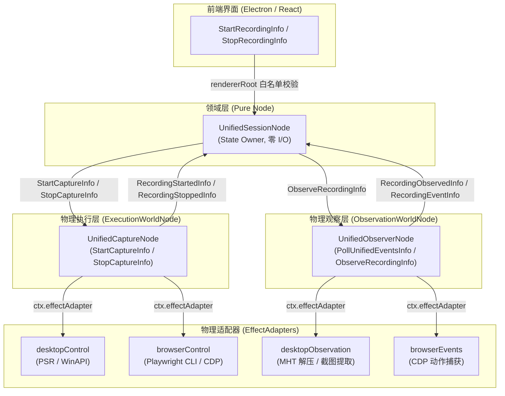

# 统一双源录制插件 (Unified Recorder Plugin)

插件 ID：`example.unified-recorder`  
代码源码路径：
- 后端：[`app/plugins/backend/unified-recorder/`](file:///c:/Users/kp157/Desktop/PM/GVSDK/app/plugins/backend/unified-recorder)
- 前端：[`app/plugins/frontend/unified-recorder/`](file:///c:/Users/kp157/Desktop/PM/GVSDK/app/plugins/frontend/unified-recorder)

`example.unified-recorder` 是 GraphFramework 的核心录制基础设施，也是 `runs/main` 桌面工作台的主力录制引擎。它支持 **Windows 桌面原生输入事件与 Chrome/Playwright 浏览器快照的双源流式合流**，能够实时提取高信噪比纯文字 Transcript、自动抽离落盘 MHT Base64 截图并生成可回放脚本。

---

## 1. 架构职责切分 (Architectural Separation)

严格遵循微内核与世界节点分离原则：
1. **`UnifiedSessionNode`（纯领域节点，所有者）**：
   - 录制会话状态（State）的唯一 Owner，零 I/O、零系统调用；
   - 集中维护流式合并的 `events`、`applications`、产物路径以及会话状态机。
2. **`UnifiedCaptureNode`（ExecutionWorldNode，物理下发者）**：
   - 经由注入的 `desktopControl` 和 `browserControl` 适配器向操作系统与浏览器下发 `start` / `stop` 指令；
   - 执行完成后立即结算并回传句柄，**零持续轮询监听职责**。
3. **`UnifiedObserverNode`（ObservationWorldNode，物理观察者）**：
   - 经由注入的 `desktopEvents` / `browserEvents` 适配器轮询未读事件，打包装入 `RecordingEventInfo` 交回 Owner；
   - 录制结束时经由 `desktopObservation` 适配器解压 PSR ZIP/MHT 截图并提取 Agent 纯文本，**零主动写操作**。



---

## 2. 节点工厂与图工厂 (Node & Graph Factories)

### 2.1 节点类工厂：`createUnifiedRecorder(ctx)`

导出路径：`import { createUnifiedRecorder } from 'app/plugins/backend/unified-recorder/index.mjs'`

- **函数签名**：
  ```typescript
  function createUnifiedRecorder(ctx?: {
    instanceId?: string;
    nodeIdFor?: (local: string) => string;
    dependencies?: {
      desktopControl?: EffectAdapter;
      browserControl?: EffectAdapter;
      desktopObservation?: EffectAdapter;
      desktopEvents?: EffectAdapter;
      browserEvents?: EffectAdapter;
    };
  }): {
    session: UnifiedSessionNode;
    execution: UnifiedCaptureNode;
    observation: UnifiedObserverNode;
  };
  ```
- **返回值**：包含 3 个已经正确连接（ID 已自动绑定路由）的节点实例集合：
  - `session`: `UnifiedSessionNode`（默认 ID：`example.unified-recorder/session` 或 `<instanceId>/session`）
  - `execution`: `UnifiedCaptureNode`（默认 ID：`example.unified-recorder/execution` 或 `<instanceId>/execution`）
  - `observation`: `UnifiedObserverNode`（默认 ID：`example.unified-recorder/observation` 或 `<instanceId>/observation`）

---

### 2.2 图工厂：`createUnifiedRecorderGraph(ctx)`

导出路径：`import { createUnifiedRecorderGraph } from 'app/plugins/backend/unified-recorder/index.mjs'`

- **函数签名**：
  ```typescript
  function createUnifiedRecorderGraph(ctx?: Context): Node[];
  ```
- **描述符元数据 (`createUnifiedRecorderGraph.describe()`)**：
  ```javascript
  {
    kind: 'graph',
    localIds: ['session', 'execution', 'observation'],
    requiredBindings: [],
    rendererRoots: [
      { localId: 'session', infoType: 'StartRecordingInfo' },
      { localId: 'session', infoType: 'StopRecordingInfo' },
    ],
  }
  ```

---

## 3. 节点类、状态机与 Info 契约

### 3.1 `UnifiedSessionNode`

#### 状态模式 (State Schema)
```typescript
interface UnifiedSessionState {
  status: 'idle' | 'starting' | 'recording' | 'stopping' | 'processing' | 'error';
  sessionId: string | null;
  sources: Array<'desktop' | 'browser'>;
  handles: { desktop: string | null; browser: string | null };
  eventCount: number;
  events: UnifiedEvent[];
  applications: string[];
  artifactPath: string | null;
  sessionDir: string | null;
  agentTranscriptPath: string | null;
  agentTranscriptContent: string | null;
  screenshotsDirectory: string | null;
  nativeExports: { browser: string | null; desktop: string | null };
  browserActions: string | null;
  startedAt: string | null;
  completedAt: string | null;
  lastEvent: UnifiedEvent | null;
  lastError: string | null;
}

interface UnifiedEvent {
  index: number;
  time: string | null;
  source: 'desktop' | 'browser';
  application: string | null;
  windowTitle: string | null;
  action: string | null;
  description: string | null;
  locator: string | null;
  code: string | null;
  text: string | null;
  screenshotFile: string | null;
}
```

#### 接受的 Info 契约 (Inbound Infos)
| Info 类型 (`info.type`) | 字段载荷 | 触发行为与变迁 |
| :--- | :--- | :--- |
| `StartRecordingInfo` | `{ sessionId?: string, sources?: ('desktop'\|'browser')[] }` | 检查当前为 `idle` 或 `error`，置状态为 `starting`，向 `execution` 发送 `StartCaptureInfo`。 |
| `StopRecordingInfo` | `{}` | 检查当前为 `recording`，置状态为 `stopping`，向 `execution` 发送 `StopCaptureInfo`。 |
| `RecordingStartedInfo` | `{ sessionId, desktopHandle, browserHandle, artifactPath, sessionDir, startedAt }` | 置状态为 `recording`，记录底层物理句柄与会话目录。 |
| `RecordingStoppedInfo` | `{ sessionId, artifactPath, sessionDir, browserActions, liveEvents, completedAt }` | 置状态为 `processing`，向 `observation` 发送 `ObserveRecordingInfo` 触发归档后处理。 |
| `RecordingObservedInfo` | `{ sessionId, artifactPath, sessionDirectory, events, applications, agentTranscriptPath, ... }` | 归档处理完成，状态重置为 `idle`，更新完整合并事件集。 |
| `RecordingEventInfo` | `{ sessionId, source, event }` | 收到流式事件，标准化后推入 `events` 数组，递增 `eventCount`。 |
| `RecordingFailedInfo` | `{ phase, message }` | 发生非预期错误，置状态为 `error` 并记录 `lastError`。 |

---

### 3.2 物理 EffectAdapters 规格

插件定义了 5 个核心 Adapter ID 常量：
```javascript
export const DESKTOP_CONTROL_ADAPTER_ID = 'unified/desktop-control';
export const BROWSER_CONTROL_ADAPTER_ID = 'unified/browser-control';
export const DESKTOP_OBSERVATION_ADAPTER_ID = 'unified/desktop-observation';
export const DESKTOP_EVENTS_ADAPTER_ID = 'unified/desktop-events';
export const BROWSER_EVENTS_ADAPTER_ID = 'unified/browser-events';
```

宿主在装配时注入提供物理实现的 Adapter：
```typescript
interface EffectAdapter {
  id: string;
  execute: (request: any) => Promise<any>;
}
```

---

### 3.3 事件标准化与清洗工具函数

插件在顶层直接导出了高效的数据清洗与产物生成函数：
- `normalizeDesktopEvent(raw, index)`: 格式化 Windows 原始动作。
- `normalizeBrowserEvent(raw, index)`: 格式化浏览器代码/快照。
- `buildTranscript(events)`: 生成可读操作摘要序列。
- `buildReplayScript(events)`: 提取合流的可执行 Playwright 脚本（桌面步骤作为注释保留）。
- `plaintextOf(code)`: 提取 `fill` / `type` 中的明文内容。

---

## 4. 前端工作台与 UI 交互 (Frontend & Workbench)

前端代码位于 [`app/plugins/frontend/unified-recorder/`](file:///c:/Users/kp157/Desktop/PM/GVSDK/app/plugins/frontend/unified-recorder)。

### 4.1 渲染根白名单与安全校验 (`rendererRoots`)
在后端插件定义中，向前端暴露的唯一白名单操作为开始和停止录制：
```javascript
export default defineBackendPlugin({
  id: 'example.unified-recorder',
  createNodes: (context) => Object.values(createUnifiedRecorder(context)),
  rendererRoots: [
    {
      targetNodeId: 'example.unified-recorder/session',
      infoType: 'StartRecordingInfo',
      validate: (info) => info?.type === 'StartRecordingInfo',
    },
    {
      targetNodeId: 'example.unified-recorder/session',
      infoType: 'StopRecordingInfo',
      validate: (info) => info?.type === 'StopRecordingInfo',
    },
  ],
});
```

### 4.2 前端宿主与 IPC 网桥 (`UnifiedRecorderBridge`)
Electron 宿主进程中封装了暴露给页面的 `window.recorder` 桥接对象：
```typescript
interface UnifiedRecorderBridge {
  readState: () => Promise<RecorderState>;
  start: (sessionId?: string, sources?: Array<'desktop' | 'browser'>) => Promise<RecorderState>;
  stop: () => Promise<RecorderState>;
  openArtifact: () => Promise<{ ok: boolean; error?: string }>;
  openPath: (targetPath: string) => Promise<{ ok: boolean; error?: string }>;
  launchBrowser: () => Promise<{ ok: boolean; alive?: boolean; output?: string; error?: string }>;
  copyToClipboard: (text: string) => Promise<{ ok: boolean }>;
  readImage?: (targetPath: string) => Promise<{ ok: boolean; dataUrl?: string; error?: string }>;
}
```

UI 界面基于 `@graphframework/workbench` 与 `@graphframework/ui` 构建，具备深浅主题切换、状态机徽章 (`IndustrialChip`)、录制产物目录一键打开与代码复制能力。

---

## 5. 推荐装配与实例化方式 (Recommended Assembly)

### 5.1 在工作流中装配 (`runs/<name>/assembly.mjs`) —— 推荐

```javascript
// runs/<name>/assembly.mjs
export default {
  id: 'main.assembly',
  contribute(run) {
    // 1. 注册后端插件
    run.backendPlugin({
      id: 'example.unified-recorder',
      path: '../../app/plugins/backend/unified-recorder',
    });

    // 2. 注册前端插件
    run.frontendPlugin({
      id: 'example.unified-recorder',
      path: '../../app/plugins/frontend/unified-recorder',
    });

    // 3. 实例化录制图
    run.graph({
      id: 'recorder',
      plugin: 'example.unified-recorder',
      factory: 'createUnifiedRecorderGraph',
    });

    // 4. 挂载主工作台 UI
    run.frontend({
      id: 'main-ui',
      plugin: 'example.unified-recorder',
      graph: 'recorder',
    });

    // 5. 守卫会话核心节点
    run.requireNode('recorder/session');
  },
};
```

### 5.2 宿主环境依赖配置 (`runs/<name>/run.config.json`)

在 `run.config.json` 的 `backend.dependencies` 中指定底层执行器选项：
```json
{
  "version": 2,
  "name": "main",
  "assembly": { "modules": ["assembly.mjs"] },
  "backend": {
    "host": "host.mjs",
    "dependencies": {
      "cdpUrl": "http://127.0.0.1:9343",
      "recordingBackend": "windows-steps-recorder",
      "ufoDirectory": "../../packages/ufo",
      "pythonExecutable": "python.exe"
    }
  }
}
```

### 5.3 启动命令

```bash
bash ./run.sh start runs/main/run.config.json
```
