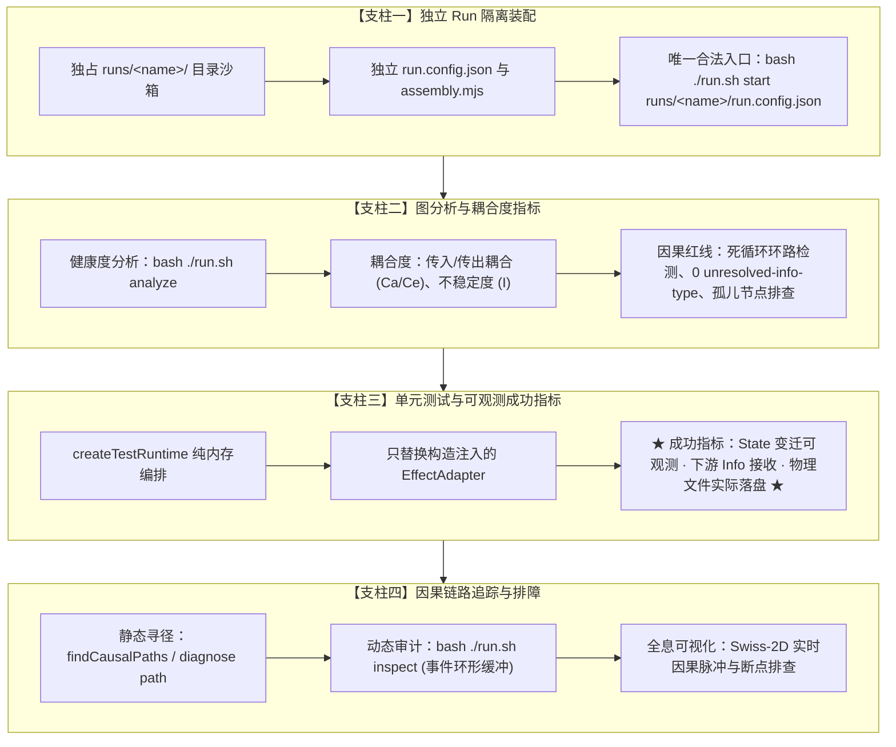

# GraphFramework 测试分层与因果验证规范 (Testing Specification)

本规范是 GraphFramework 体系中**所有核心包、核心插件与业务工作流测试的最高行为准则与技术规约**。

**核心指导思想**：
1. **测试驱动与针对性验证**：修复缺陷或扩展能力时，先写最小复现用例或单测；排障优先验证最小局部，严禁全量盲跑批，严禁启动黑盒桌面开发服务器进行肉眼盲测。
2. **确定性与无遗漏**：不使用 `node -e` 拼凑临时脚本，每一次验证必须转化为确定、可重复、断言完备的测试资产。
3. **四大核心支柱**：**独立 Run 隔离装配**、**图分析工具耦合度检查**、**以实际可行结果可观测为成功指标的单元测试**、**因果查询工具链路追踪**。

---

## 规范四大核心支柱 (The Four Pillars)



---

## 支柱一：独立 Run 隔离装配与沙箱验证 (Isolated Run Assembly)

> [!IMPORTANT]
> **架构铁律：严禁在生产主环境 `runs/main` 或全局共享目录 `app/plugins/` 下直接进行未测试代码的编写与实验性测试！**

### 1.1 物理目录隔离
每个开发者或测试任务必须分配一个独占、命名的 Run 目录（例如 `runs/alice/`、`runs/test-feature/`）：
```text
runs/test-feature/
├── run.config.json       # 场景专用配置（端口、超时、依赖路径）
├── assembly.mjs          # 声明式装配模块（注入待测插件与图实例）
├── host.mjs              # （可选）测试专属的世界物理适配器 Host
└── tests/
    └── e2e.test.mjs      # 针对该 Run 的端到端集成验收用例
```

### 1.2 声明式测试装配 (`assembly.mjs`)
在测试装配中，显式声明被测插件，不污染任何外部环境：
```javascript
// runs/test-feature/assembly.mjs
export default {
  id: 'test-feature.assembly',
  contribute(run) {
    // 1. 注册待验证的后端与前端插件（本地隔离路径）
    run.backendPlugin({
      id: 'test.my-plugin',
      path: './plugins/backend/my-plugin',
    });

    // 2. 实例化图并命名实例
    run.graph({
      id: 'feature-graph',
      plugin: 'test.my-plugin',
      factory: 'createMyPluginGraph',
    });

    // 3. 守护核心节点
    run.requireNode('feature-graph/session');
  },
};
```

### 1.3 唯一合法启动命令
任何集成验收必须经由统一入口拉起，严禁通过 `npm start`、`npx electron` 等任何旁路手段拉起：
```bash
# 启动测试 Run
bash ./run.sh start runs/test-feature/run.config.json

# 状态探活与资源检查
bash ./run.sh status runs/test-feature/run.config.json

# 验收完成优雅停止
bash ./run.sh stop runs/test-feature/run.config.json
```

---

## 支柱二：图分析工具检查节点耦合度等指标 (Graph Metrics & Coupling)

在单元测试通过后、合并至正式集成前，**必须使用图分析工具对节点的因果拓扑进行静态证明与健康度度量**。

### 2.1 运行态拓扑健康度分析命令
```bash
# 评估正在运行的 Run 的因果图健康度（输出 JSON 报告）
bash ./run.sh analyze runs/<name>/run.config.json

# 提取全局拓扑视角与路由连线
bash ./run.sh analyze runs/<name>/run.config.json '{"op":"view"}'
```

### 2.2 核心耦合度指标解读与门禁标准

分析工具返回的指标具有严格的工程含义，测试时必须核对：

```json
{
  "nodeCount": 5,
  "density": 0.4,
  "reciprocity": 0.0,
  "cyclicNodeIds": [],
  "stronglyConnectedComponents": [],
  "nodes": [
    {
      "nodeId": "feature-graph/session",
      "inboundRoutes": 3,
      "outboundRoutes": 2,
      "afferentCoupling": 2,
      "efferentCoupling": 1,
      "instability": 0.33,
      "conductance": 0.25,
      "cohesion": 0.0,
      "cycleMember": false
    }
  ]
}
```

| 拓扑指标 | 含义与公式 | 合规门禁标准 |
| :--- | :--- | :--- |
| **`afferentCoupling` (Ca)** | **传入耦合度**：依赖该节点的外部节点总数。 | 核心协调者节点（如 Session）Ca 较高属正常；叶子节点 Ca 应尽可能小。 |
| **`efferentCoupling` (Ce)** | **传出耦合度**：该节点发送 Info 所依赖的外部节点数。 | 纯领域 Node 不应盲目依赖过多外部节点，避免散弹式修改。 |
| **`instability` (I)** | **不稳定度**：$I = Ce / (Ca + Ce)$。<br>值为 1 是纯发射源，0 是纯聚合汇聚点。 | 汇聚账本（如 Ledger）$I \to 0$；触发源 $I \to 1$；核心业务层 $I$ 应相对稳定。 |
| **`cyclicNodeIds`** | **因果死循环环路检测**。 | **绝对红线：必须为空 `[]`！** 严禁出现 $A \to B \to A$ 的无守卫死循环。 |
| **`stronglyConnectedComponents`** | **强连通分量**（互相可达的分组）。 | 业务因果图中不应存在紧耦合的环状强连通子图。 |
| **`unresolved-info-type`** | **无法静态证明的 Info.type**。 | **绝对红线：0 容忍！** 所有 `ctx.send` 的 `type` 必须能在分支内静态推断。 |

### 2.3 离线 SDK 静态拓扑断言
在单测中直接对节点数组进行无运行时离线拓扑体检：
```typescript
import { buildCausalIndex, validateCausalIndex, analyzeViewHealth } from '@graphframework/sdk/analysis';

// 1. 索引待测节点
const index = buildCausalIndex({ nodeObjects: [session, execution, observation] });

// 2. 契约静态校验（红线校验）
const validation = validateCausalIndex(index);
expect(validation.unresolvedInfoTypes).toEqual([]); // 静态证明无漏报

// 3. 健康度指标断言
const health = analyzeViewHealth(index);
expect(health.cyclicNodeIds).toEqual([]); // 保证零因果环路
```

---

## 支柱三：单元测试以实际可行结果可观测为成功指标 (Observable Success Criteria)

> [!IMPORTANT]
> **成功指标不是“函数执行没报错”，而是“实际可行结果真实发生且完全可观测”！**

### 3.1 四大可观测成功断言
单元测试必须断言以下至少三项可观测事实：
1. **State 变迁可观测**：通过 `runtime.readState(nodeId)`，断言 Owner Node 的核心状态字段发生了符合预期的确定性跃迁；
2. **因果流通可观测**：目标节点收到了下游的定向 Info，或者流转终点收到了聚合回执；
3. **真实物理副作用可观测**：
   - 若执行了落盘：真实检查文件系统生成了目标文件（例如 `stat(artifactPath)` 存在、ZIP 解压出了 MHT、`agent-transcript.md` 包含正确文件路径）；
   - 若下发了指令：断言注入的 Mock `EffectAdapter` 接收到了确切的请求参数载荷（如命令名、坐标、按键序列）；
4. **投影编码/解码一致**：通过 `defaultValueCodec.decode(projection.nodes[id].state)` 检验只读投影真实可读，前端无虚假第二份状态。

### 3.2 纯内存测试编排最佳实践 (`createTestRuntime`)
使用 `@graphframework/sdk/testing`，**只替换构造注入的 `EffectAdapter`**，不启动真实物理外设：

```typescript
import { describe, it, expect } from 'vitest';
import { stat, readFile } from 'node:fs/promises';
import { createTestRuntime } from '@graphframework/sdk/testing';
import { createUnifiedRecorder } from 'app/plugins/backend/unified-recorder/index.mjs';

describe('UnifiedRecorder 实际可行结果端到端验证', () => {
  it('执行录制生命周期并产生真实可读的 Agent Transcript', async () => {
    const runtime = createTestRuntime();

    // 1. 替换构造注入的物理适配器，捕获下发参数并模拟成功返回
    const mockDesktopControl = {
      id: 'unified/desktop-control',
      execute: async ({ op, sessionId }) => ({
        handle: `psr:${sessionId}`,
        artifactPath: 'test-artifacts/rec.zip',
        sessionDir: 'test-artifacts',
        startedAt: new Date().toISOString(),
      }),
    };
    const mockDesktopObs = {
      id: 'unified/desktop-observation',
      execute: async () => ({
        events: [{ index: 1, source: 'desktop', action: 'Left Click' }],
        applications: ['notepad.exe'],
        agentTranscriptPath: 'test-artifacts/agent-transcript.md',
        agentTranscriptContent: '# Transcript\n01 [desktop|notepad.exe] Left Click',
      }),
    };

    // 2. 构造节点集合
    const { session, execution, observation } = createUnifiedRecorder({
      instanceId: 'test-rec',
      dependencies: {
        desktopControl: mockDesktopControl,
        desktopObservation: mockDesktopObs,
      },
    });

    runtime.mountNode(session);
    runtime.mountNode(execution);
    runtime.mountNode(observation);

    // 3. 执行业务动作：开始录制
    await runtime.send({ type: 'StartRecordingInfo', sessionId: 'sess-test-01' }, 'test-rec/session');
    
    // 【可观测断言 1】：会话状态真实变迁为 recording，句柄正确记录
    let state = runtime.readState('test-rec/session');
    expect(state.status).toBe('recording');
    expect(state.handles.desktop).toBe('psr:sess-test-01');

    // 4. 执行业务动作：停止录制
    await runtime.send({ type: 'StopRecordingInfo' }, 'test-rec/session');

    // 【可观测断言 2】：后处理完成，状态回落到 idle，清洗事件数 > 0
    state = runtime.readState('test-rec/session');
    expect(state.status).toBe('idle');
    expect(state.eventCount).toBe(1);
    expect(state.applications).toContain('notepad.exe');

    // 【可观测断言 3】：产物实际内容真实可观测
    expect(state.agentTranscriptContent).toContain('01 [desktop|notepad.exe] Left Click');
    expect(state.lastError).toBeNull();
  });
});
```

---

## 支柱四：使用因果查询工具做链路追踪与排障 (Causal Query & Tracing)

当测试中因果链条不推进（例如发送了 `StartRecordingInfo` 但状态停留在 `starting` 未进入 `recording`）时，**禁止胡乱打日志猜想，必须使用因果工具进行精准链路溯源**。

### 4.1 静态因果寻径 (Static Causal Path Tracing)
查询系统中实体 A 到实体 B 之间是否存在合法的因果推进路径：
```bash
# 追踪从 IncrementInfo 到 count 状态字段的全部因果变迁路径
npm --prefix packages/desktop run diagnose -- path state:example.counter::count change:example.counter::IncrementInfo

# 验证特定节点是否具备因果可达性
npm --prefix packages/desktop run diagnose -- reach example.counter
```

### 4.2 运行态因果事件环形缓冲审计 (Runtime Audit)
读取正在运行的微内核中的近 100 条因果事件流、丢弃事件与未结算租约：
```bash
bash ./run.sh inspect runs/<name>/run.config.json '{"limit":100}'
```

输出中重点排查三项：
1. **`drops`（丢弃台账）**：
   - 检查是否有由于目标节点不存在、Mailbox 积压溢出、或 `rendererRoots` 白名单拒绝而丢弃的 Info；
2. **`activeChanges`（在途变迁）**：
   - 检查是否有节点卡死在异步 I/O 或未 resolve 的 Promise 中，导致单飞锁无法释放；
3. **`events`（因果序列）**：
   - 观察每条 Info 的 `causeInfoId`，还原完整的因果推导拓扑树。

### 4.3 全息因果可视化器排查 (Causal Visualizer)
[`packages/tooling/causal-visualizer`](packages/tooling/causal-visualizer.md) 当前提供可构建的 Swiss-2D 组件和 telemetry client，但尚无经 `run.sh` 装配的独立 visualizer run。开发时可执行构建与布局测试：
```bash
npm --prefix packages/tooling/causal-visualizer run build
npm --prefix packages/tooling/causal-visualizer test
```
集成到命名 run 后，可在浏览器画布观察：
- **Node 节点气泡**：颜色反映节点当前代数（Generation）与生命周期；
- **定向连线**：实线箭头反映静态因果路由；
- **光点脉冲**：实时展现 Info 在节点间的流动方向，一旦出现因果断点，光点将在故障节点处停止前进并标红。

---

## 5. 全仓验证命令唯一正本 (Verification Commands)

依据全仓防回退准则，所有测试与提交前验证必须执行以下命令集：

```bash
# 1. 严格双重 TypeScript 类型检查（必须 0 错误）
npm --prefix packages/desktop run typecheck
npm --prefix packages/sdk/javascript run typecheck

# 2. 渲染进程安全边界检查
npm --prefix packages/desktop run check:renderer-boundary

# 3. 针对性单元测试执行（静默模式）
npm --prefix packages/desktop test -- <测试文件路径> --silent

# 4. 原生绑定加载验证
npm --prefix packages/desktop run verify:native-load

# 5. Git 干净度与检查点确认
git diff --check
git status -s
```
