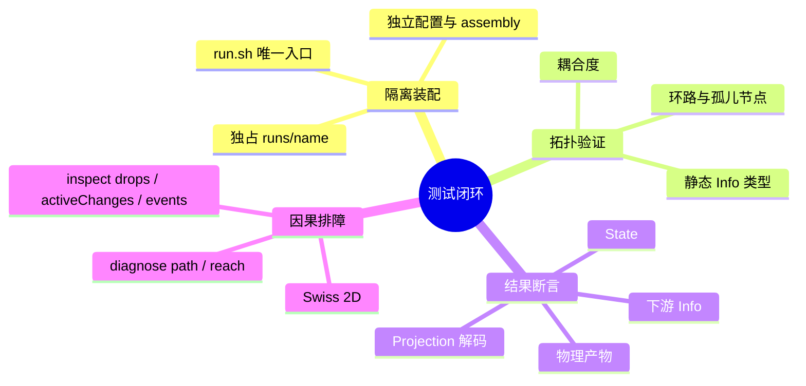

# 测试分层与因果验证规范

适用于核心包、核心插件和业务工作流。缺陷修复或扩展能力先写最小复现；排障从最小局部开始。验证应可重复且有断言，不用 `node -e` 临时拼脚本，也不靠启动黑盒桌面服务肉眼盲测。

## 验证路径



## 隔离 Run

未测试代码在独占的 `runs/<name>/` 中装配；不要在 `runs/main` 或共享 `app/plugins/` 直接实验。

```text
runs/test-feature/
├── run.config.json   # 端口、超时、依赖
├── assembly.mjs      # 被测插件与图
├── host.mjs          # 可选：测试专属物理 Adapter
└── tests/e2e.test.mjs
```

```js
export default {
  id: 'test-feature.assembly',
  contribute(run) {
    run.backendPlugin({ id: 'test.my-plugin', path: './plugins/backend/my-plugin' })
    run.graph({ id: 'feature-graph', plugin: 'test.my-plugin', factory: 'createMyPluginGraph' })
    run.requireNode('feature-graph/session')
  },
}
```

集成测试只通过统一入口启停，不能使用 `npm start` 或 `npx electron`：

```bash
bash ./run.sh start runs/test-feature/run.config.json
bash ./run.sh status runs/test-feature/run.config.json
bash ./run.sh stop runs/test-feature/run.config.json
```

## 因果拓扑

单测通过后、并入正式集成前检查图健康：

```bash
bash ./run.sh analyze runs/<name>/run.config.json
bash ./run.sh analyze runs/<name>/run.config.json '{"op":"view"}'
```

| 指标 | 含义 | 判定 |
| :--- | :--- | :--- |
| `afferentCoupling`（Ca） | 依赖该节点的外部节点数。 | Session 等协调节点可较高；叶子节点尽量低。 |
| `efferentCoupling`（Ce） | 该节点向外发送 Info 依赖的节点数。 | 纯领域节点避免散弹式外部依赖。 |
| `instability`（I） | `Ce / (Ca + Ce)`；1 为发射源，0 为汇聚点。 | Ledger 靠近 0，触发源靠近 1，核心业务层保持相对稳定。 |
| `cyclicNodeIds` | 环路节点。 | 必须为 `[]`，避免无守卫的 `A → B → A`。 |
| `stronglyConnectedComponents` | 互相可达的节点分组。 | 不应形成紧耦合环状子图。 |
| `unresolved-info-type` | 无法静态证明的 `Info.type`。 | 0 容忍；发送点或分支须静态可证明。 |

报告还给出 `nodeCount`、`density`、`reciprocity`、`inboundRoutes`、`outboundRoutes`、`conductance`、`cohesion` 和 `cycleMember`，用来定位规模、路由密度与局部节点关系。

离线测试直接校验节点集合：

```ts
import { buildCausalIndex, validateCausalIndex, analyzeViewHealth } from '@graphframework/sdk/analysis'

const index = buildCausalIndex({ nodeObjects: [session, execution, observation] })
expect(validateCausalIndex(index).unresolvedInfoTypes).toEqual([])
expect(analyzeViewHealth(index).cyclicNodeIds).toEqual([])
```

## 可观测成功

成功意味着结果真实发生。测试至少覆盖以下三类事实，涉及投影时再检查第四类：

| 事实 | 断言方法 |
| :--- | :--- |
| State 变迁 | `runtime.getState(nodeId)` 的 Owner 字段按预期变化。 |
| 因果流通 | 下游收到定向 Info，或终点收到聚合回执。 |
| 物理效果 | 检查文件实际落盘、ZIP/MHT 解包与文字稿内容；或 Mock `EffectAdapter` 收到准确命令、坐标、按键等参数。 |
| Projection | `defaultValueCodec.decode(projection.nodes[id].state)` 可读取权威状态。 |

纯内存单测使用 `createTestRuntime`，仅替换构造注入的 `EffectAdapter`，不启动物理外设。例如统一录制器的关键断言：

```ts
import { createTestRuntime } from '@graphframework/sdk/testing'
import { createUnifiedRecorder } from '../../app/plugins/backend/unified-recorder/index.mjs'

const desktopControl = { id: 'unified/desktop-control', execute: async ({ sessionId }) => ({
  handle: `psr:${sessionId}`, artifactPath: 'test-artifacts/rec.zip',
  sessionDir: 'test-artifacts', startedAt: new Date().toISOString(),
}) }
const desktopObservation = { id: 'unified/desktop-observation', execute: async () => ({
  events: [{ index: 1, source: 'desktop', action: 'Left Click' }],
  applications: ['notepad.exe'], agentTranscriptPath: 'test-artifacts/agent-transcript.md',
  agentTranscriptContent: '# Transcript\n01 [desktop|notepad.exe] Left Click',
}) }
const nodes = Object.values(createUnifiedRecorder({
  instanceId: 'test-rec', dependencies: { desktopControl, desktopObservation },
}))
const runtime = createTestRuntime({ nodes })
runtime.inject({ targetNodeId: 'test-rec/session', info: {
  type: 'StartRecordingInfo', sessionId: 'sess-test-01', sources: ['desktop'],
} })
await runtime.waitForQuiescence()
expect(runtime.getState('test-rec/session').handles.desktop).toBe('psr:sess-test-01')
runtime.inject({ targetNodeId: 'test-rec/session', info: { type: 'StopRecordingInfo' } })
await runtime.waitForQuiescence()
const state = runtime.getState('test-rec/session')
expect(state.status).toBe('idle')
expect(state.eventCount).toBe(1)
expect(state.applications).toContain('notepad.exe')
expect(state.agentTranscriptContent).toContain('Left Click')
expect(state.lastError).toBeNull()
runtime.dispose()
```

文件类场景还须用 `stat` 或读取内容证明产物真实存在；Mock 返回路径不能代替落盘断言。

## 因果排障

因果链停滞时，用静态路径和运行态审计定位：

```bash
npm --prefix packages/desktop run diagnose -- path state:example.counter::count change:example.counter::IncrementInfo
npm --prefix packages/desktop run diagnose -- reach example.counter
bash ./run.sh inspect runs/<name>/run.config.json '{"limit":100}'
```

| `inspect` 字段 | 检查内容 |
| :--- | :--- |
| `drops` | 目标不存在、Mailbox 溢出或 `rendererRoots` 拒绝。 |
| `activeChanges` | 异步 I/O 或未结算 Promise 导致的单飞停滞。 |
| `events` | 通过 `causeInfoId` 还原因果链。 |

[Swiss-2D 因果可视化器](packages/tooling/causal-visualizer.md) 目前提供组件与 telemetry client，尚无经 `run.sh` 装配的独立 visualizer run。可先运行其构建和布局测试；集成后可用节点气泡、定向连线、Info 光点查看 generation、生命周期、路由和断点。

```bash
npm --prefix packages/tooling/causal-visualizer run build
npm --prefix packages/tooling/causal-visualizer test
```

## 提交验证

```bash
npm --prefix packages/desktop run typecheck
npm --prefix packages/sdk/javascript run typecheck
npm --prefix packages/desktop run check:renderer-boundary
npm --prefix packages/desktop test -- <测试文件路径> --silent
npm --prefix packages/desktop run verify:native-load
git diff --check
git status -s
```
