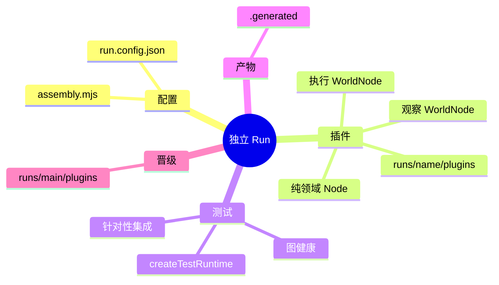

# 工作流开发模式

适用于 `runs/*` 下的业务流程、自动化策略、跨系统集成和 Agent 节点。优先装配已有能力；业务输入是结构化 Info，输出是权威 Projection 或 Observation。前端展示投影，不持有第二份业务规则。

## 归属与隔离



每个开发者或 Agent 独占稳定名称的 run；日志、缓存、构建物进入该 run 的 `.generated/`。业务与临时插件在 `runs/<name>/plugins/`，不进入 `app/`。通过独立测试后才能从 `runs/main/plugins/` 并入正式 run。面向非技术用户的意图分析与技术选型见[工作流指南](workflow/README.md)。

## 五步开发

| 步骤 | 交付 |
| :--- | :--- |
| 1 建沙箱 | `runs/my-feature/run.config.json`、`assembly.mjs`、`plugins/backend/my-feature/`。 |
| 2 写清单 | `graphframework.plugin.json`：`id/name/version/apiVersion: 2/kind: backend/contributes.backend/nodeFactories/graphFactories`。 |
| 3 写节点 | 领域 Node 零 I/O；执行与观察 WorldNode 分离，外部动作经注入的 `EffectAdapter`。 |
| 4 做测试 | `@graphframework/sdk/testing` 的 `createTestRuntime`，断言状态、消息与实际产物。 |
| 5 运行排障 | 只经 `run.sh` 启停；用 `analyze` 查因果图。 |

目录示例：

```text
runs/my-feature/
├── run.config.json
├── assembly.mjs
└── plugins/backend/my-feature/
    ├── graphframework.plugin.json
    ├── index.mjs
    └── tests/
```

```json
{"id":"my-org.my-feature","name":"My Business Feature","version":"1.0.0","apiVersion":2,"kind":"backend","contributes":{"backend":"index.mjs","nodeFactories":[],"graphFactories":[]}}
```

节点的最小因果形状：

```ts
import { Node, ExecutionWorldNode } from '@graphframework/sdk/plugin'

class OrderProcessorNode extends Node {
  constructor() { super('node-order', 'OrderProcessor', { status: 'idle' }) }
  change(info, ctx) {
    if (info.type !== 'SubmitOrder') return
    ctx.write('status', 'processing')
    ctx.send({ type: 'ExecutePayment', amount: info.amount }, 'node-payment-exec')
  }
}

class PaymentExecutionNode extends ExecutionWorldNode {
  constructor(payAdapter) { super('node-payment-exec', 'PaymentExecution', { lastTradeNo: '' }); this.payAdapter = payAdapter }
  async change(info, ctx) {
    if (info.type !== 'ExecutePayment') return
    const result = await ctx.effectAdapter(this.payAdapter, { amount: info.amount })
    ctx.write('lastTradeNo', result.tradeNo)
  }
}
```

观察节点另行接收物理反馈并封装为 Info；执行节点下发完成即结算，不持续轮询。测试应把执行节点与 Mock Adapter 一并装入 runtime，核实定向 Info 真的抵达。

```bash
bash ./run.sh start runs/my-feature/run.config.json
bash ./run.sh status runs/my-feature/run.config.json
bash ./run.sh analyze runs/my-feature/run.config.json
bash ./run.sh stop runs/my-feature/run.config.json
```

关联：[核心开发](core-development-mode.md)、[技能与 MCP 工具](workflow/skills-and-mcp-tooling.md)、[JavaScript SDK](packages/sdk/javascript/README.md)、[机器契约](packages/contract/README.md)、[Run CLI](packages/tooling/run.md)。
