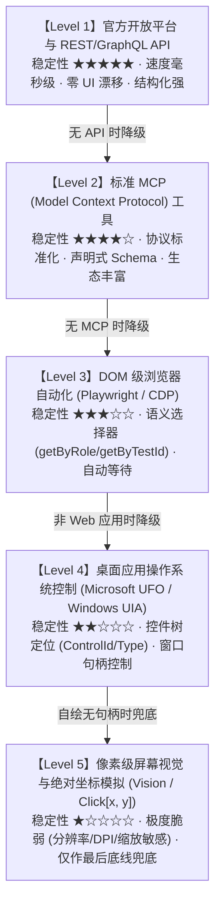
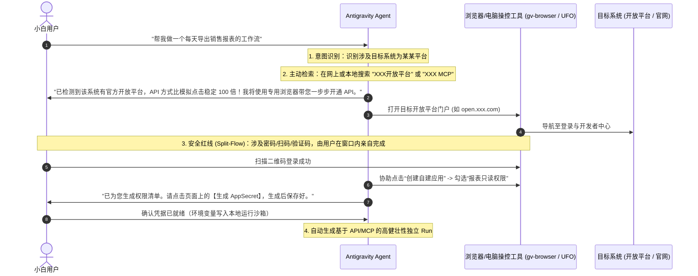

# 工作流开发全景指南 (Workflow Development Guide)

本目录是 GraphFramework 体系中**面向非技术（小白）用户与 Agent 协同构建自动化工作流的最高方法论与工程指南**。

---

## 1. 核心心智模型与用户画像 (Audience & Mindset)

### 1.1 用户画像：不懂代码的纯小白
在工作流开发模式下，业务用户通常**完全不懂编程代码**，他们不会编写 TypeScript、Rust 或 Python，也不理解微内核的因果状态机。用户表达自动化需求的主要方式只有两种：
1. **与 Agent 自然语言对话**：“我想每天早上自动把业务系统里的销售报表导出并归档”；
2. **录制人工操作演示**：通过双源统一录制器（`example.unified-recorder`）在电脑上把整套人工点击与输入操作亲自走一遍。

---

### 1.2 核心铁律：绝对不能盲从录制动作！
> [!CAUTION]
> **严禁把用户的录制操作机械式地转化为坐标点击或死板的 UI 脚本！**
> 
> 用户在屏幕上点来点去，是因为**人类肉身只能通过图形界面（GUI）操作软件**。但 Agent 是数字原生智能体，如果 Agent 去机械模仿人类在屏幕上找按钮、点坐标，属于舍本逐末的低级做法。
> 
> **用户的录制不是最终的执行脚本，而是业务“意图（Intent）”的证据！**  
> Agent 的职责是理解录制背后的**业务目标**，并按照 **Agent 原生程度** 寻找最优技术路径实现。

---

## 2. Agent 原生程度五级金字塔 (The 5-Level Hierarchy)

当接收到用户的工作流需求或录制动作后，Agent 必须严格按照以下**优先级由高到低**寻找实现途径：

$$\Large \text{API} \ > \ \text{MCP} \ > \ \text{浏览器自动化} \ > \ \text{桌面应用控制} \ > \ \text{像素级模仿}$$

### 各层级对比明细
| 层级 | 技术载体 | 核心特征 | 适用条件与优缺点 |
| :--- | :--- | :--- | :--- |
| **Level 1: 官方 API** | 开放平台 OpenAPI / RESTful / Webhook | **首选最高优先级**。稳定、快速、无头运行、零 UI 破损风险。 | 需主动搜寻开放平台并带用户完成密钥配置。 |
| **Level 2: MCP Server** | Model Context Protocol 工具协议 | **第二优先级**。标准 JSON-RPC、安全隔离、上下文友好。 | 查阅有无现成开源或官方 MCP 工具可直连。 |
| **Level 3: 浏览器自动化** | Playwright / Chrome CDP (9343 端口) | **Web 场景主力**。基于 DOM 树与可访问性语义（`getByRole`）。 | 当目标平台无 API 时，操控无头/有头浏览器完成。 |
| **Level 4: 桌面应用控制** | Microsoft UFO / Windows UIA 控件树 | **客户端桌面场景主力**。基于 AutomationId 与控件类型定位。 | 本地桌面软件（如 ERP 客户端、微信客户端）首选。 |
| **Level 5: 像素视觉模仿** | 截屏视觉多模态 / OCR / 坐标点击 | **最终兜底，严禁滥用**。极易因 DPI、主题、分辩率漂移失效。 | 仅当上述 4 级全部失效（如游戏画面、自绘控件无 UIA）时使用。 |

---

## 3. 主动发现与带教配置流程 (Proactive Guiding & Co-Configuration)

当用户提出想自动化某个系统（如“同步 ERP 订单”、“自动化审批流”、“监控报警待办”）时，**Agent 必须主动带教，而不是等用户提供 API Key**：

---

## 4. 独立 Run 沙箱与非核心插件隔离铁律

所有为小白用户开发的工作流，必须完全圈禁在独立沙箱中：

1. **工作流载体必须是独立的 Run**：
   - 目录：`runs/<workflow-name>/`
   - 配置：`runs/<workflow-name>/run.config.json`
   - 装配：`runs/<workflow-name>/assembly.mjs`
2. **铁律：业务工作流插件绝不进入 `app/`**：
   - 工作流专用节点和逻辑存放在 `runs/<workflow-name>/plugins/`；
   - 核心框架 `app/` 仅提供录制器、微内核宿主与基础工作台底座。
3. **跑通后方可收敛并入 `runs/main/`**：
   - 在独立沙箱跑通单测与图分析后，工作流可通过 `runs/main/plugins/` 并入主 run 作为生产交付，但**绝不进入核心 `app/`**。

---

## 5. 工作流三要素核心规约 (The Workflow Triad)

工程化交付的业务工作流必须具备三大要素：
1. **知识库 (Knowledge Base)**：
   - 包含业务字典、平台 API 规格、凭据指引；
   - **深挖小白盲区**：小白用户往往不知道平台深处内置的历史数据归档与批量导出口，Agent 必须主动挖掘并记录；
   - **远程维护、本地索引**：知识库本体托管在远程主机，本地仅存轻量 `knowledge-index.json`。
2. **工作流流程文档 (Process SOP)**：
   - 业务因果推进步骤、分支树与异常补偿流；远程版本受控，本地仅存索引。
3. **代码与工具出入口 (Observation & Action Gateways)**：
   - **严正声明：不是文字 Skills！** 而是 Agent 真实拥有的物理观测入口（`ObservationWorldNode`）与物理操作出口（`ExecutionWorldNode`）。

---

## 6. 详细子指南索引

深入阅读以下章节以掌握具体开发细节：

1. **[工作流三要素、远程维护与生命周期规范](file:///c:/Users/kp157/Desktop/PM/GVSDK/REFERENCE/workflow/workflow-elements-and-lifecycle.md)** (`workflow-elements-and-lifecycle.md`)
   - 深度拆解知识库、流程文档、代码出入口三大要素，深挖历史数据导出口，以及并入 `runs/main` 的准入闭环。
2. **[Agent 原生程度五级金字塔与降级决策](file:///c:/Users/kp157/Desktop/PM/GVSDK/REFERENCE/workflow/agent-native-hierarchy.md)** (`agent-native-hierarchy.md`)
   - 深度拆解 API > MCP > 浏览器 > 桌面应用 > 像素模仿的决策树与代码对照。
3. **[主动检索与手把手带教配置 API/MCP 指南](file:///c:/Users/kp157/Desktop/PM/GVSDK/REFERENCE/workflow/guided-onboarding.md)** (`guided-onboarding.md`)
   - 如何搜索“XXX开放平台”、如何利用浏览器工具协同操作、严格遵循 Split-Flow 凭据安全红线。
4. **[从用户录制到健壮工作流的转化规范](file:///c:/Users/kp157/Desktop/PM/GVSDK/REFERENCE/workflow/recording-to-workflow.md)** (`recording-to-workflow.md`)
   - 如何逆向分析 `agent-transcript.md` 与 Playwright 脚本，把 UI 点击“升维”为底层确定性工作流。
5. **[Agent 技能与 MCP 工具箱全景规范](file:///c:/Users/kp157/Desktop/PM/GVSDK/REFERENCE/workflow/skills-and-mcp-tooling.md)** (`skills-and-mcp-tooling.md` / [技能与MCP工具箱规范.md](file:///c:/Users/kp157/Desktop/PM/GVSDK/REFERENCE/workflow/技能与MCP工具箱规范.md))
   - 详述浏览器栈（Playwright CLI 与 Chrome DevTools MCP 9343）、免公网云主机运维栈（阿里云 Workbench CLI 一键安装与毫秒级执行/1GB 传输），以及本地桌面控制栈（UFO 绝对排他守卫）。

