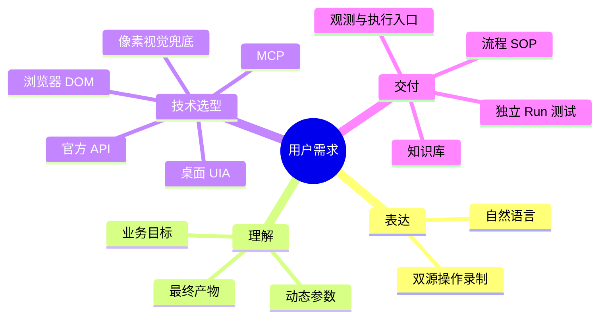

# 工作流开发指南

面向用自然语言或屏幕录制表达需求的非技术用户。录制是业务意图的证据；Agent 提取目标、输入和产物，再选择可维护的实现方式。

## 决策总览

按 `API → MCP → 浏览器自动化 → 桌面 UIA → 像素视觉` 顺序评估。API 处理结构化业务数据；MCP 提供现成工具；Web 页面用 Playwright/CDP 语义选择器；Windows 客户端用 UFO/UIA；自绘且无控件树时才用相对坐标与视觉反馈。录制中的坐标、滚动和误触不直接成为最终流程。

## 用户协作

1. 主动查目标平台的官方开放平台、开发者中心和 MCP 服务。
2. 有 API/MCP 时，用浏览器或电脑工具带用户完成开通；账号登录、扫码、验证码和授权由本人确认。凭据不写入代码、文档或聊天。
3. 根据录制提取业务字典、隐藏的历史数据批量导出口、动态参数和异常分支。
4. 把工作流放在 `runs/<workflow-name>/`：`run.config.json`、`assembly.mjs`、`plugins/`、`tests/`。非核心插件不进入 `app/`。
5. 在独立 Run 通过针对性测试和图分析，再经 `runs/main/plugins/` 并入主 run。

## 交付三要素

| 要素 | 内容与位置 |
| :--- | :--- |
| 知识库 | 业务字典、平台 API、凭据指引和历史导出口；远程维护，本地 `knowledge-index.json` 只存索引。 |
| 流程 SOP | 触发、步骤、分支和异常补偿；远程版本受控，本地保留索引。 |
| 物理出入口 | `ObservationWorldNode` 感知事实，`ExecutionWorldNode` 经注入的 `EffectAdapter` 执行动作；这里指真实代码入口，不是文字 Skills。 |

## 按任务查文档

| 任务 | 文档 |
| :--- | :--- |
| 判断 API、MCP、浏览器、桌面或像素方案 | [五级技术选型](agent-native-hierarchy.md) |
| 带用户开通和配置 API/MCP | [主动检索与带教](guided-onboarding.md) |
| 分析操作与声音录制 | [录制转工作流](recording-to-workflow.md) |
| 设计知识库、SOP、物理入口及并入主 run | [三要素与生命周期](workflow-elements-and-lifecycle.md) |
| 选择浏览器、远程主机和桌面工具 | [技能与 MCP 工具箱](skills-and-mcp-tooling.md) |
