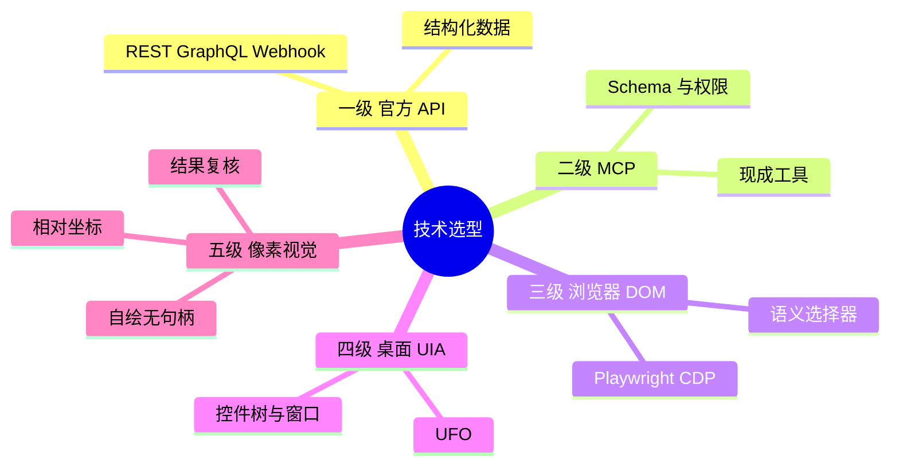
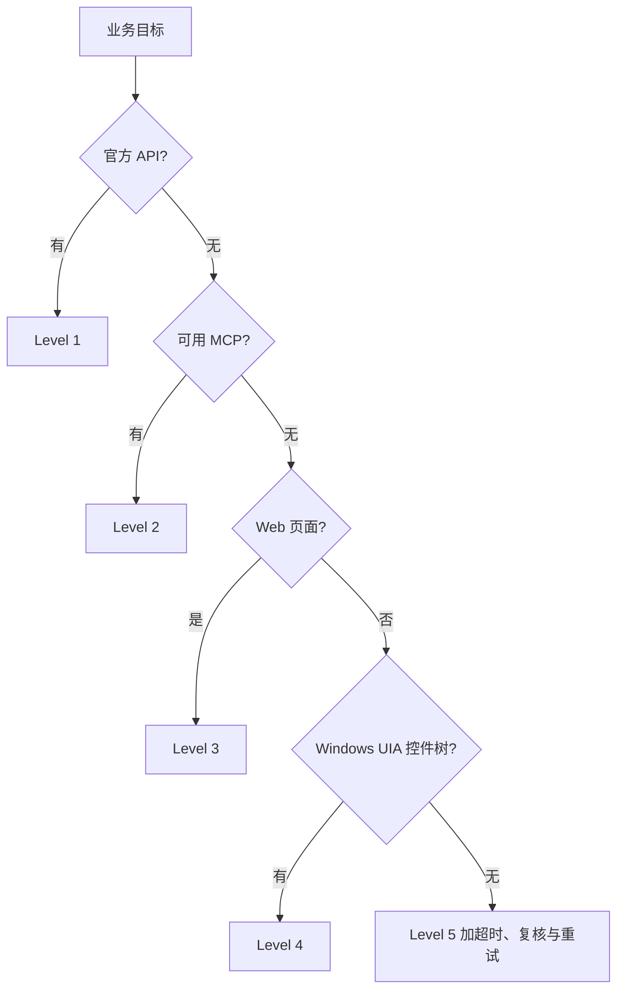

# Agent 原生程度五级选型

接到工作流需求或录制后，依次检查 `官方 API → MCP → 浏览器 DOM → 桌面 UIA → 像素视觉`。选型依据是目标系统真实能力；录制操作可作为意图证据。



| 级别 | 典型载体 | 原文示意评分：鲁棒性 / 耗时 / 内存 | 选择条件 |
| :--- | :--- | :--- | :--- |
| 1 API | 官方 OpenAPI、REST、Webhook | ★★★★★（99.9%）/ 10–200 ms / <10 MB | 有官方结构化接口；通常维护频率最低，不受 UI 改版影响。 |
| 2 MCP | 标准 MCP Server | ★★★★☆（98%）/ 50–500 ms / <50 MB | 有可用的官方或开源服务；协议、Schema 与权限已封装。 |
| 3 DOM | Playwright、CDP | ★★★☆☆（85%）/ 1–5 s / 200–500 MB | Web 场景无合适 API/MCP；用语义定位和自动等待。 |
| 4 UIA | Microsoft UFO、Windows UI Automation | ★★☆☆☆（70%）/ 2–10 s / 500 MB–1 GB | Windows 客户端提供控件树；受窗口焦点和遮挡影响。 |
| 5 像素 | 截屏、OCR、坐标点击 | ★☆☆☆☆（<40%）/ 5–30 s / 较高 | 仅在前四级无法使用，如自绘或远程画面。 |

表中百分比、耗时和内存是原文的选型示意，不是平台实测 SLA；实际方案须按目标系统验证。

## 各层执行约束

| 级别 | 做法 |
| :--- | :--- |
| API | 主动查开放平台；经外部执行适配器交换业务 JSON，可后台无头运行。 |
| MCP | 优先接入现成服务，通过声明式工具参数调用并处理权限与错误。 |
| DOM | 使用 `getByTestId`、`getByRole`、`getByPlaceholder`、`getByLabel`；等待目标网络响应。避免固定坐标与长 XPath。 |
| UIA | 按 `AutomationId`、`ControlType`、`Name` 查控件，用控件边界、窗口句柄或 `InvokePattern` 执行。 |
| 像素 | 以活动窗口为基准计算相对坐标；点击后检查状态，最多重试 3 次。DPI、窗口尺寸、主题和视觉误识别都需纳入验证。 |

代码形状示例：

```js
// Level 1：结构化业务请求（放在物理适配器中）
await fetch('https://api.example.com/v2/records', {
  method: 'POST', headers: { Authorization: `Bearer ${accessToken}`, 'Content-Type': 'application/json' },
  body: JSON.stringify({ fields: { 销售额: 1200, 部门: '华东' } }),
})

// Level 2：MCP 工具调用
await mcpClient.callTool({ name: 'github_create_issue', arguments: {
  owner: 'example-org', repo: 'repo-name', title: '巡检异常', body: '夜间批处理延迟过高',
} })

// Level 3：浏览器语义定位与完成条件
await page.getByPlaceholder('搜索商品').fill('MacBook Pro')
await page.getByRole('button', { name: '搜索' }).click()
await page.waitForResponse((r) => r.url().includes('/api/search') && r.status() === 200)

// Level 4：外部调用方经宿主控制入口注入，而非绕过节点修改 State
control.inject('computer/request', { type: 'ControlComputerInfo', requestId: 'req-click-submit',
  action: { command: 'click', controlId: 'SaveButton', controlType: 'Button' } })
```

## 降级判定


