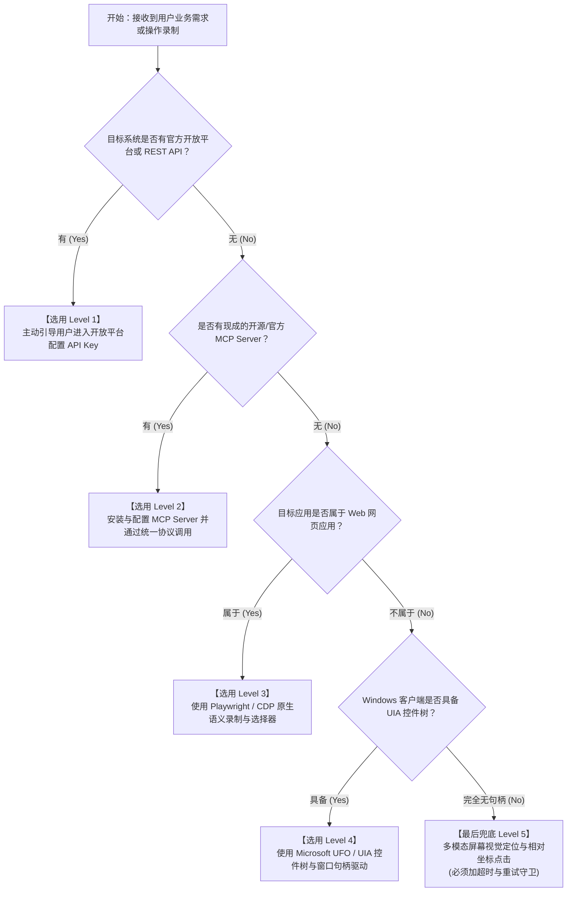

# Agent 原生程度五级金字塔与降级决策 (Agent Native Hierarchy)

在为小白用户构建工作流时，**技术路径的选择直接决定了该工作流在生产环境下的寿命与维护成本**。

机械模仿人类点击是极度脆弱的。本规范强制确立 **Agent 原生程度五级金字塔（The 5-Level Agent-Native Pyramid）**。任何工作流的落地，必须按照自顶向下的顺序严格评估。

---

## 1. 五级金字塔全景与技术打分

$$\Large \text{API} \ > \ \text{MCP} \ > \ \text{浏览器自动化} \ > \ \text{桌面应用控制} \ > \ \text{像素级模仿}$$

| 层级 | 梯队名称 | 鲁棒性 | 响应耗时 | 资源占用 | 维护频率 | 核心特征 |
| :---: | :--- | :---: | :---: | :---: | :---: | :--- |
| **Level 1** | **官方开放平台 API** | ★★★★★ (99.9%) | 10 ~ 200 ms | 极低 (< 10MB) | 极低（年级语义兼容） | 结构化 JSON 交互，无图形界面依赖，不受任何 UI 改版影响。 |
| **Level 2** | **标准 MCP Server** | ★★★★☆ (98%) | 50 ~ 500 ms | 低 (< 50MB) | 低（标准协议隔离） | 标准 Model Context Protocol 工具，声明式 Schema，开箱即用。 |
| **Level 3** | **DOM 级浏览器自动化** | ★★★☆☆ (85%) | 1 ~ 5 s | 中 (200 ~ 500MB) | 中（版本更新可能漂移） | 语义定位（`getByRole` / `getByTestId`），Playwright / CDP 原生。 |
| **Level 4** | **桌面应用 UIA 控制** | ★★☆☆☆ (70%) | 2 ~ 10 s | 较高 (500MB ~ 1GB) | 较高（窗口焦点、遮挡敏感）| 基于 Windows UI Automation 控件树与进程句柄（UFO）。 |
| **Level 5** | **像素视觉与坐标模拟** | ★☆☆☆☆ (< 40%) | 5 ~ 30 s | 极高 (多模态推理开销) | 极高（分辨率、DPI、主题一变即崩）| 截屏 OCR / 坐标点击 / 模板匹配，**非不得已严禁使用**。 |

---

## 2. 五大梯队深度剖析与代码范式

### Level 1：官方开放平台 API（最高首选）
几乎所有主流商业平台（阿里云 OpenAPI、企业微信、钉钉、Shopify、GitHub、Jira 等）均设有官方“开放平台”。
- **优势**：
  - 毫秒级网络请求，直接交换业务数据；
  - 平台保证向后兼容，UI 界面重新改版对其零影响；
  - 支持后台常驻无头运行，不需要占用用户屏幕和鼠标。
- **范式示例（RESTful Client in Node）**：
  ```javascript
  // 优质实现：直接调用开放平台结构化接口
  const response = await fetch('https://api.example.com/v2/records', {
    method: 'POST',
    headers: {
      'Authorization': `Bearer ${accessToken}`,
      'Content-Type': 'application/json',
    },
    body: JSON.stringify({ fields: { '销售额': 1200, '部门': '华东' } }),
  });
  const data = await response.json();
  ```

---

### Level 2：标准 MCP (Model Context Protocol) 服务（第二优先）
当系统存在现成的 MCP Server 时，优先接入 MCP：
- **优势**：
  - 统一的 JSON-RPC 协议标准；
  - 预设好了权限范围、类型定义与错误处理；
  - 跨编程语言通用。
- **范式示例（调用 MCP 工具）**：
  ```javascript
  const result = await mcpClient.callTool({
    name: 'github_create_issue',
    arguments: {
      owner: 'example-org',
      repo: 'repo-name',
      title: '自动化巡检异常报告',
      body: '检测到夜间批处理延迟过高...',
    },
  });
  ```

---

### Level 3：DOM 级浏览器自动化（Web 场景主力）
当目标平台没有开放 API 或需要登录态但未开放 OAuth 时降级至此：
- **原则**：
  - **严禁写死坐标点击 (`page.mouse.click(500, 300)`)**；
  - **严禁写死易碎长链 XPath (`/html/body/div[2]/div[1]/.../button`)**；
  - 必须使用 Playwright 原生**语义选择器**：
    1. `page.getByTestId('submit-btn')`
    2. `page.getByRole('button', { name: '提交订单' })`
    3. `page.getByPlaceholder('请输入手机号')`
    4. `page.getByLabel('用户名')`
- **范式示例**：
  ```javascript
  // 健壮实现：依赖可访问性树与语义选择器
  await page.getByPlaceholder('搜索商品').fill('MacBook Pro');
  await page.getByRole('button', { name: '搜索' }).click();
  await page.waitForResponse((res) => res.url().includes('/api/search') && res.status() === 200);
  ```

---

### Level 4：桌面应用系统控制（Windows UIA / Microsoft UFO）
当目标软件是 Windows 本地原生客户端（如各类老旧 ERP 客户端、微信客户端、财务专用软件等）：
- **原则**：
  - 通过 Windows UI Automation 协议遍历窗口与控件层级；
  - 依赖 `AutomationId`、`ControlType`（如 `Button`, `Edit`, `MenuItem`）和控件名称 `Name` 定位；
  - 获取控件的真实屏幕边界 (`BoundingBox`) 后精准聚焦或触发 UIA 默认动作（`InvokePattern`）。
- **范式示例**（外部通过宿主向 session 节点注入命令；节点内部才用 `ctx.send` 做定向转发）：
  ```javascript
  // 外部调用方：经宿主 daemon client / run control 注入（非节点内部）
  control.inject('computer/session', {
    type: 'ControlComputerInfo',
    requestId: 'req-click-submit',
    action: {
      command: 'click',
      controlId: 'SaveButton',
      controlType: 'Button',
    },
  });
  ```

---

### Level 5：像素级屏幕视觉与绝对坐标模拟（最后兜底，设防红线）
> [!WARNING]
> **红线警示：Level 5 极度脆弱！若非万不得已（如无句柄 DirectUI 自绘游戏画面、远程桌面投屏），严禁作为主方案！**

- **为什么脆弱？**
  - Windows 系统 DPI 缩放（100%、125%、150%）一变，坐标即偏移；
  - 用户调整窗口尺寸或最大化，固定坐标必定点空；
  - 操作系统暗色/浅色模式切换，基于 OpenCV 的图片模板匹配识别率暴跌；
  - 视觉大模型截屏推理延迟高达数秒，且存在视觉幻觉点击风险。
- **使用约束（若必须使用）**：
  - 必须附带**自适应相对坐标计算**（相对于活动窗口左上角而非整屏绝对像素）；
  - 必须在点击后进行状态确认（例如验证目标界面元素是否已出现），重试上限严设为 3 次。

---

## 3. 降级判定决策流程 (Decision Flowchart)

在接手任何自动化需求时，严格运行以下判定流：


