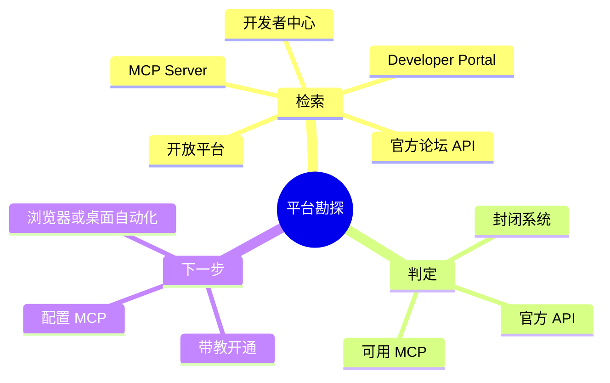
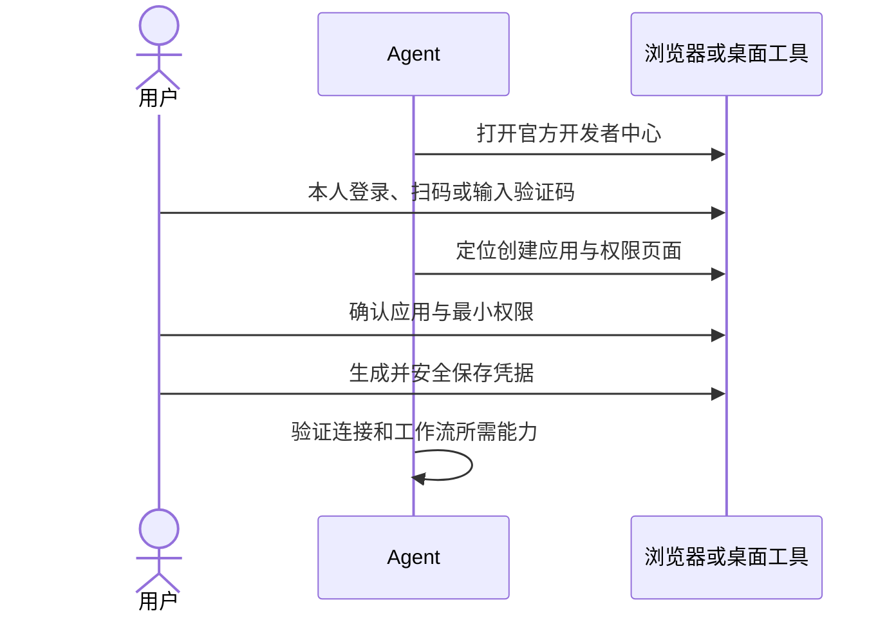

# 主动检索与带教配置 API/MCP

用户提出平台自动化需求时，Agent 主动查可用接口与工具，并用浏览器或桌面工具带用户完成配置。用户负责本人登录、扫码、验证码和授权。

## 发现能力



搜索词用目标平台名组合“开放平台”“开发者中心/平台”“Developer Portal/Open API Reference”“官方论坛 API/自动化插件”“MCP Server/Model Context Protocol”。尽快形成可核查的能力清单：有官方 API 时协助开通；有成熟 MCP 时评估接入；两者均无时说明证据并选浏览器 DOM 或桌面 UIA。

## 协同开通



Web 平台使用专用浏览器和 `gv-browser`；桌面设置使用 `ufo-computer-control`。Agent 可导航和定位控件，用户亲自确认账户授权。报表导出只申请所需的 `read` 权限，不申请管理员全权。

凭据不进入聊天、仓库代码、`assembly.mjs`、Markdown 或 Git；由用户放入受保护的本地环境配置或系统凭据存储。不能要求用户在聊天中发送密码，也不能代用户登录。这里遵循仓库根目录 [AGENTS.md](../../AGENTS.md) 的凭据红线。

## MCP 配置与探活

先检查 Node.js/Python 运行时。在独立工作流目录旁保留 MCP 配置，例如 `runs/<name>/mcp-config.json`；`run.config.json` 只写它支持的已知字段，不塞额外的 MCP 配置或密钥。

```json
{
  "mcpServers": {
    "target-platform": {
      "command": "npx",
      "args": ["-y", "@modelcontextprotocol/server-xxx"],
      "env": { "PLATFORM_API_KEY": "${env:LOCAL_PRIVATE_API_KEY}" }
    }
  }
}
```

单次 Ping 或 Tool List 验证握手与权限：

```js
const available = await mcpClient.listTools()
console.log(available.map((tool) => tool.name))
```

探活后告知用户已可调用的具体能力，再进入工作流实现。
