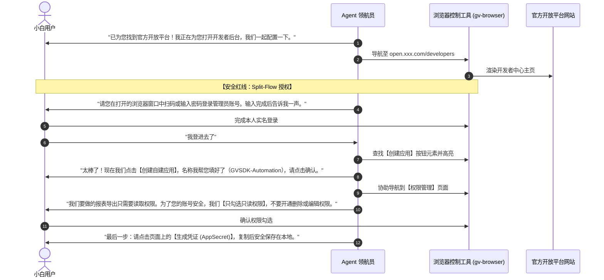

# 主动检索与手把手带教配置 API 与 MCP 指南 (Guided Onboarding)

面对不懂代码的纯小白用户，**“请提供您的 API Key”是一句极具门槛、极不友好的糟糕回复**。小白用户根本不知道什么是 API Key，也不知道去哪里获取。

本指南确立了 Agent 的**主动探查与交互式带教操作规范**：Agent 必须主动检索官方开放平台，并**亲自调起浏览器或电脑操作工具，像领航员一样带着用户在屏幕上一同完成开通与配置**。

---

## 阶段一：主动情报检索 (Proactive Discovery)

当用户提出对某个特定系统（例如“小红书”、“企业微信”、“Shopify”、“金蝶云”、“Jira”等）的自动化需求时，Agent 的第一动作**不是写代码，也不是盲目开始录制**，而是进行**主动能力勘探**。

### 1.1 搜索关键词模式
调用搜索引擎或工具主动检索以下五类核心关键词：
1. `"<平台名称> 开放平台"`（国内绝大多数 SaaS 系统的标准命名，如“飞书开放平台”、“微信开放平台”、“钉钉开放平台”）；
2. `"<平台名称> 开发者中心"` / `"<平台名称> 开发者平台"`；
3. `"<Platform> Developer Portal"` / `"<Platform> Open API Reference"`；
4. `"<平台名称> 官方论坛 API / 自动化插件"`；
5. `"<平台名称> MCP Server"` / `"<Platform> Model Context Protocol"`（检索 GitHub 是否有现成开源 MCP 服务）。

### 1.2 勘探判定产出
Agent 在 1 分钟内完成检索，并形成决策：
- 若存在官方 API：立即准备通过浏览器带用户开通；
- 若存在高质量 MCP Server：准备通过配置加载该 MCP；
- 若确实是封闭系统（无任何开放平台）：向用户说明情况，平滑降级至 Level 3 浏览器自动化或 Level 4 桌面 UIA 控件录制。

---

## 阶段二：使用浏览器/电脑工具协同带教 (Hands-on Guidance)

确定存在开放平台后，Agent 必须调起专用工具进入“人机协同领航模式”。

### 2.1 工具选用标准
- **Web 开放平台**：使用专用浏览器（如 9343 端口独立 Chrome 会话，参见 `gv-browser` 技能），由 Agent 下发导航命令并向用户展示界面；
- **桌面端设置窗口**：使用 `ufo-computer-control` 识别并高亮桌面窗口。



---

## 阶段三：团队安全与凭据红线 (Security Guardrails)

在协同带教过程中，必须严格恪守以下团队安全红线（违反即事故）：

> [!CAUTION]
> ### 凭据安全三大红线
> 1. **严禁代客登录**：任何账号授权、密码输入、手机验证码、微信扫码，**必须由用户本人在浏览器或桌面窗口中确认**。Agent 绝对不能要求用户在聊天窗口中发送密码！
> 2. **严禁明文持久化进代码仓库**：
>    - **严禁把 AppSecret、Access Token、API Key 写入仓库代码、`assembly.mjs`、Markdown 文档或 Git 提交**；
>    - 只能保存在运行沙箱本地的 `.env` 文件或受 `.gitignore` 保护的 `run.config.json` 本地私有字段中。
> 3. **权限最小化原则 (Principle of Least Privilege)**：
>    - 带用户勾选权限时，必须指导用户**仅开通当前工作流所需的最小范围**（例如导出只需要 `read`，严禁让用户图省事勾选“管理员全权”）。

---

## 阶段四：MCP (Model Context Protocol) 协同装配流程

如果检索到目标系统有成熟的 MCP Server（例如 GitHub MCP、PostgreSQL MCP、Slack MCP）：

### 4.1 Agent 自动化安装与配置检查
Agent 可代为检查本地环境：
1. 检查 Node.js / Python 运行时是否就绪；
2. 在该工作流独立 Run 的配置沙箱（`runs/<name>/mcp_config.json`）中声明该服务：
   ```json
   {
     "mcpServers": {
       "target-platform": {
         "command": "npx",
         "args": ["-y", "@modelcontextprotocol/server-xxx"],
         "env": {
           "PLATFORM_API_KEY": "${env:LOCAL_PRIVATE_API_KEY}"
         }
       }
     }
   }
   ```

### 4.2 连通性自测
配置完成后，Agent 在后台执行单次探活命令（Ping / Tool List），确认 MCP 握手成功：
```javascript
const tools = await mcpClient.listTools();
console.log('MCP 就绪，可用能力:', tools.map(t => t.name));
```
探活成功后，及时向用户播报：*“通道已搭建完毕！现在我们可以开始自动化流程了。”*
