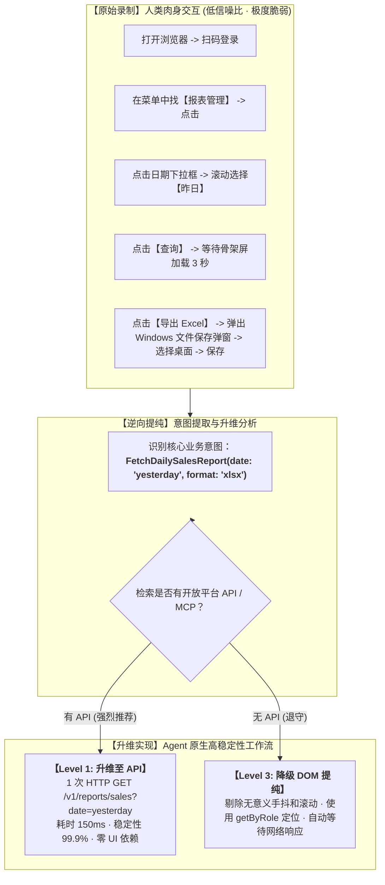

# 从用户录制到健壮工作流的工程转化 (Recording to Robust Workflow)

当小白用户使用双源统一录制器（`example.unified-recorder`）录制了一段长达数分钟的屏幕交互后，录制目录中会生成三样核心产物：
1. **`agent-transcript.md`**：过滤掉冗余噪声的结构化 Markdown 文字序列（附有抽离落盘的截图路径）；
2. **`native/browser-playwright.js`**：原生 Playwright 录制语句；
3. **`native/desktop-psr.zip`**：Windows 步骤记录器的原生 XML/MHT 归档。

**核心问题**：Agent 应该如何处理这些产物？**绝不是把录制的脚本原封不动拿去回放！**

---

## 转化核心法则：升维替代法则 (The Elevation Rule)



---

## 阶段一：意图提取与噪声清洗 (Intent Extraction)

### 0. 文字事实优先与极度克制读取截图 (Text-First, Minimal Image Reads)
> [!IMPORTANT]
> **Token 节约与速度保障红线**：
> 录制归档中包含的大量高分辨率截图会迅速吞噬宝贵的 Agent 上下文 Token，严重拖慢推理速度。
> 
> - **文字事实足以为凭**：清洗后的 `agent-transcript.md`、`aligned-timeline.md`（带解说同步）与 `unified-events.json` 已经精准提炼了应用名、控件类型、按钮名称、文本输入和时间戳，**绝大部分场景完全不需要看图**；
> - **极度克制读取截图**：**严禁无目的或批量查看 `screenshots/` 目录**。**只有在文字描述存在严重歧义、关键按钮完全缺少可读文本、或必须裁决视觉布局冲突时，才允许针对性读取单张必须确认的截图**。

### 1. 过滤人类交互噪声
人类在操作界面时不可避免会产生大量与业务无关的动作，必须全部剔除：
- 鼠标在空白区域的无意义晃动与停顿；
- 点击失误后的回退与重复点击；
- 上下反复滚轮（仅为了肉眼寻找目标，Agent 可直接通过语义选择器定位，不需要滚轮）；
- 误触无关应用或通知弹窗。

### 2. 识别业务实体与上下文参数
将一系列动作归纳为一个结构化的领域动作（Domain Action）：
- **前置条件 (Pre-condition)**：用户在什么系统、拥有什么角色；
- **业务输入 (Inputs)**：表单填写的具体参数（例如 `date: '2026-09-22'`，在提纯时转化为动态参数 `date: getYesterday()`）；
- **最终产物 (Outputs)**：生成的文件（Excel、PDF）、页面更新的状态、或发出的消息。

---

## 阶段二：知识库沉淀与索引维护 (Knowledge Base Extraction & Remote Sync)

依据 [工作流三要素、远程维护与生命周期规范](file:///c:/Users/kp157/Desktop/PM/GVSDK/REFERENCE/workflow/workflow-elements-and-lifecycle.md)，工作流绝不仅是一段自动化代码，**必须包含作为认知大脑的领域知识库与操作 SOP**。

### 1. 业务字典提取与小白盲区挖掘
- **业务实体与字段字典**：从用户操作录制中梳理目标系统的输入约束、业务枚举与鉴权前置依赖；
- **主动挖掘隐秘历史数据导出口**：
  > [!IMPORTANT]
  > 小白用户在界面上往往习惯机械翻页查找。**Agent 在提纯工作流时，必须主动探索和记录目标平台是否具备“批量导出归档 ZIP”、“全量数据结转”、“OpenAPI 历史报表下载”等隐藏导出口**，将其写入知识库，杜绝放任工作流采用逐页翻查的低效做法。

### 2. 生成本地轻量索引 (`runs/<workflow-name>/knowledge-index.json`)
依据全仓规范，本地代码库只保留轻量索引，不将大体量业务文档硬编码进 Git：
```json
{
  "workflowId": "sales-report-sync",
  "version": "1.0.0",
  "remoteHost": {
    "provider": "alibabacloud-ecs",
    "instanceId": "i-uf6fm76cksm8ipd5mfjy",
    "region": "cn-shanghai",
    "rootPath": "/root/knowledgeroot"
  },
  "lastSyncedAt": "2026-09-23T04:00:00Z",
  "items": [
    {
      "id": "sales-report-spec",
      "title": "销售报表字段说明与历史导出口规格",
      "remoteFile": "/root/knowledgeroot/sales-report-spec.md",
      "sha256": "e3b0c44298fc1c149afbf4c8996fb92427ae41e4649b934ca495991b7852b855",
      "hiddenDataExports": ["系统设置 -> 历史结转 -> 批量导出全量 ZIP"]
    }
  ]
}
```

### 3. 同步至阿里云 ECS 共享知识库 (`/root/knowledgeroot`)
依据 [知识库共享根目录协作契约](file:///c:/Users/kp157/Desktop/PM/GVSDK/DOCUMENTS/contracts/knowledge-root-sharing.md)，使用 **阿里云 Workbench CLI (`workbench`)** 进行人机协同同步：
```bash
# 1. 检查远程目标状态（查存在）
workbench exec --instance-id i-uf6fm76cksm8ipd5mfjy --command "ls -la /root/knowledgeroot"

# 2. 上传知识正文（若已存在，先评估影响）
workbench upload ./sales-report-spec.md /root/knowledgeroot/sales-report-spec.md --instance-id i-uf6fm76cksm8ipd5mfjy

# 3. 回读校验大小与权限
workbench exec --instance-id i-uf6fm76cksm8ipd5mfjy --command "ls -la /root/knowledgeroot/sales-report-spec.md"
```

---

## 阶段三：升维实现设计 (Elevation to Code)

### 3.1 路径 A：升维为 Level 1 API / Level 2 MCP（优先走）
如果在第一步已指导用户开通了开放平台：
- **废弃所有 UI 录制脚本**；
- 将 20 个界面的点击跳转，直接替换为一个轻量的领域 Node 或外部执行适配器；
- 示例（外部 I/O 必须在 `ExecutionWorldNode` 中经构造注入的 `EffectAdapter` 执行，纯领域 `Node` 零 I/O）：
  ```javascript
  import { ExecutionWorldNode } from '@graphframework/sdk/plugin';

  export class SalesExportNode extends ExecutionWorldNode {
    constructor(id, apiAdapter) {
      super(id, 'SalesExport', { lastSync: null, status: 'idle' });
      this.apiAdapter = apiAdapter;
    }
    async change(info, ctx) {
      if (info.type === 'TriggerDailySync') {
        const reportData = await ctx.effectAdapter(this.apiAdapter, {
          date: getYesterday(),
        });
        ctx.patchState({ lastSync: new Date().toISOString(), status: 'synced' });
      }
    }
  }
  ```

### 3.2 路径 B：提纯为 Level 3 健壮自动化节点（无 API 时的退守）
若必须走浏览器或桌面 UI 模拟，**绝对禁止直接在仓库根目录写裸跑脚本或建外部测试目录（严禁第二套测试方案）**，必须完成以下两重收敛：

1. **必须封装为标准的 `EffectAdapter` 与 `ExecutionWorldNode`**：
   - 将 Playwright 或桌面 UIA 动作抽离为外部执行适配器；
   - 由微内核的 `ExecutionWorldNode` 经 `ctx.effectAdapter` 统一下发，保持因果拓扑与租约审计：
   ```javascript
   import { ExecutionWorldNode } from '@graphframework/sdk/plugin';

   export class BrowserPlaybackExecutionNode extends ExecutionWorldNode {
     constructor(id, browserAdapter) {
       super(id, 'BrowserPlayback', { status: 'idle', currentVideo: null });
       this.browserAdapter = browserAdapter;
     }

     async change(info, ctx) {
       if (info.type === 'PlayVideoInfo') {
         // 通过注入的 EffectAdapter 下发动作，并持续捕获状态
         const result = await ctx.effectAdapter(this.browserAdapter, {
           targetUrl: info.url,
           action: 'play',
         });
         ctx.patchState({ status: 'playing', currentVideo: result.title });
         ctx.send({ type: 'VideoPlaybackObservedInfo', ...result }, 'workflow/observation');
       }
     }
   }
   ```

2. **必须永远具备前端可监视的监视窗口（Live Monitor Window），关键步骤从前端确认**：
   - **绝对严禁做成后台静默盲跑的黑盒**；
   - **前端实时可视**：浏览器操作必须以有头模式（Headed）展示或经由 CDP 实时帧投射到前端监视窗口；桌面操作必须由配套的 `ObservationWorldNode` 实时截取当前窗口与控件树，作为 `EncodedValue` 投影至工作台界面；
   - **关键步骤前端确认**：表单数据填充、关键按钮点击、弹窗“保存/不保存”选择等关键因果步骤，必须在前端监视窗口中清晰展现，供用户与 Agent 随时审验与确认。

---

## 阶段四：装配进独立 Run 沙箱与针对性测试 (Assembly & Testing in Run)

> [!CAUTION]
> **红线铁律：工作流的测试开发必须在 run 下实现，绝不支持第二套测试方案！**
> 
> - 严禁在仓库根目录下另起 `tests/` 目录写裸跑脚本；
> - 严禁通过散落的独立 `.mjs`/`.ps1` 文件进行黑盒旁路验证；
> - 所有的场景配置、插件实现、针对性单测与集成验证，**必须且只能完整闭环在 `runs/<workflow-name>/` 独立目录中**！

### 标准 Run 目录结构
```text
runs/sales-report-sync/
├── run.config.json       # 场景配置（独立端口、微内核守护进程与资源目录）
├── knowledge-index.json  # 领域知识库与 SOP 轻量索引
├── assembly.mjs          # 声明式装配微内核、插件与前端监视实例
├── plugins/
│   └── backend/
│       └── sync-plugin/  # 提纯后的 ExecutionWorldNode 与 ObservationWorldNode
└── tests/
    └── workflow.test.mjs # 针对性因果单测 (基于 @graphframework/sdk/testing 的 createTestRuntime)
```

### 1. 在 `assembly.mjs` 中接入微内核与前端监视工作台
```javascript
export default {
  id: 'sales-report-sync.assembly',
  contribute(run) {
    run.backendPlugin({
      id: 'local.sales-sync',
      path: './plugins/backend/sync-plugin',
    });

    run.node({
      id: 'sales-sync',
      plugin: 'local.sales-sync',
      factory: 'createSalesSyncNode',
    });

    // 必须挂载前端监视窗口实例，确保全流程前端可监视
    run.frontend({
      id: 'monitor-ui',
      plugin: 'example.unified-recorder',
      graph: 'sales-sync',
    });

    run.requireNode('sales-sync');
  },
};
```

### 2. 就地执行与验证（唯一合法方式）
```bash
# 1. 运行针对性因果单测（在 run 内部闭环）
npx vitest run runs/sales-report-sync/tests/

# 2. 完整拉起工作台（带前端实时监视窗口）
bash ./run.sh start runs/sales-report-sync/run.config.json
```

---

## 总结：给 Agent 的转化行动检查清单

- [ ] **是否已主动探查过目标系统开放平台？**（优先走 API/MCP，不盲目写 UI 模拟）。
- [ ] **是否做到了极度克制读取截图？**（以结构化清洗文字为第一事实来源，绝不无节制批量查看图片消耗 Token，仅在必要时核对单张关键截图）。
- [ ] **是否已从录制中沉淀领域知识库，并在 run 下建立了 `knowledge-index.json` 索引？**（挖掘隐秘历史数据导出口，杜绝盲目翻页）。
- [ ] **是否已通过阿里云 Workbench CLI 将知识文档同步至远程 `/root/knowledgeroot`？**（查存在 $\to$ 上传 $\to$ 回读校验）。
- [ ] **是否已将所有测试与实现收敛在 `runs/<workflow-name>/` 下？**（严禁在仓库根目录新建 `tests/` 或旁路测试脚本，全仓绝不支持第二套测试方案）。
- [ ] **是否已封装为标准图节点（`ExecutionWorldNode`/`ObservationWorldNode`）？**（严禁直接写孤立的裸 Playwright/PowerShell 脚本）。
- [ ] **自动化操作是否永远前端可监视？**（浏览器有头展示或 CDP 快照流，桌面操作带实时截图投影）。
- [ ] **关键步骤是否已在监视窗口中确认？**（输入填充、点击提交、放弃保存等因果关键点所见即所得）。
- [ ] **录制动作中的动态参数是否已参数化？**（如时间、用户姓名、查询范围是否支持动态传入）。
- [ ] **是否已落实凭据安全隔离？**（无明文 Key，无硬编码密码）。
- [ ] **是否已杜绝污染核心 `app/`？**（非核心插件绝对不进入 `app/`）。
