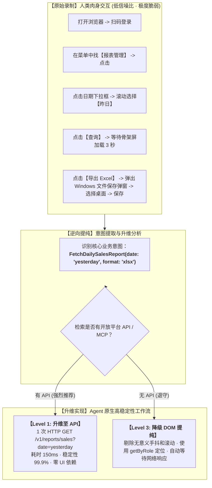

# 从用户录制到健壮工作流的工程转化 (Recording to Robust Workflow)

当小白用户使用双源统一录制器（`example.unified-recorder`）录制了一段长达数分钟的屏幕交互后，录制目录中会生成三样核心产物：
1. **`agent-transcript.md`**：过滤掉冗余噪声的结构化 Markdown 文字序列（附有抽离落盘的截图路径）；
2. **`native/browser-playwright.js`**：原生 Playwright 录制语句；
3. **`native/desktop-psr.zip`**：Windows 步骤记录器的原生 XML/MHT 归档。

**核心问题**：Agent 应该如何处理这些产物？**绝不是把录制的脚本原封不动拿去回放！**

---

## 转化核心法则：升维替代法则 (The Elevation Rule)



---

## 阶段一：意图提取与噪声清洗 (Intent Extraction)

阅读 `agent-transcript.md`，执行两步清洗：

### 1. 过滤人类交互噪声
人类在操作界面时不可避免会产生大量与业务无关的动作，必须全部剔除：
- 鼠标在空白区域的无意义晃动与停顿；
- 点击失误后的回退与重复点击；
- 上下反复滚轮（仅为了肉眼寻找目标，Agent 可直接通过语义选择器定位，不需要滚轮）；
- 误触无关应用或通知弹窗。

### 2. 识别业务实体与上下文参数
将一系列动作归纳为一个结构化的领域动作（Domain Action）：
- **前置条件 (Pre-condition)**：用户在什么系统、拥有什么角色；
- **业务输入 (Inputs)**：表单填写的具体参数（例如 `date: '2026-09-22'`，在提纯时转化为动态参数 `date: getYesterday()`）；
- **最终产物 (Outputs)**：生成的文件（Excel、PDF）、页面更新的状态、或发出的消息。

---

## 阶段二：升维实现设计 (Elevation to Code)

### 2.1 路径 A：升维为 Level 1 API / Level 2 MCP（优先走）
如果在第一步已指导用户开通了开放平台：
- **废弃所有 UI 录制脚本**；
- 将 20 个界面的点击跳转，直接替换为一个轻量的领域 Node 或外部执行适配器；
- 示例：
  ```javascript
  export class SalesExportNode extends Node {
    async change(info, ctx) {
      if (info.type === 'TriggerDailySync') {
        const reportData = await ctx.effectAdapter(this.apiAdapter, {
          date: getYesterday(),
        });
        ctx.patchState({ lastSync: new Date().toISOString(), status: 'synced' });
      }
    }
  }
  ```

### 2.2 路径 B：提纯为 Level 3 健壮浏览器脚本（无 API 时的退守）
若必须走浏览器模拟：
- 将录制代码中的绝对坐标、XPath、CSS 伪类清洗为最健壮的 Playwright 语义选择器：
  ```javascript
  // 危险且脆弱的原始录制代码（必须重写）：
  // await page.mouse.click(843, 212);
  // await page.locator('div > div:nth-child(3) > button').click();

  // 清洗提纯后的合规脚本：
  await page.getByRole('button', { name: '导出 Excel' }).click();
  const downloadPromise = page.waitForEvent('download');
  const download = await downloadPromise;
  await download.saveAs(targetPath);
  ```

---

## 阶段三：装配进独立 Run 沙箱 (Assembly & Deployment)

完成提纯后，将工作流封装为标准的命名 Run：

```text
runs/sales-report-sync/
├── run.config.json       # 场景配置（定时调度 cron 或手动触发）
├── assembly.mjs          # 声明式装配
└── plugins/
    └── backend/
        └── sync-plugin/  # 提纯后的领域逻辑
```

在 `assembly.mjs` 中接入微内核：
```javascript
export default {
  id: 'sales-report-sync.assembly',
  contribute(run) {
    run.backendPlugin({
      id: 'local.sales-sync',
      path: './plugins/backend/sync-plugin',
    });

    run.node({
      id: 'sales-sync',
      plugin: 'local.sales-sync',
      factory: 'createSalesSyncNode',
    });

    run.requireNode('sales-sync');
  },
};
```

---

## 总结：给 Agent 的转化行动检查清单

- [ ] **是否已主动探查过目标系统开放平台？**（不要一拿到录制就闷头写 UI 脚本，先搜开放平台/MCP）。
- [ ] **录制动作中的动态参数是否已参数化？**（如时间、用户姓名、查询范围是否支持动态传入，而不是写死录制时的当次数据）。
- [ ] **是否已剔除人类手抖与多余滚动？**
- [ ] **是否已落实凭据安全隔离？**（无明文 Key，无硬编码密码）。
- [ ] **是否已圈禁在独立的 `runs/<workflow-name>/` 沙箱内？**（非核心插件严禁写入 `app/`）。
