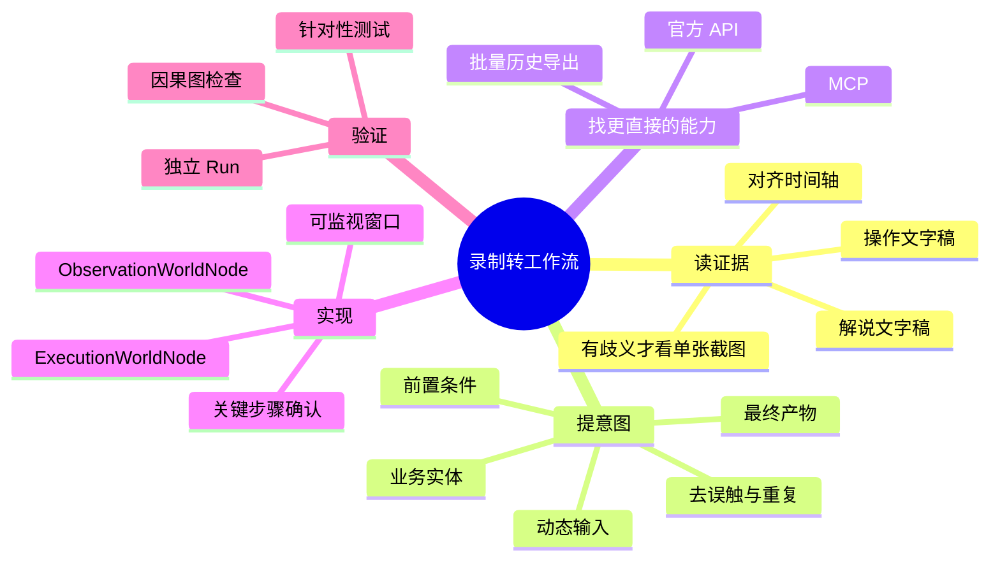
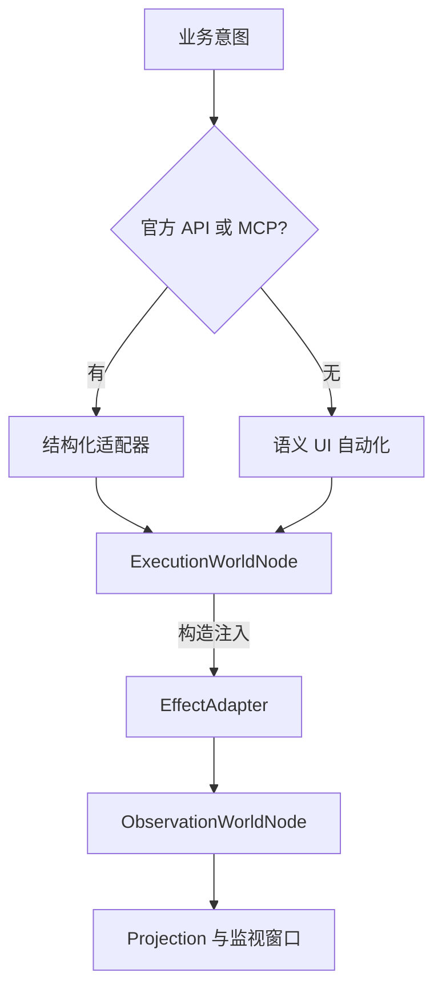

# 从录制到健壮工作流

统一录制器的会话目录含 `agent-transcript.md`（操作）、`narration-transcript.md`（解说）、`aligned-timeline.md`（对齐时间轴）、`unified-events.json`（结构化事件）、`native/browser-playwright.js` 和 `native/desktop-psr.zip`。这些是理解业务目标的证据。

## 转化路径



例如“扫码登录→找报表→选昨日→等待加载→导出 Excel”的意图可写成 `FetchDailySalesReport(date: 'yesterday', format: 'xlsx')`。有结构化 API 时调用 API；否则提纯 DOM 定位与等待条件。录制脚本中的手抖、无关滚动、误触、回退、重复点击不进入最终流程。

## 读录制与建知识库

先读三个文字稿和 `unified-events.json`，按同一时间基准对照操作与解说。只有文字严重歧义、按钮缺少可读文本或视觉布局冲突时，才针对性打开一张截图；不批量读取 `screenshots/`。

| 提取项 | 内容 |
| :--- | :--- |
| 前置条件 | 系统、账号角色、权限、登录状态。 |
| 输入 | 日期、名称、范围等；固定示例改为动态参数，例如 `getYesterday()`。 |
| 输出 | Excel/PDF、页面状态或消息。 |
| 噪声 | 无意义鼠标移动、停顿、误点、回退、重复点击、找目标用的滚轮、无关通知。 |
| 隐藏能力 | 平台的全量历史 ZIP、数据结转、OpenAPI 报表下载等批量导出口。 |

知识库记录业务字典、枚举、鉴权、API 和隐藏导出口；SOP 记录步骤、分支与补偿。本地 `runs/<workflow>/knowledge-index.json` 只存 `workflowId`、版本、远端主机、`lastSyncedAt`、条目 `id/title/remoteFile/sha256/hiddenDataExports` 等元数据，大正文放远端知识库。

共享知识库按 [工作流生命周期](workflow-elements-and-lifecycle.md) 的约定维护。用阿里云 Workbench CLI 先检查 `/root/knowledgeroot`，再上传更新，最后回读大小与权限；已存在文件先评估覆盖影响。命令示意：

```bash
workbench exec --instance-id <instance-id> --command "ls -la /root/knowledgeroot"
workbench upload ./sales-report-spec.md /root/knowledgeroot/sales-report-spec.md --instance-id <instance-id>
workbench exec --instance-id <instance-id> --command "ls -la /root/knowledgeroot/sales-report-spec.md"
```

## 实现边界



- API/MCP 路径：以领域 Info 触发执行节点，经构造注入的 `EffectAdapter` 请求外部系统；纯领域 Node 零 I/O。
- 浏览器/桌面路径：把 Playwright 或 UIA 动作封装为适配器与执行节点；不在根目录放裸脚本。浏览器有头展示或投射 CDP 帧；桌面由观察节点持续提供窗口、截图和控件事实。
- 自动化过程在前端可监视；数据填充、核心按钮和“保存/放弃”等关键步骤清晰呈现，供用户与 Agent 确认。物理动作完成后，执行节点结算并反馈句柄；持续监听属于观察节点。

```js
import { ExecutionWorldNode } from '@graphframework/sdk/plugin'

export class SalesExportNode extends ExecutionWorldNode {
  constructor(id, apiAdapter) {
    super(id, 'SalesExport', { lastSync: null, status: 'idle' })
    this.apiAdapter = apiAdapter
  }
  async change(info, ctx) {
    if (info.type !== 'TriggerDailySync') return
    await ctx.effectAdapter(this.apiAdapter, { date: info.date })
    ctx.patchState({ lastSync: new Date().toISOString(), status: 'synced' })
  }
}
```

## 独立 Run 验证

```text
runs/sales-report-sync/
├── run.config.json
├── knowledge-index.json
├── assembly.mjs
├── plugins/backend/sync-plugin/
└── tests/workflow.test.mjs
```

工作流插件、测试和集成配置留在独立 run；非核心插件不进入 `app/`。`assembly.mjs` 注册插件、Node/Graph、监视前端和 `requireNode`；测试用 `@graphframework/sdk/testing` 的 `createTestRuntime` 检查 State、下游 Info 与真实产物。

```bash
npx vitest run runs/sales-report-sync/tests/
bash ./run.sh start runs/sales-report-sync/run.config.json
```

验收时确认：已查 API/MCP 和批量导出口；参数已动态化；截图只在必要时读取；知识库和 SOP 有索引；物理能力经执行/观察节点；前端能监视与确认关键步骤；凭据不入仓库；所有测试收敛在独立 run。
