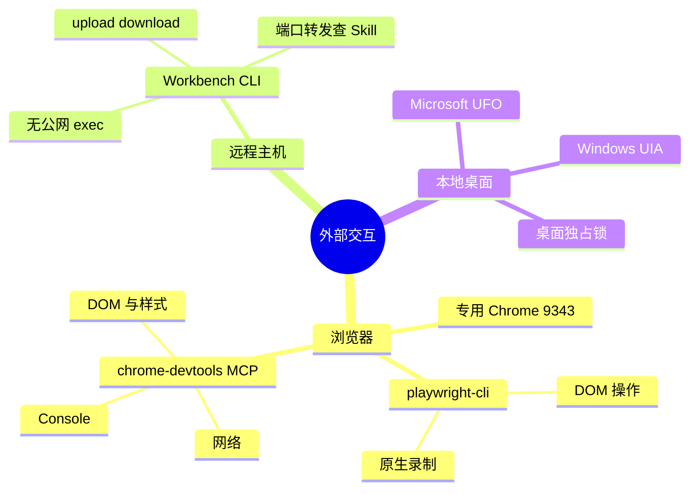

# Agent 技能与 MCP 工具箱



## 浏览器

专用 Chrome 使用独立数据目录 `GVSDK/.agents/browser/data-Profile-1`，复用已授权的 Profile 1 会话；CDP 端口 `9343`，与自动化发货端口 `9333` 分离。启动与探活脚本见 `gv-browser` 技能：

```powershell
powershell.exe -NoProfile -ExecutionPolicy Bypass -File ".agents/skills/browser-setup/scripts/browser.ps1" -Action Start
curl http://127.0.0.1:9343/json/version
```

`@playwright/cli` 用 CDP 会话操控页面，`snapshot` 返回可访问性引用；原生录制输出 Playwright Locator 代码：

```bash
playwright-cli attach --cdp=http://127.0.0.1:9343 --session rec
playwright-cli -s=rec goto https://open.example.com
playwright-cli -s=rec snapshot
playwright-cli -s=rec click f1e6
playwright-cli -s=rec fill f1e6 "我的应用名称"
playwright-cli -s=rec tab-list
playwright-cli -s=rec recording-start
playwright-cli -s=rec recording-stop
playwright-cli -s=rec detach
```

输出可包含 `page.goto()`、`page.getByRole(...).click()`、`page.getByLabel(...).fill()`。`chrome-devtools` MCP 的配置位于 `.omp/mcp.json`；用于复杂 SPA 的 DOM/样式检查、只读 Console 分析和网络请求/载荷观察，以判断是否有更直接的 API。

## 阿里云远程主机

本地技能见 [alibabacloud-workbench-cli](../../.agents/skills/alibabacloud-workbench-cli/SKILL.md)，官方项目见 [Aliyun AIOps Skills](https://github.com/aliyun/alibabacloud-aiops-skills/tree/master/skills/developertools/solutions/alibabacloud-workbench-cli)。Workbench CLI 提供免公网命令执行、最大 1 GB 单文件传输和端口转发；具体认证模式与转发语法以技能为准。

| 任务 | 命令形状 |
| :--- | :--- |
| 安装（Linux/macOS） | `curl -fsSL https://workbench-cli.oss-cn-hangzhou.aliyuncs.com/install.sh \| bash` |
| 安装（Windows PowerShell） | `irm https://workbench-cli.oss-cn-hangzhou.aliyuncs.com/install.ps1 \| iex` |
| 检查/升级 | `workbench version` / `workbench upgrade` |
| 命令执行 | `workbench exec -i <instance-id> -c "ls -la /root/knowledgeroot"` |
| 上传 | `workbench upload <local> <remote> --instance-id <id>` |
| 下载 | `workbench download <remote> <local> --instance-id <id>` |

上传已存在文件前先检查远端，避免交互式覆盖提示卡住流程。凭据由本人提供，保存在本地受保护配置中；不能提交仓库或写入 `assembly.mjs`、Markdown。AK 配置 schema 及权限设置查技能，不在这里复制密钥模板。

## Windows 桌面

`ufo-computer-control` 使用 Microsoft UFO 与 Windows UI Automation，提供窗口发现、截图、控件树（`ControlId`、`Name`、`BoundingRectangle`）和键鼠操作。开发时用 Mock `EffectAdapter` 做离线单测；真机控制先取得系统级桌面独占锁，单 Agent 串行操作，完成后释放焦点。详见 [桌面排他契约](../subagent-parallel-contract.md)。

## 选型

| 场景 | 首选 | 辅助与约束 |
| :--- | :--- | :--- |
| 远程知识库/主机 | Workbench CLI | 端口转发按技能查；凭据不入库。 |
| Web 配置/API 开通 | `gv-browser` + `playwright-cli` | `chrome-devtools` MCP 查 DOM/网络；使用受管浏览器。 |
| Web 录制 | `playwright-cli recording-start/stop` | 网络观察帮助发现 API；避免固定坐标。 |
| Windows 客户端 | `ufo-computer-control` + UIA | PSR 可记录步骤；真机桌面绝不并发抢占。 |

关联：[工作流指南](README.md)、[五级选型](agent-native-hierarchy.md)、[主动带教](guided-onboarding.md)。
