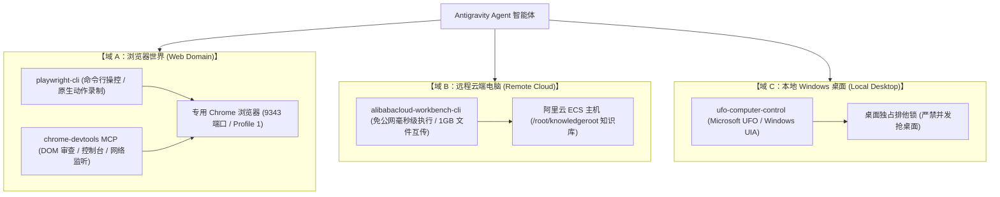

# Agent 技能与 MCP 工具箱全景规范

在 GraphFramework 的工作流开发与 Agent 协同体系中，Agent 不仅是一个只能生成代码的文本大模型，更是能够直接操作物理电脑、驱动浏览器、管理远程云端基础设施的**数字原生员工**。

为了确保 Agent 具备完整、健壮、安全的操作能力，GraphFramework 装备了三位一体的外部交互工具箱体系（Browser / Remote Cloud / Local Desktop）。本文档系统规定各工具的接入方法、安装流程、命令行契约与场景选型。

---

## 1. 三位一体外部交互栈全景



---

## 2. 域 A：浏览器操作与原生录制栈

### 2.1 专用隔离浏览器（9343 端口）

GVSDK 为 Agent 配置了独立的专用 Chrome 浏览器，与用户日常使用的 Chrome 在数据目录和网络端口上实现物理隔离：

- **数据目录**：`GVSDK/.agents/browser/data-Profile-1`（通过软链接复用已授权的 Profile 1 会话，免去频繁扫码登录）；
- **通信端口**：**`9343`**（自动化发货端口为 9333，互不冲突）；
- **启动与自动探活脚本**：
  ```powershell
  # 自动拉起或复用专用浏览器（浏览器关闭时会自动启动，无需用户干预）
  powershell.exe -NoProfile -ExecutionPolicy Bypass -File ".agents/skills/browser-setup/scripts/browser.ps1" -Action Start
  
  # 探活检查：返回 HTTP 200 即表示存活
  curl http://127.0.0.1:9343/json/version
  ```

---

### 2.2 `playwright-cli`（浏览器命令行操控与原生录制）

全局已预装 `@playwright/cli`。它是 Agent 操控网页和录制用户意图的第一利器：

#### 核心操作流程：
```bash
# 1. 建立与专用浏览器的 CDP 挂载会话 (Session)
playwright-cli attach --cdp=http://127.0.0.1:9343 --session rec

# 2. 打开目标页面
playwright-cli -s=rec goto https://open.example.com

# 3. 获取无障碍元素快照与引用编号 (如 f1e6)
playwright-cli -s=rec snapshot

# 4. 根据引用编号进行精准点击与输入
playwright-cli -s=rec click f1e6
playwright-cli -s=rec fill f1e6 "我的应用名称"

# 5. 查看所有活动标签页
playwright-cli -s=rec tab-list
```

#### 原生动作录制（Recording Start / Stop）：
当需要记录用户在页面上的复杂人工交互时，采用 Playwright 原生录制，底层直接输出健壮的 Playwright Locator 代码：

```bash
# 开启原生录制
playwright-cli -s=rec recording-start

# 用户或 Agent 在浏览器中操作...

# 停止录制并一次性输出干净的代码片段
playwright-cli -s=rec recording-stop

# 断开会话 (浏览器继续保持运行)
playwright-cli -s=rec detach
```

输出标准代码示例：
```javascript
await page.goto('https://open.example.com/');
await page.getByRole('button', { name: '创建应用' }).click();
await page.getByLabel('应用名称').fill('销售同步机器人');
```

---

### 2.3 `chrome-devtools` MCP Server

通过 Model Context Protocol（MCP）直连专用浏览器的 Chrome DevTools Protocol 调试通道：

- **配置文件**：`GVSDK/.omp/mcp.json`
- **核心能力**：
  1. **DOM 结构与样式深度审查**：用于分析无语义标签的复杂 SPA 单页应用；
  2. **Console 上下文表达式执行**：直接在目标页面执行只读脚本获取埋点数据或状态对象；
  3. **网络与接口监听（Network Sniffing）**：在用户操作时捕获后台发送的真实 RESTful API 与载荷结构，为逆向升级到 Level 1（API 级）提供铁证。

---

## 3. 域 B：远程云端电脑与知识库运维栈 (`alibabacloud-workbench-cli`)

### 3.1 官方开源背景与定位

`alibabacloud-workbench-cli` 是阿里云专门为 AI Agent 研发的免公网云主机运维命令行工具，支持毫秒级远程执行、大文件极速传输与端口映射：

- **官方开源项目地址**：[Aliyun AIOps Skills: alibabacloud-workbench-cli](https://github.com/aliyun/alibabacloud-aiops-skills/tree/master/skills/developertools/solutions/alibabacloud-workbench-cli?spm=aliyun-agent-skills-portal.skill_detail.0.0.4d336f75s4hkiB)
- **本地 Skill 目录**：[`.agents/skills/alibabacloud-workbench-cli/SKILL.md`](file:///c:/Users/kp157/Desktop/PM/GVSDK/.agents/skills/alibabacloud-workbench-cli/SKILL.md)

---

### 3.2 一键安装命令

在任意终端或自动化脚本中，使用官方一键安装脚本部署：

#### Linux / macOS:
```bash
curl -fsSL https://workbench-cli.oss-cn-hangzhou.aliyuncs.com/install.sh | bash
```

#### Windows (PowerShell):
```powershell
irm https://workbench-cli.oss-cn-hangzhou.aliyuncs.com/install.ps1 | iex
```

#### 版本与健康校验：
```bash
workbench version
# 升级到最新版
workbench upgrade
```

---

### 3.3 凭证装配（结合 `credentials.json`，`0600` 权限）

凭据安全红线：`credentials.json` 已被 `.gitignore` 保护，读取后只写入本地 `~/.workbench/config.json`，绝不提交进仓库、绝不写入 `assembly.mjs` 或 Markdown。AK 模式 schema 以 skill 为准（无 `region_id` 字段）：

```bash
# 1. 创建配置目录
mkdir -p ~/.workbench

# 2. 写入配置 (AK 模式)
cat > ~/.workbench/config.json << 'EOF'
{
  "current": "default",
  "profiles": {
    "default": {
      "mode": "AK",
      "access_key_id": "<AccessKeyID-from-credentials.json>",
      "access_key_secret": "<AccessKeySecret-from-credentials.json>"
    }
  }
}
EOF

# 3. 设置严格访问权限
chmod 600 ~/.workbench/config.json
```

---

### 3.4 核心运维能力

#### 1. 毫秒级免公网命令执行 (`workbench exec`)
无需目标服务器开通公网 IP 或开放 22 端口，通过云助手安全隧道毫秒级执行命令：
```bash
workbench exec -i i-uf6xxxxxxxxxxxxxx -c "ls -la /root/knowledgeroot"
```

#### 2. 大文件双向传输 (`workbench upload` / `workbench download`)
最大支持 **1GB** 单文件高速传输（经 OSS 中转），位置参数为 `<local> <remote>` / `<remote> <local>`，实例用 `--instance-id` 指定。`upload` 覆盖远端已存在文件会交互确认，自动化流程先用 `exec ls` 确认：
```bash
# 上传能力包至远程主机知识库
workbench upload ./my-capability-1.0.0.zip /root/knowledgeroot/capabilities/my-capability-1.0.0.zip --instance-id i-uf6xxxxxxxxxxxxxx

# 下载远程生成的最新工作流 SOP 文档
workbench download /root/knowledgeroot/workflows/order-sync.md ./runs/alice/docs/order-sync.md --instance-id i-uf6xxxxxxxxxxxxxx
```

> 端口转发：以 skill 的实际命令为准，文档不虚构 `forward` 语法；需要时先查 skill 再执行。

---

## 4. 域 C：本地桌面操作系统控制栈 (`ufo-computer-control`)

针对非 Web 界面的原生 Windows 客户端（如 ERP 客户端、桌面协同软件）：

- **底层驱动**：Microsoft UFO（UI-Focused Agent）+ Windows UI Automation（UIA）；
- **核心能力**：窗口发现、全屏截图巡检、控件树遍历（ControlId / Name / BoundingRectangle）、键鼠原生点击输入；
- **排他守卫铁律**：
  > [!CAUTION]
  > **桌面独占红线**：遵循 [`REFERENCE/subagent-parallel-contract.md`](file:///c:/Users/kp157/Desktop/PM/GVSDK/REFERENCE/subagent-parallel-contract.md)，严禁多 Agent 并发抢桌面！
  > - 开发阶段：用内存 mock EffectAdapter 做离线单测分流（见 `app/plugins/backend/ufo-computer-control/tests/backend.test.mjs` 的 `assemble()` 模式）；
  > - 真机联调：必须在取得桌面锁后单 Agent 串行执行，执行完立即释放前台焦点。

---

## 5. Agent 工具箱选型与优先级决策表
| **云端知识库维护 / 远程主机管理** | `alibabacloud-workbench-cli`（免公网 exec/upload/download） | 按 skill 查端口转发命令 | 严禁明文密码写入代码仓库 |
| **Web 平台配置 / 开放平台 API 开通** | `gv-browser`（`playwright-cli` attach 9343） | `chrome-devtools` MCP | 严禁开启不受管的日常 Chrome 抢占标签 |
| **Web 业务操作录制与意图解析** | `playwright-cli recording-start/stop` | `chrome-devtools` 网络抓包逆向 API | 严禁使用死板的像素绝对坐标盲点 |
| **Windows 本地软件操作** | `ufo-computer-control`（基于 UIA 控件树） | PSR 步骤记录器 (`example.os-recorder`) | **严禁多 Agent 并发拉起 UFO 强占物理桌面** |

---

## 相关权威链接

- [工作流开发全景指南](README.md)
- [Agent 原生层级五级金字塔](agent-native-hierarchy.md)
- [主动带教与配置指引](guided-onboarding.md)
- [子 Agent 并行开发契约与桌面排他守卫](../subagent-parallel-contract.md)
- [根目录敏感凭据管理说明 (credentials.json)](file:///c:/Users/kp157/Desktop/PM/GVSDK/credentials.json)
