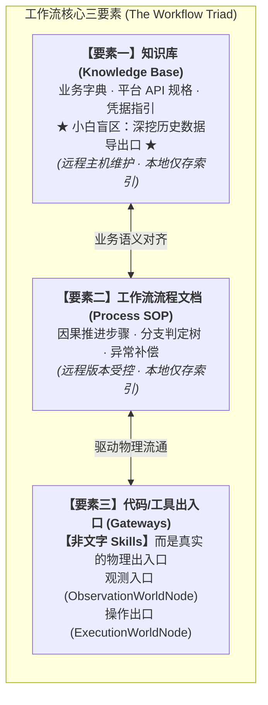
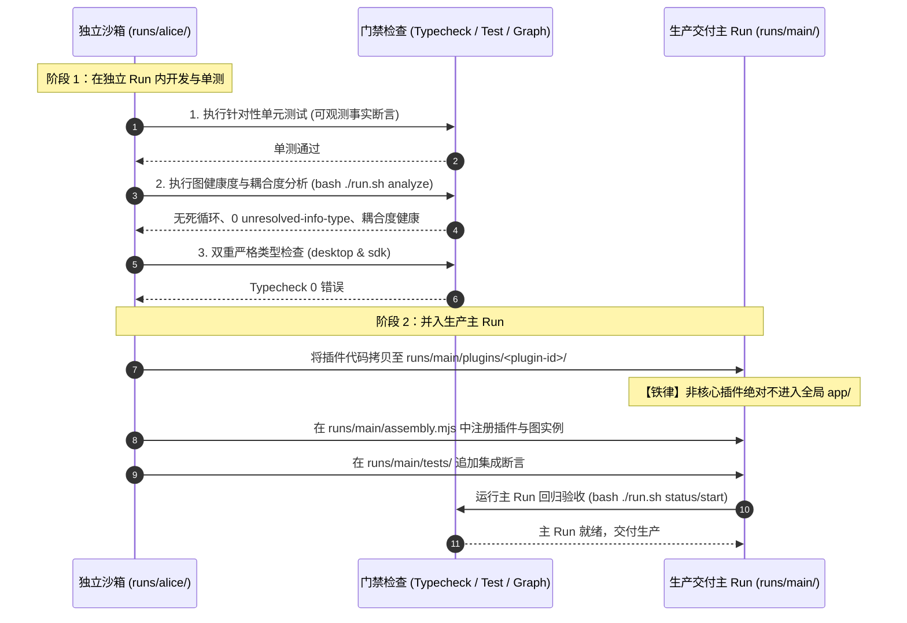

# 工作流三要素、远程维护与生命周期规范 (Workflow Triad & Lifecycle)

本规范规定了 GraphFramework 工作流的**资产结构标准、知识库构建原则、远程获取机制**以及**成熟工作流并入生产主环境（`runs/main`）的准入闭环**。

---

## 1. 工作流核心三要素 (The Workflow Triad)

一个在工程上可交付、可自愈、可长期维护的业务工作流，必须且仅由以下**三大要素**构成：



---

### 要素一：知识库（Knowledge Base）与小白用户盲区挖掘

知识库是工作流运行的“领域认知大脑”，用于支撑 Agent 的上下文理解与决策。

#### 1. 小白用户盲区与“历史数据导出口”主动挖掘
> [!IMPORTANT]
> **小白用户认知局限**：纯小白用户只熟悉日常界面最显眼的按钮。用户往往**完全不知道很多平台在后台深处其实内置了“一键全量导出”、“数据归档”、“批量历史下载”等隐藏导出口**！
> 
> 例如：
> - 许多电商或 CRM 系统在“设置 $\to$ 数据安全 $\to$ 导出归档”中支持一键生成全量历史 CSV 压缩包；
> - 某些财务软件表面上只能按月筛选，但后台 OpenAPI 或“历史结转报表”支持按年批量获取。
> 
> **构建知识库时的强制铁律**：  
> Agent 在为小白用户构建知识库时，**必须主动探索和记录目标平台的所有“隐秘历史数据导出口”**。严禁放任工作流采用逐页翻查、逐个点击下载的方式去抓取海量历史数据！

#### 2. 远程主机获取与本地轻量索引
- **远程主机维护**：依据全仓统一契约 [知识库共享根目录协作契约](file:///c:/Users/kp157/Desktop/PM/GVSDK/DOCUMENTS/contracts/knowledge-root-sharing.md)，通用的业务知识库、数据字典、平台交互样例**统一落地在买的阿里云 ECS 远程主机（`i-uf6fm76cksm8ipd5mfjy`，`cn-shanghai`）的 `/root/knowledgeroot` 目录下**；
- **唯一操作工具**：统一通过 **阿里云 Workbench CLI (`workbench`)**（技能位于 `.agents/skills/alibabacloud-workbench-cli/SKILL.md`）进行 `exec`、`download` 与 `upload` 操作，绝对不建立私有 SSH 旁路；
- **本地代码库仅保留索引（Index）**：本地只保存元数据索引文件（`knowledge-index.json`），严禁把数兆的业务手册或大文件直接提交进 Git 仓库。
- **本地索引结构范式 (`runs/<workflow>/knowledge-index.json`)**：
  ```json
  {
    "workflowId": "sales-report-sync",
    "version": "1.2.0",
    "remoteHost": {
      "provider": "alibabacloud-ecs",
      "instanceId": "i-uf6fm76cksm8ipd5mfjy",
      "region": "cn-shanghai",
      "rootPath": "/root/knowledgeroot"
    },
    "lastSyncedAt": "2026-09-22T08:00:00Z",
    "items": [
      {
        "id": "sales-data-spec",
        "title": "销售系统数据字段映射与批量历史导出口规格",
        "remoteFile": "/root/knowledgeroot/sales-data-spec.md",
        "sha256": "e3b0c44298fc1c149afbf4c8996fb92427ae41e4649b934ca495991b7852b855",
        "hiddenDataExports": [
          "系统管理 -> 安全与审计 -> 历史数据结转归档 -> 批量导出全量 ZIP",
          "平台 OpenAPI -> GET /v2/archive/reports (单次调用直接下载全量历史 CSV 压缩包)"
        ]
      }
    ]
  }
  ```

---


### 要素二：工作流流程文档（Process SOP Document）

流程文档是业务因果推进的“标准化作业指导书”，规定了执行次序、条件分支与降级策略。

1. **内容标准**：
   - **Trigger**：触发条件（定时 Cron、Webhook 事件、用户手动按钮）；
   - **Pipeline**：因果推进主干道（步骤 1 认证 $\to$ 步骤 2 提取 $\to$ 步骤 3 清洗 $\to$ 步骤 4 同步）；
   - **Error Handling**：异常补偿方案（若遇网络超时重试 3 次；若遇接口限流等待 backoff；若遇数据不一致产生 Error Info 发给审计节点）。
2. **远程维护与本地索引**：
   - 流程文档由业务团队在远程协同平台（Wiki / 文档系统）统一编辑与版本受控；
   - 本地 `runs/<workflow>/SOP.md` 仅包含指向远程权威流程的 URL 索引与本地运行校验哈希。

---

### 要素三：代码与工具出入口（Agent Observation & Action Gateways）

> [!CAUTION]
> **概念红线：这里的“代码/工具”绝不是指纯提示词技能（非 Skills Prompt）！**
> 
> - **Skills（技能）**：是纯文字性的 Prompt 指导说明书（如告诉 Agent 怎么写代码）；
> - **工作流三要素的代码/工具**：是 **Agent 拥有真实物理效力的观测与操作出入口（I/O Gateways）**，是连接微内核与物理世界的真实驱动代码！

必须由以下两类实体实现：
1. **观测入口 (Observability Gateways)**：
   - **类载体**：继承自 `@graphframework/sdk/plugin` 的 `ObservationWorldNode`；
   - **职能**：监听物理事件、轮询系统状态、拉取数据变更、截图感知。零主动外部写操作；
   - **对 Agent 暴露**：将物理事实封装为只读的 `EncodedValue` 投影（Projection）与 `RecordingEventInfo`，供 Agent 实时观测。
2. **操作出口 (Action Gateways)**：
   - **类载体**：继承自 `@graphframework/sdk/plugin` 的 `ExecutionWorldNode`；
   - **职能**：通过构造注入的 `EffectAdapter`（如 HTTP Client、Playwright 驱动、UFO 键鼠驱动、Shell 执行器）向外部物理世界下达确定的动作；
   - **对 Agent 暴露**：Agent 通过向其发送结构化的 Info 脉冲（如 `ExecuteActionInfo`）触发物理下发，执行完成立即结算单飞租约并返回句柄。

---

## 2. 从独立 Run 到 `runs/main` 的成熟并入规范 (Promotion to Main)

当一个工作流在独立沙箱中开发完成，**必须经过严格的质量门禁，方可并入生产主环境 `runs/main/`**。



### 2.1 准入四大门禁
在并入 `runs/main` 之前，必须满足以下所有条件：
1. **独立 Run 跑通**：在 `runs/<workflow-name>/` 下通过 `bash ./run.sh start` 正常运行，所有端到端流程无卡死；
2. **针对性单元测试全绿**：断言了 State 变迁、下游 Info 交付与物理文件落盘三项事实；
3. **因果图分析通过**：`cyclicNodeIds` 必须为空，`unresolvedInfoTypes` 为 0，节点耦合度度量在合理区间；
4. **凭据解耦安全**：本地无明文 AppSecret、私钥或密码。

### 2.2 物理并入路径规范
- **允许的并入路径**：`runs/main/plugins/<workflow-plugin-id>/`；
- **绝对禁止的路径**：严禁提交到 `app/` 或 `app/plugins/`（`app/` 仅限全仓最核心的底座基础设施）。

---

## 3. 本地索引与阿里云 ECS 远程同步标准操作 (Alibaba Cloud Sync)

依据全仓规范 [知识库共享根目录协作契约](file:///c:/Users/kp157/Desktop/PM/GVSDK/DOCUMENTS/contracts/knowledge-root-sharing.md)，为保证工作流知识库和流程文档随时与阿里云 ECS 远程主机（`i-uf6fm76cksm8ipd5mfjy`）保持最新，统一使用 **阿里云 Workbench CLI (`workbench`)**：

### 3.1 远程探活与目录检查
```bash
# 检查远程 ECS 主机上的知识库根目录状态
workbench exec --instance-id i-uf6fm76cksm8ipd5mfjy --command "ls -la /root/knowledgeroot"
```

### 3.2 增量拉取知识正文与 SOP
当本地首次构建工作流或版本发生更新时，通过索引拉取到本地缓存：
```bash
# 从远程 ECS 主机下载指定业务知识文档至本地工作流沙箱
workbench download /root/knowledgeroot/sales-data-spec.md runs/<workflow>/knowledge/sales-data-spec.md --instance-id i-uf6fm76cksm8ipd5mfjy
```

### 3.3 人机协同维护与安全回传
当 Agent 或用户更新了业务字典、补全了隐藏导出口说明后，按规则回传：
```bash
# 上传更新后的知识库正文至 ECS 共享知识库（执行前先用 exec 确认目标文件状态，避免覆盖提示卡住自动化流程）
workbench upload runs/<workflow>/knowledge/sales-data-spec.md /root/knowledgeroot/sales-data-spec.md --instance-id i-uf6fm76cksm8ipd5mfjy

# 回读校验文件大小与权限
workbench exec --instance-id i-uf6fm76cksm8ipd5mfjy --command "ls -la /root/knowledgeroot/sales-data-spec.md"
```

### 3.4 运行时校验
工作流在 `initInfos` 初始化阶段，节点自动核对本地缓存哈希与 `knowledge-index.json` 中的 `sha256`：
- 若哈希一致：秒级拉起，直接使用本地缓存；
- 若哈希不一致或本地缺失：自动调用下载命令从阿里云 ECS 拉取最新数据字典并热更新。

