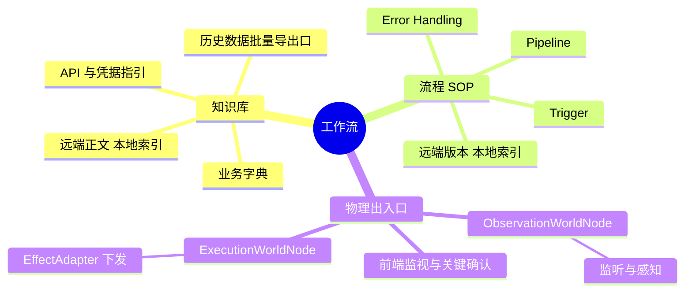
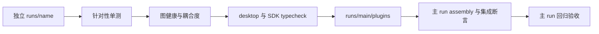

# 工作流三要素与生命周期

可交付工作流由知识库、流程 SOP 和真实物理出入口组成；在独立 Run 开发、验证后才并入 `runs/main/`。

## 三要素



### 知识库

记录实体、字段、枚举、鉴权与平台 API。主动查“一键全量导出”“数据归档”“历史结转报表”和批量下载接口；例如电商/CRM 的历史 CSV ZIP、财务系统的年度批量报表，避免逐页点击抓取海量数据。

团队共享正文在阿里云 ECS（`i-uf6fm76cksm8ipd5mfjy`，`cn-shanghai`）的 `/root/knowledgeroot`；按[技能与 MCP 工具箱](skills-and-mcp-tooling.md)用 Workbench CLI 读写，不建私有 SSH 旁路。本地 Git 只留 `runs/<workflow>/knowledge-index.json`，不提交大体量业务正文。索引字段：

```json
{
  "workflowId": "sales-report-sync",
  "version": "1.2.0",
  "remoteHost": {
    "provider": "alibabacloud-ecs",
    "instanceId": "i-uf6fm76cksm8ipd5mfjy",
    "region": "cn-shanghai",
    "rootPath": "/root/knowledgeroot"
  },
  "lastSyncedAt": "2026-09-22T08:00:00Z",
  "items": [{
    "id": "sales-data-spec",
    "title": "销售字段与批量历史导出口",
    "remoteFile": "/root/knowledgeroot/sales-data-spec.md",
    "sha256": "<expected-sha256>",
    "hiddenDataExports": ["系统管理 → 历史结转 → 全量 ZIP", "OpenAPI → 历史报表下载"]
  }]
}
```

### 流程 SOP

| 部分 | 内容 |
| :--- | :--- |
| `Trigger` | Cron、Webhook 或用户操作。 |
| `Pipeline` | 认证 → 提取 → 清洗 → 同步等因果步骤与条件分支。 |
| `Error Handling` | 超时重试、限流 backoff、数据不一致时发送 Error Info 到审计节点。 |

业务团队在远程 Wiki/文档系统维护版本；本地 `runs/<workflow>/SOP.md` 只含远端 URL 索引和运行校验哈希。

### 物理出入口

这里指真实驱动代码，而非文字 Skills：

| 入口 | 职责 |
| :--- | :--- |
| `ObservationWorldNode` | 监听事件、轮询状态、读取变更与截图；将事实封装为 Info，经 Projection（`EncodedValue`）供界面读取；零主动外部写入。 |
| `ExecutionWorldNode` | 经构造注入的 `EffectAdapter` 执行 HTTP、Playwright、UFO 或 Shell 动作；由结构化 Info 触发，执行后立即结算并返回句柄。 |

浏览器或桌面自动化需有前端监视窗口：有头展示、CDP 帧或观察节点的截图/控件投影。输入填充、关键按钮及保存/放弃弹窗必须清晰呈现，供用户与 Agent 审验和确认。

## 从独立 Run 并入主 run



| 准入门禁 | 要求 |
| :--- | :--- |
| 独立闭环 | 实现与测试都在 `runs/<workflow>/`，经 `bash ./run.sh start` 可运行，流程不卡死，前端可监视且关键步骤可确认。 |
| 可观测结果 | `runs/<workflow>/tests/` 断言 State、下游 Info、实际文件产物。 |
| 因果健康 | `bash ./run.sh analyze`；`cyclicNodeIds: []`、`unresolvedInfoTypes: 0`，耦合度合理。 |
| 类型与凭据 | Desktop、SDK 双 typecheck 通过；无明文 AppSecret、私钥或密码。 |

通过后把非核心插件放入 `runs/main/plugins/<workflow-plugin-id>/`，在主 run `assembly.mjs` 注册插件和图，并在 `runs/main/tests/` 增加集成断言。非核心插件不进入 `app/`；不在仓库根目录建第二套裸脚本测试。

## 远端同步与运行校验

```bash
workbench exec --instance-id i-uf6fm76cksm8ipd5mfjy --command "ls -la /root/knowledgeroot"
workbench download /root/knowledgeroot/sales-data-spec.md runs/<workflow>/knowledge/sales-data-spec.md --instance-id i-uf6fm76cksm8ipd5mfjy
workbench upload runs/<workflow>/knowledge/sales-data-spec.md /root/knowledgeroot/sales-data-spec.md --instance-id i-uf6fm76cksm8ipd5mfjy
workbench exec --instance-id i-uf6fm76cksm8ipd5mfjy --command "ls -la /root/knowledgeroot/sales-data-spec.md"
```

上传前先确认远端文件，上传后回读大小与权限。运行时在 `initInfos` 阶段核对缓存与索引 `sha256`：相同则使用本地缓存；缺失或不一致则经 Workbench 下载并更新。
