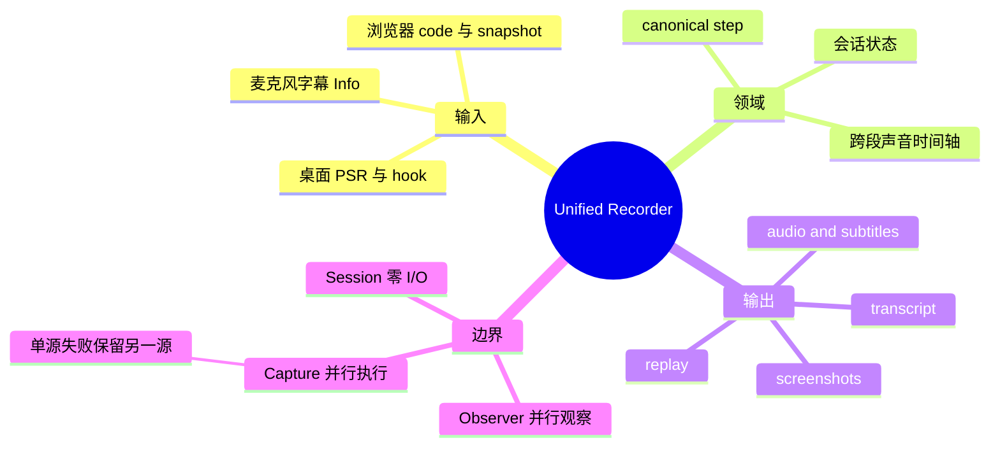
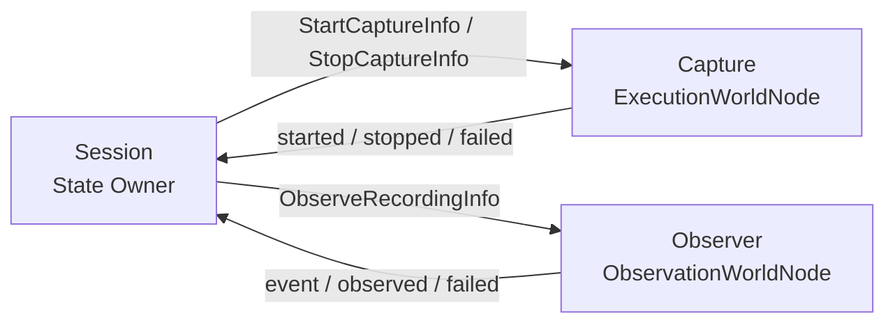

# Unified Recorder



桌面与浏览器事件统一为 Agent 可读步骤；声音采集、落盘和 OpenRouter 转写由桌面宿主完成。WebM 原件保持不变，单声道 16 kHz WAV 只用于 MAI-Transcribe 2 词级转写和按停顿拆句。个人系统中的输入明文保存在 `text/code`，不做脱敏。

插件不导入或修改 `example.os-recorder`、`example.browser-recorder`，也不持有浏览器或直驱 PSR。物理能力由宿主注入五个 Adapter：`desktopControl`、`browserControl`、`desktopObservation`、`desktopEvents`、`browserEvents`。

## 公开契约

目标 Owner：`<instance>/session`。

| 来源 | Info | 结果 |
| :--- | :--- | :--- |
| Renderer | `StartRecordingInfo` / `StopRecordingInfo` | 启停录制。 |
| Renderer | `AudioTranscribedInfo` | 合入声音片段和字幕。 |
| Renderer | `CorrectSubtitleInfo` | 修正字幕及持久化文字。 |
| Renderer | `RestoreSubtitlesInfo` | 宿主重启后恢复声音时间轴。 |
| Execution | `RecordingStartedInfo` / `RecordingStoppedInfo` / `RecordingFailedInfo` | 报告物理执行结果。 |
| Observation | `RecordingEventInfo` / `RecordingObservedInfo` / `RecordingFailedInfo` | 追加实时事件或提交权威归档。 |

五类 Renderer Info 均通过 `rendererRoots.validate()`。`StartCaptureInfo`、`StopCaptureInfo`、`RecordingStartedInfo`、`RecordingStoppedInfo`、`ObserveRecordingInfo`、`RecordingObservedInfo`、`RecordingEventInfo`、`PollUnifiedEventsInfo` 不得由 renderer 直接注入；宿主仅可经 `hostRoots` 向 observation 注入 `PollUnifiedEventsInfo`。



## 状态与数据

- 生命周期：`status`、`sessionId`、`sources`、`startedAt`、`completedAt`、`lastError`。
- 操作：`events[]`、`eventCount`、`applications[]`、`lastEvent`、`browserActions`。
- 产物：`artifactPath`、`sessionDir`、文字稿、截图目录和原生导出路径。
- 声音：`narrationStartedAt`、`subtitles[]`、`audioClips[]`；新片段保留此前字幕。
- canonical step：`index, time, timestamp, atMs, timeSource, source, application, windowTitle, action, description, locator, code, text, screenshotFile`。

权威桌面轨迹替换桌面预览，浏览器流保留。宿主恢复需等待 run 为 `running` 且 session 已进入 Projection；失败后在下次状态读取时重试。IPC 输入经运行时校验，缺失列表归一为空数组；读取失败继续轮询，React 异常进入可重试故障页。

## 持久化

```text
录制中  YYYY-MM-DD_HH-mm-ss_recording_<sessionId>
已完成  YYYY-MM-DD_HH-mm-ss__YYYY-MM-DD_HH-mm-ss_<sessionId>
```

时间使用宿主本地年月日和时分秒；跨午夜保留结束日期，PSR 路径随目录改名更新。会话目录保存操作文字稿、对齐时间轴、结构化事件、回放脚本、原生导出、截图、独立 WebM 声音和 SRT。Agent 文字时间显示到秒；内部时间及 SRT 保留毫秒。字幕界面最新在前，持久化时间线按真实时间正序。

完整说明见 [`REFERENCE/plugins/unified-recorder.md`](../../../../REFERENCE/plugins/unified-recorder.md)。
